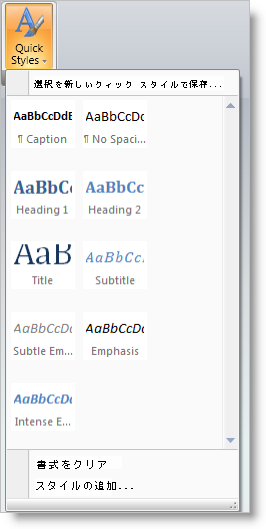
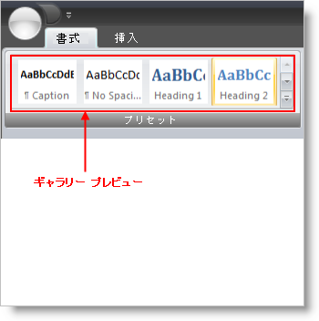
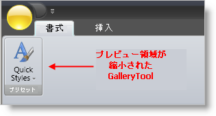
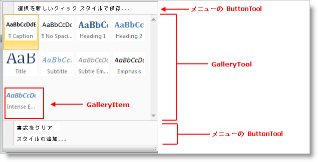

////

|metadata|
{
    "name": "xamribbon-gallery",
    "controlName": ["xamRibbon"],
    "tags": ["Data Presentation","Grouping","How Do I","Selection"],
    "guid": "{89E34047-C291-42D9-A781-D4D14A0F723E}",  
    "buildFlags": [],
    "createdOn": "2012-01-30T19:39:54.1711873Z"
}
|metadata|
////

= ギャラリー

== 概要

ギャラリー ツールは Microsoft® Office® 2007 ギャラリー機能にある機能をエミュレートします。メニューは選択可能なアクションのテキスト リストを提供し、ギャラリーはオプションの視覚的なリストを提供します。

たとえば、QuickStyles Gallery を作成して、テキスト ベースのメニュー オプションやスタイル プロパティを設定するためのリボン ボタンを単純に提供するのではなく、選択ことができるスタイル設定の視覚的なリストを提供することができます。

== ギャラリー プレビュー

Microsoft Office 2007 ギャラリーは、含まれている項目のプレビューをリボンに直接表示することもできるので、ユーザーは GalleryTool をドロップダウンせずにギャラリーから選択できます。ギャラリー ツールは、このオプションのプレビュー機能をサポートします。

ギャラリー ツールのリボンでプレビューを表示するには、ギャラリー ツールを含むメニュー ツールで ShouldDisplayGalleryPreview プロパティを Ture に設定します。

== ギャラリー プレビューのリサイズ

ギャラリー ツール プレビューは、それが含まれるリボン グループがサイズ変更されるとサイズ変更されます。ギャラリー ツールがリボンのプレビューを表示している場合、Ribbon Group が小さいサイズに変更されると GalleryItems はプレビュー領域表示から削除されます。特定のしきい値の幅に到達すると、ギャラリー ツールのプレビュー領域は完全に消え、GalleryTool を含む MenuTool だけがリボン領域に表示可能となります。

ギャラリー プレビューのリサイズ方法を制御できる方法には 2 つあります。

* GroupVariants - 各 RibbonGroup は GroupVariants プロパティを公開します。これは GroupVariant オブジェクトのコレクションです。GroupVariant オブジェクトは、リボン グループがリサイズされた時に発生するリサイズ アクションの順序とタイプを決定するために使用されます。可能なリサイズ アクションのひとつは ReduceGalleryPreviewItems です。これは GalleryTool.MaxPreviewColumns から GalleryTool.MinPreviewColumns にギャラリー ツール プレビューの GalleryItems 数を削減します。ReduceGalleryPreviewItems の ResizeAction に指定されている GroupVariant を RibbonGroup.GroupVariants コレクションに追加することで、リボン グループ内の他のツールに基づいてギャラリー プレビューがサイズ変更を行う時を決定できます。
* ギャラリー プレビュー列の数を調整 - GalleryTool.MinPreviewColumns および GalleryTool.MaxPreviewColumns プロパティを設定して、ギャラリー プレビュー領域の有効な幅を制御します。

== GalleryTools および MenuTools

ギャラリー ツールは、メニュー ツールだけで使用されるように設計されています。事実、ギャラリー ツールは、xamRibbon のその他の任意の場所に配置されると例外をスローします。

[NOTE]
====
*注:* 他のツールはギャラリー ツールと共にメニュー ツールに配置できますが、プレビュー領域ではなくメニュー (任意のメニューと同じように) のドロップダウン部分にだけ表示されます。
====

以下のスクリーン ショットは、ギャラリーの上にひとつの Button ツール、そしてギャラリーの下に 2 つの Button ツールを持つギャラリー ツールを含む MenuTool を示します。

ギャラリー ツールのリボンにプレビューを表示するには、ギャラリー ツールを含むメニュー ツールで ShouldDisplayGalleryPreview プロパティを Ture に設定します。

メニュー ツール ドロップダウン ボックスでギャラリー ツール領域の幅を制御するには、ギャラリー ツールで MinDropDownColumns、MaxDropDownColumns および PreferredDropDownColumns プロパティを使用します。

* MinDropDownColumns - メニュー ツール ドロップダウン ボックスのギャラリー ツール領域に表示するための GalleryItem 列の最小数。ユーザーは、この多くの GalleryItem 列を表示するために必要なサイズよりもメニュー ツール ドロップダウン ボックスを小さくサイズ変更することはできません。
* MaxDropDownColumns - メニュー ツール ドロップダウン ボックスのギャラリー ツール領域に表示するための GalleryItem 列の最大数。
* PreferredDropDownColumns - ドロップダウン ボックスが最初に表示される時にメニュー ツール ドロップダウン ボックスのギャラリー ツール領域に表示するための GalleryItem 列の数。

== GalleryItems

各 GalleryItem はテキストおよび/または画像だけでなく、GalleryItems のレイアウトや動作に影響を及ぼすプロパティを含む GalleryItemSettings オブジェクトを含むことができます。GalleryItemSettings オブジェクトは、以下で公開されます。

* GalleryItem 自体 - ここで指定される設定は、より高いレベルで他の設定 (存在する場合) よりも優先されます。
* GalleryItemGroup - ここで指定される設定は、グループのすべての GalleryItems に適用され、より高いレベルで他の設定 (存在する場合) よりも優先されます。ここで行われた設定 (存在する場合) は、含まれる GalleryItems に対する対応する設定 (存在する場合) をオーバーライドしません。
* GalleryTool - ここで指定される設定は、ギャラリー ツールのすべての GalleryItems に適用されます。ここで行われた設定 (存在する場合) は、含まれる GalleryGroups および GalleryItems に対する対応する設定 (存在する場合) をオーバーライドしません。

以下の GalleryItemSettings プロパティは、テキストおよび画像が Galleryitem でどのように表示されるか、また表示されるかどうかを決定します。

* TextPlacement - 画像を基準として GalleryItem のテキストの配置を決定します。有効な配置は、AboveImage、BelowImage、LeftOfImage、および RightOfImage です。
* TextDisplayMode - GalleryItem テキストが表示される時間を決定します。設定には、Always、OnlyInDropDown、および Never が含まれます。
* HorizontalTextAlignment / VerticalTextAlignment - GalleryItem 領域を基準として GalleryItem テキストの配置を決定します。
* SelectionDisplayMode - 選択されると GalleryItem がどのように視覚的に強調表示されるかを決定します。設定には、None、HighlightImageOnly、および HighlightEntireItem が含まれます。

== GalleryItemGroups

Microsoft Office 2007 と同じように、ギャラリー ツールは個別グループに GalleryItems を表示でき、それ自体の説明的なヘッダーをそれぞれが付けられます。以下を含むメニュー ツールのドロップダウン部分の例を示します。

* GalleryTool の上にひとつの ButtonTool。
* GalleryTool の下に 2 つの ButtonTools。
* 3 つの GalleryItemGroups (Group1、Group2、および Group3) を含む GalleryTool で、それぞれが異なる項目のセットを持ちます。

[NOTE]
====
*注:* GalleryItem は複数の GalleryItemGroup で表示できます。
====

image::images/xamRibbon_GalleryTool_05.png[xamribbon の galleryitemgroups]

以下の XAML は、上記のスクリーンショットの構造に似ているメニュー ツールを作成する方法を示します。

*XAML の場合:*

----
xmlns:igRibbon="http://infragistics.com/Ribbon"
  xmlns:s="clr-namespace:System;assembly=mscorlib"
<igRibbon:MenuTool Caption="Quick Styles" 
  LargeImage="\Images\QuickStyles_32x32.png">
        <igRibbon:CheckBoxTool Caption="XamRibbon CheckBox Tool" 
          SmallImage="\Images\BlueQuestionMark.png"/>
        <igRibbon:ButtonTool Caption="Save Selection as a New Quick Style" 
          SmallImage="\Images\16x16.png"/>
                <igRibbon:GalleryTool Id="galleryTool1">
                <igRibbon:GalleryTool.Groups>
                        <igRibbon:GalleryItemGroup Title="Group1">
                                <s:String>Item1</s:String>
                                <s:String>Item2</s:String>
                                <s:String>Item3</s:String>
                        </igRibbon:GalleryItemGroup>
                        <igRibbon:GalleryItemGroup Title="Group2">
                                <s:String>Item4</s:String>
                                <s:String>Item5</s:String>
                                <s:String>Item6</s:String>
                        </igRibbon:GalleryItemGroup>
                        <igRibbon:GalleryItemGroup Title="Group3">
                                <s:String>Item7</s:String>
                                <s:String>Item8</s:String>
                                <s:String>Item9</s:String>
                                <s:String>Item10</s:String>
                                <s:String>Item11</s:String>
                        </igRibbon:GalleryItemGroup>
                </igRibbon:GalleryTool.Groups>
        <igRibbon:GalleryTool.Items>
                <igRibbon:GalleryItem Key="Item1" Text="Item1 - Extra Long Text"  
                  Image="\Images\GalleryItem1.png"/>
                <igRibbon:GalleryItem Key="Item2" Text="Item2" 
                  Image="\Images\GalleryItem2.png"/>
                <igRibbon:GalleryItem Key="Item3" Text="Item3" 
                  Image="\Images\GalleryItem3.png"/>
                <igRibbon:GalleryItem Key="Item4" Text="Item4" 
                  Image="\Images\GalleryItem4.png"/>
                <igRibbon:GalleryItem Key="Item5" Text="Item5" 
                  Image="\Images\GalleryItem5.png"/>
                <igRibbon:GalleryItem Key="Item6" Text="Item6" 
                  Image="\Images\GalleryItem6.png"/>
                <igRibbon:GalleryItem Key="Item7" Text="Item7" 
                  Image="\Images\GalleryItem7.png"/>
                <igRibbon:GalleryItem Key="Item8" Text="Item8" 
                  Image="\Images\GalleryItem8.png"/>
                <igRibbon:GalleryItem Key="Item9" Text="Item9" 
                  Image="\Images\GalleryItem9.png"/>
                <igRibbon:GalleryItem Key="Item10" Text="Item10" 
                  Image="\Images\GalleryItem10.png"/>
                <igRibbon:GalleryItem Key="Item11" Text="Item11" 
                  Image="\Images\GalleryItem11.png"/>
        </igRibbon:GalleryTool.Items>
</igRibbon:GalleryTool>
----

== GalleryItem 選択と起動

ギャラリー ツールは、その中に含まれる GalleryItems の起動と選択の両方をサポートします。

選択は GalleryItem の永続的な状態で、ある時間ギャラリー ツールに存在できる選択された状態の GalleryItem はひとつだけです。GalleryItem は以下の場合に選択された状態になります。

[start=1]
. ユーザーが UI で GalleryItem でクリック
[start=2]
. GalleryTool の SelectedItem プロパティが GalleryItem に設定される
[start=3]
. GalleryItem の IsSelected プロパティが True に設定される

GalleryItem が上記のメソッドのいずれかで選択されると、ギャラリー ツールの ItemSelected イベントが起動されます。

起動は GalleryItem の一時的な状態で、ユーザーが GalleryItem の上にマウス ポインタを移動すると発生し、ギャラリー ツールの ActivationActionDelay および ActivationInitialActionDelay プロパティで指定された一定の時間、その状態が保持されます。マウスを GalleryItem 上に置いたまま指定した遅延期間が経過すると、GalleryTool.ItemActivated イベントが発生します。

上記の 2 つのギャラリー ツール プロパティの使用は、以下のとおりです。

* ActivationInitialActionDelay - ギャラリー プレビュー領域またはギャラリー ドロップダウン領域に入った後、初めてマウス ポインタが項目の上に置かれた時に使用される遅延しきい値。
* ActivationActionDelay - 遅延しきい値は、マウス ポインタを以降の項目の上に置いた時に使用されます。

マウスがギャラリー ツール領域全体から出ると、次回にマウス ポインタがギャラリー ツール領域に入って初めて項目の上に置かれると、ギャラリー ツールは ActivationInitialActionDelay プロパティを使用するように戻ります。

* link:xamribbon-add-a-galleryitem-to-a-gallerytool.html[GalleryItem を GalleryTool に追加]
* link:xamribbon-add-a-gallerytool-to-a-ribbongroup.html[GalleryTool を RibbonGroup に追加]
* link:xamribbon-create-groups-of-galleryitems.html[GalleryItems のグループを作成]
* link:xamribbon-creating-a-live-preview.html[ライブ プレビューを作成]