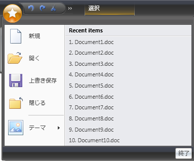

////

|metadata|
{
    "name": "xamribbon-menu",
    "controlName": ["xamRibbon"],
    "tags": ["Data Presentation","Events","Getting Started","How Do I","Navigation","Selection"],
    "guid": "{D54E8797-B6E3-4BF0-8B72-4B8340BA92F6}",  
    "buildFlags": [],
    "createdOn": "2012-01-30T19:39:54.1821895Z"
}
|metadata|
////

= メニュー

== 概要

Menu ツールは、ポップアップ内に含まれるツール項目を表示する ItemsControl 派生コントロールです。RibbonGroup に直接追加するか、ToolVerticalWrapPanel、ToolHorizontalWrapPanel、または ButtonGroup 内にネストすることができます。別の Menu ツール、アプリケーション メニュー、アプリケーション メニューの RecentItems コレクション、またはアプリケーション メニューのフッター ツールバーにツール項目として追加することもできます。

標準のツール プロパティに加えて、MenuTool は MenuItemDescription および HasMenuItemDescription 添付プロパティを公開します。これは含まれている項目に適用されます。

たとえば、以下のスクリーンショットは、ApplicationMenu 内の MenuTool の例を示します。

xamRibbon コントロールを使用してアプリケーションでこれを達成するには、ひとつの MenuTool (テーマ) が後ろに続く 4 つの ButtonTools (新規、開く、保存、閉じる) を xamRibbon のアプリケーション メニューに追加します。

'Theme' MenuTool 内で 3 つの ButtonTools を追加します。アイコンを供給するために各 ButtonTool の LargeImage プロパティ、タイトル (たとえば、'Blue') を供給するために Caption プロパティ、そして説明 (たとえば、'Office2007 Blue テーマを使用') を供給するために MenuTool.MenuItemDescription 添付プロパティを設定します。

メニュー ツールの MenuItemDescriptionMinWidth プロパティは、説明領域をどの程度の幅にするかを制御するためにも設定できます。

以下の XAML はこれらのプロパティの設定方法を説明します。

*XAML の場合:*

----
<igRibbon:XamRibbonWindow x:Class="MyRibbonApp.Window1"
  xmlns="http://schemas.microsoft.com/winfx/2006/xaml/presentation"
  xmlns:x="http://schemas.microsoft.com/winfx/2006/xaml"
  xmlns:igRibbon="http://infragistics.com/Ribbon"
  xmlns:igEditors="http://infragistics.com/Editors"
  xmlns:igWindows="http://infragistics.com/Windows"
  Title="MyRibbonWindow" Height="300" Width="300"
  >
	<igRibbon:XamRibbonWindow.Ribbon>
		<igRibbon:XamRibbon>
			<igRibbon:XamRibbon.ApplicationMenu>
				<igRibbon:ApplicationMenu>
					<igRibbon:ButtonTool
					  Caption="_New"
					  Command="{x:Static ApplicationCommands.New}"/>
					<igRibbon:MenuTool
					  Caption="_Theme"
					  ButtonType="Segmented"
					  LargeImage="\Images\Theme.png"
					  MenuItemDescriptionMinWidth="220">
						<igRibbon:ButtonTool
					  	  Caption="Blue"
					  	  LargeImage="\Images\BlueTheme.png"
					  	  igRibbon:MenuToolBase.MenuItemDescription="Use an Office2007 Blue theme"
						  />
					</igRibbon:MenuTool>
				</igRibbon:ApplicationMenu>
			</igRibbon:XamRibbon.ApplicationMenu>
		</igRibbon:XamRibbon>
	</igRibbon:XamRibbonWindow.Ribbon>
	<Grid>
		...
	</Grid>
	<igRibbon:XamRibbonWindow.StatusBar>
		<StatusBar>
		</StatusBar>
	</igRibbon:XamRibbonWindow.StatusBar>
</igRibbon:XamRibbonWindow>
----

== プロパティ

標準ツール プロパティに加えて (たとえば、Caption、HasCaption、Id、KeyTip、LargeImage など)、Menu ツールは以下の補足プロパティを公開します。

* ButtonType - 以下の値がある MenuToolButtonType 列挙体:

** DropDown (デフォルト) - メニュー ツールの任意の場所をマウスの左ボタンでクリックすると、ツールの IsOpen プロパティを切り替えて、Closed イベントまたは Opening/Opened イベントの組み合わせを発生させます。

** Segmented - ツールは 2 つのボタン領域に分割されます。ひとつの領域でマウスの左ボタンでクリックすると、ツールの IsOpen プロパティを切り替えて、Closed イベントまたは Opening/Opened イベントの組み合わせを発生させます。マウスの左ボタンで他の領域をクリックすると、ツールの Click イベントが起動されます。

[NOTE]
====
*注:* このイベントはマウスアップで起動されます。
====

** SegmentedState - ツールは 2 つのボタン領域に分割されます。ひとつの領域でマウスの左ボタンでクリックすると、ツールの IsOpen プロパティを切り替えて、Closed イベントまたは Opening/Opened イベントの組み合わせを発生させます。マウスの左ボタンで他の領域をクリックすると、ツールの Checked または Unchecked イベントが起動されます。

[NOTE]
====
*注:* これらのイベントはマウスアップで起動されます。
====

* Command、CommandTarget、CommandParameter -- これらは、標準 ButtonBase クラスの同じプロパティに対応します。
* IsChecked - この Boolean プロパティは、ButtonType プロパティが「SegmentedState」に設定されている場合に限って適用されます。
* IsOpen - この Boolean プロパティは、ポップアップの開いた状態を反映します。
* KeyTipForSegmentedButton - セグメント化されたボタンには 2 つのキーチップがあるので、このプロパティは ButtonType が「SegmentedState」である場合に Click イベントを起動するか、'IsChecked' 状態を切り替えるボタンに適用されるキーチップを設定します。
* MenuItemDescription - この添付文字列プロパティは、メニュー内のツール項目の説明を設定するために使用されます。説明領域を表示/非表示にするためにテンプレート トリガーで使用できる対応する読み取り専用 Boolean 'HasMenuItemDescription' プロパティがあります。
* MenuItemDescriptionMinWidth - タイプ Double のこのプロパティは、子メニュー項目の幅をどの程度にするかを決定する手助けをします。すべての項目の幅は、各項目の Image と Caption を考慮して最も広い幅の項目の幅となります。最も広い幅のキャプションが MenuItemDescriptionMinWidth よりも小さくなる場合、MenuItemDescriptionMinWidth の値がキャプション領域をサイズ設定するために使用されます。
* ShouldDisplayGalleryPreview - この Boolean プロパティが True に設定されている場合 (デフォルトでは False)、MenuTool が RibbonGroup 内にあれば、このギャラリー ツール プレビューが表示されます。

[NOTE]
====
*注:* MenuTool は 1 つの GalleryTool しか含むことができません。
====

* MenuTool が GalleryTool を含まない場合、このプロパティは無視されます。
* UseLargeImages - このプロパティは、すべての含まれるメニュー項目に大きな画像が使用されるのか、それとも小さな画像が使用されるのかを決定します。デフォルトでは、アプリケーション メニューまたはアプリケーション メニューのサブメニューのメニュー項目を除き、小さい画像がメニュー項目で使用されます。

== イベント:

Menu ツールは以下のイベントを起動します。

* Checked - このイベントは、ButtonType プロパティが「SegmentedState」に設定されている Menu ツールに限って発生します。これは Menu ツールの IsChecked プロパティが True に切り替えられると発生し、通常は、ツールのセグメント化されたボタン部分上でマウスの左ボタンをユーザーがクリックした結果です。この状態変更はマウスアップで起こります。
* Clicked - このイベントは、ButtonType プロパティが「Segmented」に設定されている Menu ツールに限って起動されます。これはツールのセグメント化されたボタン部分上でマウスの左ボタンをユーザーがクリックした時に発生します。これはマウスアップで起動されます。
* Cloned - このイベントは、Menu ツールがクローンされると起動されます。たとえば、ユーザーが Menu ツールをツールのコンテキスト メニューからクイック アクセス ツールバーに追加する場合、または Menu ツールを含む RibbonGroup をクイック アクセス ツールバーに追加する場合です。

[NOTE]
====
*注:* OriginalTool および ClonedTool に加えて、イベント引数は読み取り専用 EventHandlersAttached ブール値 プロパティを公開します。イベント ハンドラをオリジナルのツールからクローンにコピーするクローン プロセスの一部は、リフレクション権限を必要とします。したがって、サンドボックスされる XBAP アプリケーションでは、我々はそれらの権限を持ちません。この場合、適切なイベント ハンドラをここで接続することができます。
====

* CloneDiscarded - このイベントは、Menu ツールのクローンが破棄されると発生します。
* Closed - このイベントは、Menu ツールのポップアップが閉じられると発生します。
* Opening - このイベントは、Menu ツールのポップアップが開かれると発生します。Menu ツールのコンテンツの移植を、それが開かれる寸前まで遅延するために使用できます。ただし、クローンではなく、オリジナルの MenuTool の Items コレクションを修正することだけ可能です。したがって、このイベント引数で公開される Tool プロパティは、クローンが開かれているとしても、オリジナルのツールに戻ります。

[NOTE]
====
*注:* Menu ツールは、それを開くためには有効に設定された少なくともひとつの項目を持つ必要があります。Menu ツールに有効に設定されたツールが少なくともひとつなければ、開かずに無効となります。これは Microsoft Office 2007 UI ガイドラインの要件に一致しています。
====

* Opened - このイベントは、Menu ツールのポップアップが開かれた時に発生します。
* Unchecked - このイベントは、ButtonType プロパティが「SegmentedState」に設定されている Menu ツールに限って発生します。このイベントは Menu ツールの IsChecked プロパティが False に切り替えられると発生し、通常は、ツールのセグメント化されたボタン部分上でマウスの左ボタンをユーザーがクリックした結果です。この状態変更はマウスアップで起こります。