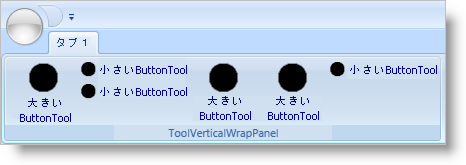
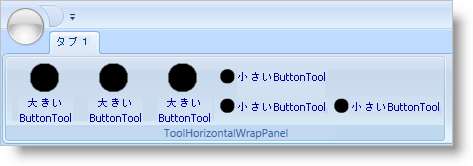
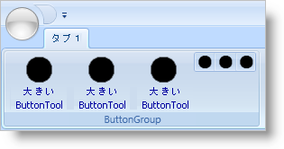

////

|metadata|
{
    "name": "xamribbon-ribbon-group-layout-panels",
    "controlName": ["xamRibbon"],
    "tags": ["Grouping","How Do I","Layouts"],
    "guid": "{EB1AB4EE-6597-403C-9F34-6519F965F95E}",  
    "buildFlags": [],
    "createdOn": "2012-01-30T19:39:54.1941919Z"
}
|metadata|
////

= リボン グループ レイアウト パネル

xamRibbon™ コントロールは、Ribbon ツールを配列するために link:{ApiPlatform}ribbon{ApiVersion}~infragistics.windows.ribbon.ribbongroup.html[RibbonGroup] 内の 3 つの特別なレイアウト コンテナを使用します。

* link:{ApiPlatform}ribbon{ApiVersion}~infragistics.windows.ribbon.toolverticalwrappanel.html[ToolVerticalWrapPanel]
* link:{ApiPlatform}ribbon{ApiVersion}~infragistics.windows.ribbon.toolhorizontalwrappanel.html[ToolHorizontalWrapPanel]
* link:{ApiPlatform}ribbon{ApiVersion}~infragistics.windows.ribbon.buttongroup.html[ButtonGroup]

ToolVerticalWrapPanel および ToolHorizontalWrapPanel コンテナは、RibbonGroup のサイズが変更される時、現在の SizingMode プロパティおよびリサイズ ツールに基づいてツールを配列する責任があります。一方、ButtonGroup コンテナの唯一の責任は、ToolVerticalWrapPanel または ToolHorizontalWrapPanel 内の機能的に関連するツールのグループにツールをまとめることです。

== ToolVerticalWrapPanel

ToolVerticalWrapPanel は、そのツールを列に配列するために RibbonGroup によって使用されるデフォルトのレイアウト コンテナです。ToolVerticalWrapPanel は、ツールを配列する時に以下の規則を使用します。

* SizingMode プロパティが link:{ApiPlatform}ribbon{ApiVersion}~infragistics.windows.ribbon.ribbontoolsizingmode.html[ImageAndTextLarge] に解決されるツールは、それ自体の列に表示され、RibbonGroup の高さ全体をスパンします。
* SizingMode プロパティが ImageAndTextNormal または ImageOnly に解決されるツールは、最大 3 つの項目の列に配列されます。列にあるツールが 3 つ未満の場合、ToolVerticalWrapPanel は列の下側を空のままにしておきます。ToolVerticalWrapPanelの link:{ApiPlatform}ribbon{ApiVersion}~infragistics.windows.ribbon.toolverticalwrappanel~verticaltoolalignment.html[VerticalToolAlignment] プロパティを設定して、このデフォルト設定をオーバーライドできます。

== ToolHorizontalWrapPanel

ToolHorizontalWrapPanel はツールを行に配列します。行のデフォルト最小数は 2 で、行のデフォルト最大数は 3 ですが、これらのデフォルトを link:{ApiPlatform}ribbon{ApiVersion}~infragistics.windows.ribbon.toolhorizontalwrappanel~minrows.html[MinRows] および link:{ApiPlatform}ribbon{ApiVersion}~infragistics.windows.ribbon.toolhorizontalwrappanel~maxrows.html[MaxRows] プロパティをそれぞれ設定して変更できます。ToolHorizontalWrapPanel は、ツールを配列する時に以下の規則を使用します。

* ツールで link:{ApiPlatform}ribbon{ApiVersion}~infragistics.windows.ribbon.ribbongroup~maximumsizeproperty.html[MaximumSize] 添付プロパティを ImageAndTextLarge に設定すると、ツールはソートされ、パネルの先頭に表示されます。これらのツールはリサイズに関わらず、大きなツールとして残ります。
* SizingMode プロパティが ImageAndTextNormal または ImageOnly に解決されるツールは、パネルの行内に表示されます。

RibbonGroup をリサイズしてパネルが MinRows プロパティより多くの行にツールを配列すると、 link:{ApiPlatform}ribbon{ApiVersion}~infragistics.windows.ribbon.toolhorizontalwrappanel~sortorderproperty.html[SortOrder] 添付プロパティを設定してツールのソートを選択できます。パネル内のツールに SortOrder 添付プロパティを設定しなければ、ツールは元の順序のままになります。

== ButtonGroup

ButtonGroup は他の 2 つのレイアウト コンテナ内に一つ以上のツールをグループ化するために使用できる特別なレイアウト コンテナです。これは、xamRibbon のリサイズ時に RibbonGroup 内でツールが分離されないように機能に関連するツールのグループ化するために役立ちます。ButtonGroup 内に配置されるツールは、ImageOnly に解決された SizingMode を持ちます。

興味がある場合、xamRibbon のレイアウト パネルについての詳細は、以下のトピックを参照してください。

* link:xamribbon-add-a-toolhorizontalwrappanel-to-a-ribbongroup.html[ToolHorizontalWrapPanel を RibbonGroup に追加]
* link:xamribbon-add-tools-to-a-buttongroup.html[ツールを ButtonGroup に追加]
* link:xamribbon-specify-a-sortorder-for-tools-in-a-toolhorizontalwrappanel.html[ツールの SortOrder を ToolHorizontalWrapPanel で指定]