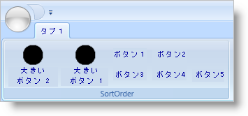
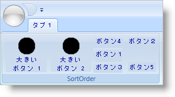

////

|metadata|
{
    "name": "xamribbon-specify-a-sortorder-for-tools-in-a-toolhorizontalwrappanel",
    "controlName": ["xamRibbon"],
    "tags": ["How Do I","Layouts","Sorting"],
    "guid": "{028D8F8F-82D7-418B-89B4-3BCC60B6C606}",  
    "buildFlags": [],
    "createdOn": "2012-01-30T19:39:54.2151961Z"
}
|metadata|
////

= ツールの SortOrder を ToolHorizontalWrapPanel で指定

link:{ApiPlatform}ribbon{ApiVersion}~infragistics.windows.ribbon.ribbongroup.html[RibbonGroup] の幅が小さくなると、RibbonGroup の新しい境界内にすべてのツールを表示するために、 link:{ApiPlatform}ribbon{ApiVersion}~infragistics.windows.ribbon.toolhorizontalwrappanel.html[ToolHorizontalWrapPanel] はそのツールを追加行にラップする場合があります。この再配置段階でツールの順序を制御したい場合、 link:{ApiPlatform}ribbon{ApiVersion}~infragistics.windows.ribbon.toolhorizontalwrappanel~sortorderproperty.html[SortOrder] 添付プロパティを設定できます。ToolHorizontalWrapPanel は、必要となる行数が link:{ApiPlatform}ribbon{ApiVersion}~infragistics.windows.ribbon.toolhorizontalwrappanel~minrows.html[MinRows] プロパティによって指定された行数を超える場合に限ってツールをソートします。

ToolHorizontalWrapPanel は、SortOrder 添付プロパティの値に基づいて昇順でツールをソートします。ただし、大きなツール (link:{ApiPlatform}ribbon{ApiVersion}~infragistics.windows.ribbon.ribbongroup~maximumsizeproperty.html[MaximumSize] 添付プロパティが link:{ApiPlatform}ribbon{ApiVersion}~infragistics.windows.ribbon.ribbontoolsizingmode.html[ImageAndTextLarge] に設定された) および小さいツール (SizingMode が ImageAndTextNormal または ImageOnly に解決された) の間の分離は、ソート順序よりも優先されます。ツールに SortOrder 添付プロパティを設定しなければ、ソート プロセスに加わりません。

たとえば、本トピックの終わりにあるコード例のように ToolHorizontalWrapPanel を構成している場合、ToolHorizontalWrapPanel は以下の手順を使用してツールを追加行に配列し直します。

[start=1]
. SortOrder 添付プロパティ値を持つ大きなツール (MaximumSize 添付プロパティが ImageAndTextLarge に設定された) をソートします。
[start=2]
. それぞれのソートされた大きなツールをそれ自体の列に配置します。これで、キャプション 'Large Button 1' の link:{ApiPlatform}ribbon{ApiVersion}~infragistics.windows.ribbon.buttontool.html[ButtonTool] が 1 番目になり、キャプション 'Large Button 2' の ButtonTool が 2 番目になります。
[start=3]
. 残りの大きなツールを手順 2 でソートしたツールの横に配置します。ToolHorizontalWrapPanel が作成する行数に関係なく、手順 1、2、および 3 が実行されます。
[start=4]
. SortOrder 添付プロパティ値を持つ小さいツール (SizingMode プロパティが ImageAndTextNormal または ImageOnly に解決された) をソートします。これで、キャプション 'Button 4' の ButtonTool が 1 番目となり、キャプション 'Button 2' の ButtonTool が 2 番目になります。
[start=5]
. ソートされた小さいツールを最初の行から開始する行に配置します。
[start=6]
. ソート プロセスに参加しなかった残りの小さいツールを残りの行に配置します。

以下のスクリーンショットは、RibbonGroup がリサイズされる前または後の ToolHorizontalWrapPanel でのツールの順序を説明しています。

以下のコード例は、ToolHorizontalWrapPanel のツールに SortOrder 添付プロパティを設定する方法を示します。

*XAML の場合:*

----
...
<!--TODO: 開発者自身の画像で置き換えます。-->
<igRibbon:ToolHorizontalWrapPanel>        
        <igRibbon:ButtonTool 
                Caption="Large Button 2" 
                LargeImage="32x32.png" 
                igRibbon:RibbonGroup.MaximumSize="ImageAndTextLarge" 
                igRibbon:ToolHorizontalWrapPanel.SortOrder="2" />
        <igRibbon:ButtonTool Caption="Button 1" />
        <igRibbon:ButtonTool 
                Caption="Button 2" 
                igRibbon:ToolHorizontalWrapPanel.SortOrder="2" />
        <igRibbon:ButtonTool Caption="Button 3" />
        <igRibbon:ButtonTool 
                Caption="Button 4" 
                igRibbon:ToolHorizontalWrapPanel.SortOrder="1" />
        <igRibbon:ButtonTool Caption="Button 5" />
        <igRibbon:ButtonTool 
                Caption="Large Button 1" 
                LargeImage="32x32.png" 
                igRibbon:RibbonGroup.MaximumSize="ImageAndTextLarge" 
                igRibbon:ToolHorizontalWrapPanel.SortOrder="1" />            
</igRibbon:ToolHorizontalWrapPanel>
...
----

*Visual Basic の場合:*

----
Imports Infragistics.Windows.Ribbon
...
Dim bt As New ButtonTool()
bt.Caption = "Large Button 2"
ToolHorizontalWrapPanel.SetSortOrder(bt, 2)
...
----

*C# の場合:*

----
using Infragistics.Windows.Ribbon;
...
ButtonTool bt = new ButtonTool();
bt.Caption = "Large Button 2";
ToolHorizontalWrapPanel.SetSortOrder(bt, 2);
...
----

== 関連トピック

link:xamribbon-add-a-toolhorizontalwrappanel-to-a-ribbongroup.html[ToolHorizontalWrapPanel を RibbonGroup に追加]

link:xamribbon-add-tools-to-a-buttongroup.html[ツールを ButtonGroup に追加]