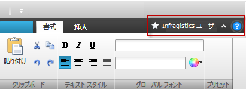
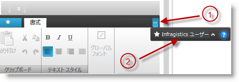

////

|metadata|
{
    "name": "xamribbon-tab-item-area-toolbar",
    "tags": ["Getting Started","How Do I","Layouts"],
    "controlName": ["xamRibbon"],
    "guid": "c0604eda-992e-47b2-8c77-60b884b9afb3",  
    "buildFlags": [],
    "createdOn": "2014-03-21T12:51:46.9108341Z"
}
|metadata|
////

= タブ項目領域ツールバー (xamRibbon)

== トピックの概要

=== 目的

このトピックでは、タブ項目の隣にツールバー エリアを作成して構成する方法を説明します。

=== 前提条件

このトピックをより理解するために、以下のトピックを参照することをお勧めします。

[options="header", cols="a,a"]
|====
|トピック|目的

| link:xamribbon-about-xamribbon.html[xamRibbon について]
|このトピックでは、 _xamRibbon_ コントロールの機能をより深く理解するうえで役立つ情報を提供します。

| link:xamribbon-ribbon-tabs.html[リボン タブ]
|このセクションの各トピックでは、 _xamRibbon_ のリボン タブ領域について説明し、これを _xamRibbon_ に追加する方法を示します。

|====

=== このトピックの内容

このトピックは、以下のセクションで構成されます。

* <<_Ref382406228,はじめに>>
* <<_Ref382406229,タブ項目領域ツールバーの作成と構成>>
* <<_Ref382406237,関連コンテンツ>>

[[_Ref382406228]]
== はじめに

=== タブ項目領域ツールバーの概要

_xamRibbon_   コントロールによって、タブの隣にツールバーを作成できます。このツールバーは、`ItemsControl` クラスから拡張され、あらゆる種類の内容をここに追加できます。

このツールバーは、タブ項目を右に配置した行に配置されます。ツールバーの内容をすべて表示するスペースが足りない場合は、一部が非表示になり、オーバーフロー ボタンが右に表示されます。このボタンをクリックすると、非表示のツールバーの内容をすべて表示したポップアップが開きます。

注:

[NOTE]
====
ツールバーの項目が非表示になり始める幅を決定する場合は、左側のタブ項目を表示するための幅の最小値を `TabItemAreaMinWidth` プロパティで指定します。
====

以下のスクリーンショットは、タブ項目領域ツールバーのある  _xamRibbon_   コントロールを示します。

以下のスクリーンショットは、オーバーフロー ポップアップが表示されている  _xamRibbon_   コントロールを示します。スペースが限られていてツールバーの全内容をタブ項目の隣に表示できないため非表示となっていた項目が、ポップアップに表示されます。

[start=1]
. オーバーフロー ボタン
[start=2]
. ポップアップに表示されたタブ項目領域ツールバー

[[_Ref382406229]]
== タブ項目領域ツールバーの作成と構成

[[_Hlk368069110]]

=== 概要

タブ項目領域ツールバーは、 link:{ApiPlatform}ribbon{ApiVersion}~infragistics.windows.ribbon.tabitemareatoolbar_members.html[TabItemAreaToolbar] クラスによって表示されます。ユーザーは、このインスタンスを作成し、xamRibbon の link:{ApiPlatform}ribbon{ApiVersion}~infragistics.windows.ribbon.tabitemareatoolbar_members.html[TabItemAreaToolbar] プロパティに設定する必要があります。`TabItemAreaToolbar` クラスは、ツールバーの構成に使用するいくつかのプロパティを提供します。これらのプロパティを以下の表に説明します。

=== プロパティ設定

以下の表は、任意の構成 / 動作とそれを管理するプロパティ設定のマップを示します。

[options="header", cols="a,a"]
|====
|目的:|以下を実行します。

|タブ項目領域ツールバーを作成します。
|`TabItemAreaToolbar` クラスのインスタンスを作成します。

|タブ項目領域ツールバーのインスタンスを _xamRibbon_ コントロールに関連付けます。
|インスタンスを xamRibbon の `TabItemAreaToolbar` プロパティに設定します。

|タブ項目領域の幅の最小値を指定 (確保) します。
|ツールバーの link:{ApiPlatform}ribbon{ApiVersion}~infragistics.windows.ribbon.tabitemareatoolbar~tabitemareaminwidth.html[TabItemAreaMinWidth] プロパティに任意の最小幅を設定します。

|オーバーフロー ボタンの表示状態を取得します。
| link:{ApiPlatform}ribbon{ApiVersion}~infragistics.windows.ribbon.toolbarwithoverflow~overflowbuttonvisibility.html[OverflowButtonVisibility] プロパティの値を取得します。

|タブ項目領域ツールバーのオーバーフロー領域を開くまたは閉じます。
| link:{ApiPlatform}ribbon{ApiVersion}~infragistics.windows.ribbon.toolbarwithoverflow~isoverflowopen.html[IsOverflowOpen] ブール値プロパティを設定または取得します。

|====

[[_Hlk337817761]]

=== 例

以下のコード例は、タブ項目領域ツールバーを作成および設定する方法を示します。

*XAML の場合:*

[source,xaml]
----
<igRibbon:XamRibbon>
    <igRibbon:XamRibbon.TabItemAreaToolbar>
        <igRibbon:TabItemAreaToolbar TabItemAreaMinWidth="150">
        <!-- ここにタブ項目領域ツールバーの内容を追加 -->            
        </igRibbon:TabItemAreaToolbar>
    </igRibbon:XamRibbon.TabItemAreaToolbar>
</igRibbon:XamRibbon>
----

[[_Ref382406237]]
== 関連コンテンツ

このトピックの追加情報については、以下のトピックも合わせてご参照ください。

[options="header", cols="a,a"]
|====
|トピック|目的

| link:xamribbon-quick-access-toolbar.html[クイック アクセス ツールバー]
|このセクションの各トピックでは、 _xamRibbon_ のクイック アクセス ツールバー領域の主要な機能について説明します。

|====
