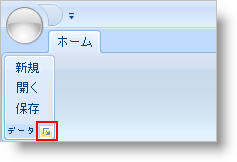

////

|metadata|
{
    "name": "xamribbon-using-the-dialog-box-launcher-to-display-a-dialog-box",
    "controlName": ["xamRibbon"],
    "tags": ["Getting Started","How Do I","Navigation","Selection"],
    "guid": "{7DB3BB05-7E42-4415-8196-872C81E2D380}",  
    "buildFlags": [],
    "createdOn": "2012-01-30T19:39:54.2261983Z"
}
|metadata|
////

= ダイアログ ボックス ランチャーを使用してダイアログ ボックスを表示

== 始める前に

リボン グループは、リボン グループのキャプションの右側の DialogBoxLauncher と呼ばれる小さいボタンを表示できます。名前が意味するように、このボタンは主にダイアログを表示したり、そのリボン グループのアプリケーション作業に関連するタスク ペインを表示するために使用されます。

リボン グループの DialogBoxLauncherTool プロパティを ButtonTool のインスタンスに設定する必要があります。

== 達成すること

リボン グループの DialogBoxLauncher ボタンを表示します。SaveFileDialog を起動するためにこの DialogBoxLauncher を使用します。

[NOTE]
====
*注:* このトピックは、 link:xamribbon-adding-xamribbon-to-your-application-.html[Extensible Application Markup Language (XAML) を使用して基本 xamRibbon を作成]する方法を知っていることを前提とします。
====

== ダイアログボックスを表示するために DialogBoxLauncherTool を使用：

[start=1]
. RibbonGroup で DialogBoxLauncherTool を宣言します。
[start=2]
. DialogBoxLauncherTool タグで ButtonTool のインスタンスを作成します。
[start=3]
. ButtonTool の ID プロパティを btnSaveDialog に設定します。ID および xamRibbon™ コントロールの GetToolById メソッドを使用して、コード ビハインドで ButtonTool への参照を取得できます。
[start=4]
. クリック イベント ハンドラを ButtonTool に接続します。以下のコード例は、btnSaveDialog_Click という名前のメソッドを使用して ButtonTool のクリック イベントを処理します。

*XAML の場合:*

----
...
<igRibbon:RibbonGroup Caption="Data">
        <igRibbon:RibbonGroup.DialogBoxLauncherTool>
                <igRibbon:ButtonTool Id="btnSaveDialog" Click="btnSaveDialog_Click" />
        </igRibbon:RibbonGroup.DialogBoxLauncherTool>
</igRibbon:RibbonGroup>
...
----

[start=5]
. コード ビハインドでは、btnSaveDialog_Click という名前のメソッドを作成します。このメソッドでは、SaveFileDialog をインスタンス化して表示します。

*Visual Basic の場合:*

----
Private Sub btnSaveDialog_Click(ByVal sender As System.Object, _
  ByVal e As System.Windows.RoutedEventArgs)
        Dim dialog As New Microsoft.Win32.SaveFileDialog()
        If dialog.ShowDialog() = True Then
                'TODO: ファイル保存ロジックを追加します。
        End If
End Sub
----

*C# の場合:*

----
private void btnSaveDialog_Click(object sender, RoutedEventArgs e)
{
        Microsoft.Win32.SaveFileDialog dialog = 
          new Microsoft.Win32.SaveFileDialog();
        if(dialog.ShowDialog() == true)
        {
                //TODO: ファイル保存ロジックを追加します。
        }
}
----

[start=6]
. アプリケーションを実行し、キャプションが Data のリボン グループの DialogBoxLauncher ボタンをクリックします。

== 関連トピック

link:xamribbon-about-group-resizing.html[リボン グループのリサイズについて]

link:xamribbon-add-a-ribbon-group-to-a-ribbon-tab.html[リボン タブにリボン グループを追加]