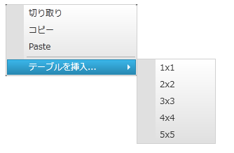

////

|metadata|
{
    "name": "xamrichtexteditor-managing-context-menu",
    "tags": ["Editing","How Do I","Layouts"],
    "controlName": ["xamRichTextEditor"],
    "guid": "8961a6ee-2855-4f8d-afb7-b0927f450ca1",  
    "buildFlags": [],
    "createdOn": "2016-05-25T18:21:58.5563083Z"
}
|metadata|
////

= コンテキスト メニューの管理 (xamRichTextEditor)

== トピックの概要

=== 目的

このトピックは、 link:{ApiPlatform}controls.editors.xamrichtexteditor{ApiVersion}~infragistics.controls.editors.xamrichtexteditor.html[ _xamRichTextEditor_  ]™ のコンテキスト メニューを管理する方法を説明します。

=== 前提条件

このトピックをより理解するために、以下のトピックを参照することをお勧めします。

[options="header", cols="a,a"]
|====
|トピック|目的

| link:xamrichtexteditor-features-overview.html[機能の概要]
|このトピックでは、 _xamRichTextEditor_ コントロールがサポートする機能の概要を説明します。

| link:xamrichtexteditor-content-structure.html[コンテンツの構造]
|このトピックは、 _xamRichTextEditor_ でコンテンツをプログラム処理する際に必要なドキュメントのコンテンツ論理構造を説明します。

| link:xamrichtexteditor-adding-to-your-page.html[xamRichTextEditor をページに追加]
|このトピックでは、 _xamRichTextEditor_ を短時間で起動、実行するために役立つ詳細な操作方法を紹介します。

|====

=== このトピックの内容

このトピックは、以下のセクションで構成されます。

* <<_Ref368490243,はじめに>>
* <<_Ref368490549,コンテキスト メニューのカスタマイズ>>
* <<_Ref368490553,関連コンテンツ>>

[[_Ref368490243]]
== はじめに

=== コンテキスト メニューの概要

_xamRichTextEditor_   コントロールは、クリップボード操作やテーブル作成ができるコンテキスト メニューをサポートしています。コンテキスト メニューのコンテンツのカスタマイズまたは非表示ができます。詳細はこのトピックの後で説明します。

以下のスクリーンショットは、開いた  _xamRichTextEditor_   コンテキスト メニューを示しています。

[[_Ref368490549]]
== コンテキスト メニューのカスタマイズ

=== 概要

_xamRichTexEditor_   では、 link:{ApiPlatform}controls.editors.xamrichtexteditor{ApiVersion}~infragistics.controls.editors.xamrichtexteditor~contextmenuopening_ev.html[ContextMenuOpening] と呼ばれるキャンセル可能なイベントを公開しています。このイベントはコンテキスト メニューの非表示、またはコンテキスト メニューのコンテンツのカスタマイズができます。どちらの場合も、`ContextMenuOpening` イベントにイベント ハンドラーを割り当てます。さらに、 link:{ApiPlatform}controls.editors.xamrichtexteditor{ApiVersion}~infragistics.controls.editors.contextmenuopeningeventargs.html[ContextMenuOpeningEventArgs] 引数をイベントハンドラーに渡す必要があります。

=== プロパティ設定

以下の表は、任意の動作と各プロパティ設定のマップを示します。

[options="header", cols="a,a,a"]
|====
|目的:|使用するプロパティ / コレクション:|操作:

|コンテキスト メニューの非表示
| link:{ApiPlatform}controls.editors.xamrichtexteditor{ApiVersion}~infragistics.controls.editors.contextmenuopeningeventargs~cancel.html[ContextMenuOpeningEventArgs.Cancel]
|true に設定する

|コンテキスト メニューのコンテンツの変更
| link:{ApiPlatform}controls.editors.xamrichtexteditor{ApiVersion}~infragistics.controls.editors.contextmenuopeningeventargs~contextmenu.html[ContextMenuOpeningEventArgs.ContextMenu]
| link:http://msdn.microsoft.com/query/dev10.query?appId=Dev10IDEF1&l=EN-US&k=k(System.Windows.Controls.ItemsControl.Items)&rd=true[Items] コレクションを編集します (link:{ApiPlatform}controls.menus.xammenu{ApiVersion}~infragistics.controls.menus.xammenuitem.html[XamMenuItem] の追加 / 削除 / 編集)

|====

[[_Ref368490553]]
== 関連コンテンツ

=== トピック

このトピックの追加情報については、以下のトピックも合わせてご参照ください。

[options="header", cols="a,a"]
|====
|トピック|目的

| link:xamrichtexteditor-configuring-overview.html[xamRichTextEditor の概要の構成]
|このトピックでは、 _xamRichTextEditor_ コントロールで複数の有用なコンテンツ編集機能を構成する方法を説明します。

| link:xammenu-adding-and-removing-items.html[項目の追加と削除]
|このトピックでは、xamMenuItem を追加/削除する方法について説明します。

|====