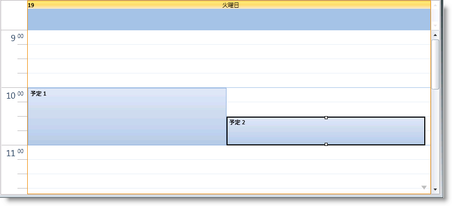

////
|metadata|
{
    "name": "xamschedule-getting-started",
    "controlName": ["xamSchedule"],
    "tags": ["Getting Started","How Do I","Scheduling"],
    "guid": "4b32ea6a-5ba3-40f3-b88b-897bb1f1e1e6",
    "buildFlags": [],
    "createdOn": "2016-05-25T18:21:58.6443227Z"
}
|metadata|
////

= xamSchedule をページに追加

== 始める前に

XamSchedule によってスケジュール データを表示および編集できます。このデータは異なるタイプの link:{ApiPlatform}controls.schedules{ApiVersion}~infragistics.controls.schedules.activitybase.html[アクティビティ] (この詳細なガイドでは link:{ApiPlatform}controls.schedules{ApiVersion}~infragistics.controls.schedules.appointment.html[予定]) で構成されており、あらゆるアクティビティは所有するリソースと所有するカレンダーを持っています。ビューに予定を表示するために (link:{ApiPlatform}controls.schedules{ApiVersion}~infragistics.controls.schedules.xamdayview.html[dayView] コントロールは以下のコードで使用される)、 link:{ApiPlatform}controls.schedules{ApiVersion}~infragistics.controls.schedules.listscheduledataconnector.html[ListScheduleDataConnector] が使用されデータを link:{ApiPlatform}controls.schedules{ApiVersion}~infragistics.controls.schedules.xamscheduledatamanager.html[XamScheduleDataManager] に移植します。

== 達成すること

プロシージャー コードで xamSchedule コントロールとデータ マネージャーを定義する方法を学習します。

== 次の手順を実行します

[start=1]
. Microsoft® {PlatformName}® ページを作成します。
[start=2]
. 以下の NuGet パッケージ参照をアプリケーションに追加します。

** Infragistics.WPF.Schedules
** Infragistics.WPF.Schedules.Dialogs

[start=3]
. ページを作成し、xamSchedule の名前空間の宣言を追加します。

*XAML の場合:*

[source,xaml]
----
xmlns:ig="http://schemas.infragistics.com/xaml"
----

*Visual Basic の場合:*

[source,vb]
----
Imports Infragistics.Controls.Schedules
----

*C# の場合:*

[source,csharp]
----
using Infragistics.Controls.Schedules;
----

[start=4]
. XAML ページのメインのグリッド タグを PageRoot と名付けることにより、コードビハインドからアクセスできます。

*XAML の場合:*

[source,xaml]
----
<Grid Name="PageRoot"> 
</Grid>
----

[start=5]
. リソースとカレンダーをコードビハインドに作成します。

*Visual Basic の場合:*

[source,vb]
----
Dim resources As New ObservableCollection(Of Resource)()
Dim resAmanda As New Resource() With { _
        Key .Id = "own1", _
        Key .Name = "Amanda" _
}
resources.Add(resAmanda)
Dim calendars As New ObservableCollection(Of ResourceCalendar)()
Dim calAmanda As New ResourceCalendar() With { _
        Key .Id = "cal1", _
        Key .OwningResourceId = "own1" _
}
calendars.Add(calAmanda)
----

*C# の場合:*

[source,csharp]
----
ObservableCollection<Resource> resources =
    new ObservableCollection<Resource>();
Resource resAmanda = new Resource() { Id = "own1", Name = "Amanda" };
resources.Add(resAmanda);
ObservableCollection<ResourceCalendar> calendars =
    new ObservableCollection<ResourceCalendar>(); 
ResourceCalendar calAmanda = new ResourceCalendar()
{
    Id = "cal1",
    OwningResourceId = "own1"
};
calendars.Add(calAmanda);
----

注: カレンダーの所有するリソース ID はリソース ID と同じです。

[start=6]
. その中に 2 つの項目がある予定のリストを作成します。

*Visual Basic の場合:*

[source,vb]
----
Dim appointments As New ObservableCollection(Of Appointment)()
        ' タイムゾーンはこのスニペットで設定しないため、
        ' 日付をグリニッジ標準時へ変換します 
Dim app1 As New Appointment() With { _
        Key .Id = "t1", _
        Key .OwningResourceId = "own1", _
        Key .OwningCalendarId = "cal1", _
        Key .Subject = "Appointment 1", _
        Key .Description = "My first appointment", _
        Key .Start = DateTime.Today.AddHours(9).AddMinutes(12).
            ToUniversalTime(), _
        Key .[End] = DateTime.Today.AddHours(11).AddMinutes(42).
            ToUniversalTime() _
}
appointments.Add(app1)
        ' 日付を標準時に変更します
        ' このコードでタイム ゾーンが設定されていないからです    
Dim app2 As New Appointment() With { _
        Key .Id = "t2", _
        Key .OwningResourceId = "own1", _
        Key .OwningCalendarId = "cal1", _
        Key .Subject = "Appointment 2", _
        Key .Description = "My second appointment", _
        Key .Start = DateTime.Today.AddHours(10).AddMinutes(12).
            ToUniversalTime(), _
        Key .[End] = DateTime.Today.AddHours(11).AddMinutes(42).
            ToUniversalTime() _
}
appointments.Add(app2)
----

*C# の場合:*

[source,csharp]
----
ObservableCollection<Appointment> appointments =
    new ObservableCollection<Appointment>(); 
Appointment app1 = new Appointment()
{
    Id = "t1",
    OwningResourceId = "own1",
    OwningCalendarId = "cal1",
    Subject = "Appointment 1",
    Description = "My first appointment",
    // タイムゾーンはこのスニペットで設定しないため、
    // 日付をグリニッジ標準時へ変換します    
    Start = DateTime.Today.AddHours(9).AddMinutes(12).ToUniversalTime(),
    End = DateTime.Today.AddHours(11).AddMinutes(42).ToUniversalTime()
};
appointments.Add(app1);
Appointment app2 = new Appointment()
{
    Id = "t2",
    OwningResourceId = "own1",
    OwningCalendarId = "cal1",
    Subject = "Appointment 2",
    Description = "My second appointment",
    // タイムゾーンはこのスニペットで設定しないため、
    // 日付をグリニッジ標準時へ変換します    
    Start = DateTime.Today.AddHours(10).AddMinutes(12).ToUniversalTime(),
    End = DateTime.Today.AddHours(11).AddMinutes(42).ToUniversalTime()
};
appointments.Add(app2);
----

注: リソースとカレンダーは前の手順で定義したため、2 つの予定のリソース id とカレンダー id は同じです。

[start=7]
. コードビハインドを使用して ListScheduleDataConnector を追加、作成する場合、XAML ページのメイン グリッドまたはページコンストラクターが必要です。リソース リスト、カレンダー、予定をアタッチします。

*XAML の場合:*

[source,xaml]
----
<ig:ListScheduleDataConnector x:Name="dataConnector" />
----

*Visual Basic の場合:*

[source,vb]
----
Dim dataConnector As New ListScheduleDataConnector()
dataConnector.ResourceItemsSource = resources
dataConnector.ResourceCalendarItemsSource = calendars
dataConnector.AppointmentItemsSource = appointments
----

*C# の場合:*

[source,csharp]
----
ListScheduleDataConnector dataConnector =
    new ListScheduleDataConnector();
dataConnector.ResourceItemsSource = resources;
dataConnector.ResourceCalendarItemsSource = calendars;
dataConnector.AppointmentItemsSource = appointments;
----

[start=8]
. xamScheduleDataManager を作成し、DataConnector プロパティをデータ コネクターにバインドします。CalendarGroups コレクションにひとつの link:{ApiPlatform}controls.schedules{ApiVersion}~infragistics.controls.schedules.calendargroup.html[CalendarGroup] を作成します。link:{ApiPlatform}controls.schedules{ApiVersion}~infragistics.controls.schedules.calendargroup~initialcalendarids.html[InitialCalendarIds] プロパティには、表示されるカレンダーを指定するコンマで区切られた値を含むことができます。メインのカレンダーが表示対象である場合、フォーマットは owningResourceId[calendarId] または owningResourceId です。

例: InitialCalendarIds=“own2, own1[cal1]”

*XAML の場合:*

[source,xaml]
----
<ig:XamScheduleDataManager x:Name="dataManager"
             DataConnector="{Binding ElementName=dataConnector}">
     <ig:XamScheduleDataManager.CalendarGroups>
         <ig:CalendarGroup InitialCalendarIds="own1[cal1]"/>
     </ig:XamScheduleDataManager.CalendarGroups>
</ig:XamScheduleDataManager>
----

[start=9]
. カレンダー グループを作成し、初期カレンダーを設定します。

*Visual Basic の場合:*

[source,vb]
----
Dim dataManager As New XamScheduleDataManager()
dataManager.DataConnector = dataConnector
Dim calGroups As CalendarGroupCollection = _
    dataManager.CalendarGroups
Dim calGroup As New CalendarGroup()
calGroup.InitialCalendarIds = "own1[cal1]"
calGroups.Add(calGroup)
----

*C# の場合:*

[source,csharp]
----
XamScheduleDataManager dataManager = new XamScheduleDataManager(); 
dataManager.DataConnector = dataConnector;
CalendarGroupCollection calGroups = dataManager.CalendarGroups;
CalendarGroup calGroup = new CalendarGroup();
calGroup.InitialCalendarIds = "own1[cal1]";
calGroups.Add(calGroup);
----

注: 複数のカレンダーが関連付けられているリソースがあることに注意してください。そのため、どのカレンダーを使用するのかを指定します。カレンダーを指定しない場合、カレント ユーザーが第一に使用されます。

[start=10]
. 最後に、xamSchedule DayView を作成し、データ マネージャーを添付して、手順 4 で名前を指定した「PageRoot」グリッドに追加します。

*XAML の場合:*

[source,xaml]
----
<ig:XamDayView x:Name="dayView"
DataManager="{Binding ElementName=dataManager}" />
----

*Visual Basic の場合:*

[source,vb]
----
Dim dayView As New XamDayView()
dayView.DataManager = dataManager
Me.PageRoot.Children.Add(dayView)
----

*C# の場合:*

[source,csharp]
----
XamDayView dayView = new XamDayView();
dayView.DataManager = dataManager;
this.PageRoot.Children.Add(dayView);
----

[start=11]
. アプリケーションを保存して実行します。作成したばかりの予定を見つけるためにビューを下にスクロールします。 

