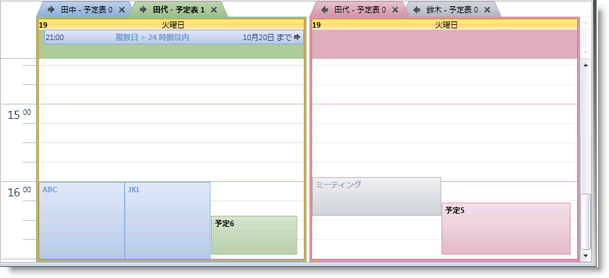
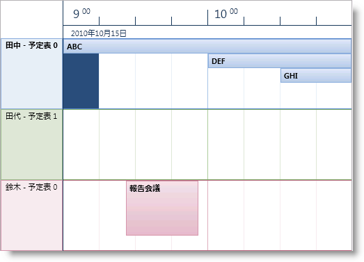
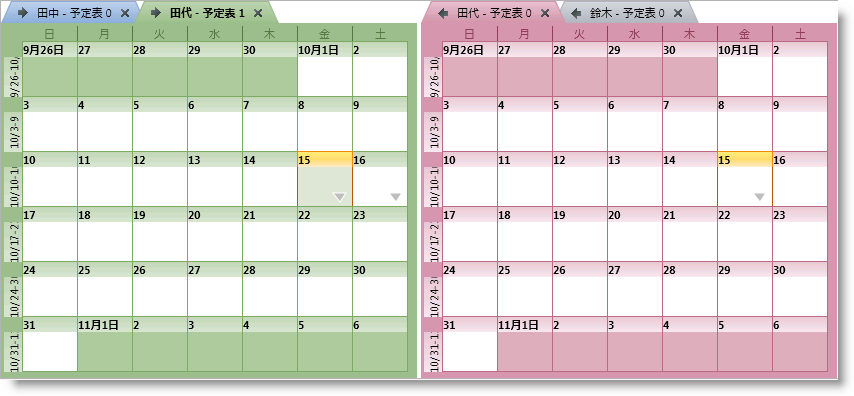
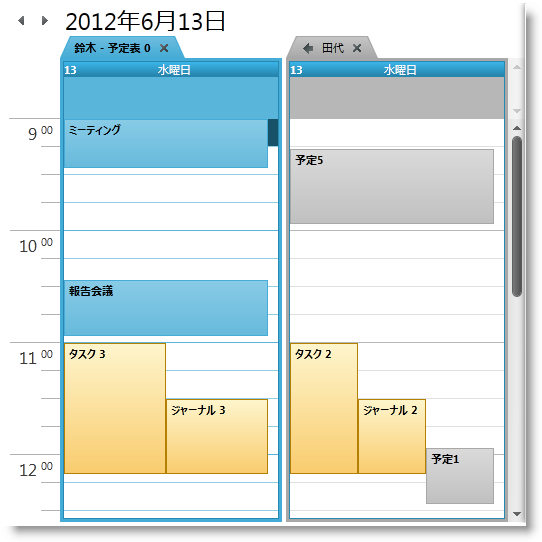
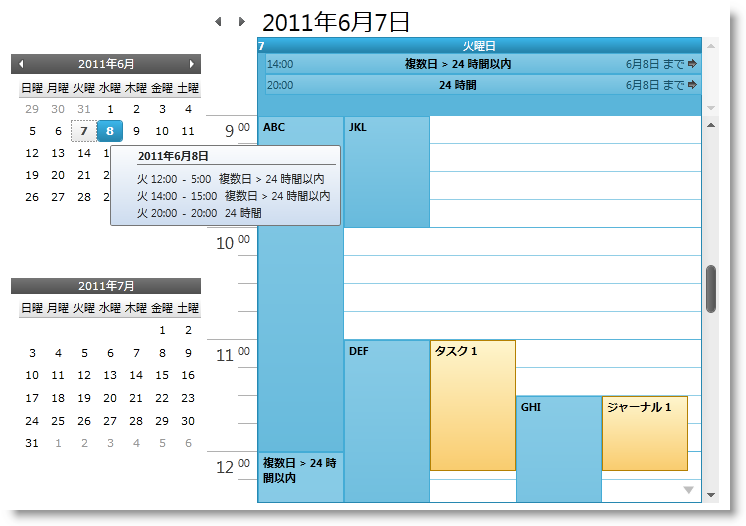

////

|metadata|
{
    "name": "xamschedule-understanding-views",
    "controlName": ["xamSchedule"],
    "tags": ["Scheduling"],
    "guid": "47db0c8b-16d3-491c-9b17-dfda2a8bc490",  
    "buildFlags": [],
    "createdOn": "2016-05-25T18:21:58.6253206Z"
}
|metadata|
////

= xamSchedule ビューについて

このトピックは、xamSchedule コントロールによってサポートされるビューを提供します。

* xamDayView
* xamScheduleView
* xamMonthView
* xamOutlookCalendarView
* xamDateNavigator

== 概要

コントロールの xamSchedule ファミリは、 link:{ApiPlatform}controls.schedules{ApiVersion}~infragistics.controls.schedules.xamdayview.html[日単位の表示]、 link:{ApiPlatform}controls.schedules{ApiVersion}~infragistics.controls.schedules.xammonthview.html[月単位の表示]などのように、異なる観点からカレンダー アクティビティを視覚化する一連のビューを提供します。各ビューを個別の link:{ApiPlatform}controls.schedules{ApiVersion}~infragistics.controls.schedules.xamscheduledatamanager.html[データ マネージャー]に添付することも可能ですが、多くのビューは単一の Data Manager を共有して異なる方法で同じアクティビティを提示することができます。このビューによって、アクティビティを視覚化する方法のカスタマイズが可能です。これによって各ビューには固有の特性があります。それに加えて、ユーザーは各ビューのユーザー インターフェイス (UI) を介してアクティビティを操作できます。

== xamSchedule ビューの説明

以下は、xamSchedule コントロールによってサポートされるビューの説明です。

link:{ApiPlatform}controls.schedules{ApiVersion}~infragistics.controls.schedules.xamdayview.html[xamDayView] - カレンダーの時間ベースのビューを提供します。このビューで 1 日の時間は上から下に縦にリストされ、アクティビティは横に配列されます。このビューの「ビルディング ブロック」は時間帯セグメントです。これらのセグメントは、開発者によって指定された等しい長さになります。1 日または複数日のアクティビティを示します (VisibleDates コレクションのエントリに基づいて) (図 1)

図 1: xamDayView コントロールの実装例
link:{ApiPlatform}controls.schedules{ApiVersion}~infragistics.controls.schedules.xamscheduleview.html[xamScheduleView] - リソースとカレンダーで縦に整理して連続した横の表示で 1 日または複数日のアクティビティを示します (VisibleDates コレクションでのエントリーに基づいて) (図 2)

図 2: xamScheduleView コントロールの実装例
link:{ApiPlatform}controls.schedules{ApiVersion}~infragistics.controls.schedules.xammonthview.html[xamMonthView] - カレンダーの週ベースのビューを提供します。その月の週は上から下に縦に配列され、週の日は横に配列されます。最高 6 週間のアクティビティを、VisibleDates コレクションのエントリに基づいて表示できます(図 3)

図 3: xamMonthView コントロールの実装例
link:{ApiPlatform}controls.schedules{ApiVersion}~infragistics.controls.schedules.xamoutlookcalendarview.html[xamOutlookCalendarView] - このビューは前述の 3 つのビューをひとつの使いやすいシェルに結合することで、ユーザーが統合されたナビゲーション ヘッダーを使用してビューを切り替えてナビゲートできるようにします(図 4)

図 4: xamOutlookCalendarView コントロールの実装例
link:{ApiPlatform}controls.schedules{ApiVersion}~infragistics.controls.schedules.xamdatenavigator.html[xamDateNavigator] - これは、xamOutlookCalendarView コントロールと一緒によく使用される特別なタイプのビューです (これは Outlook のカレンダー ビューの左側に配置された Outlook のカレンダー ナビゲーターによって提供されるのと同じ機能です)。DateNavigator をスタンドアローン ビューで使用することも可能です。この場合、マウスが日の上に置かれると表示するツールチップに関連付けられた DataManager の各アクティビティに関する情報を表示するように構成できます(図 5)

図 5: xamOutlookCalendarView と xamDateNavigator を結合した実装例

== 関連トピック

link:xamschedule-understanding-data-connector.html[データ コネクターについて]

link:xamschedule-understanding-data-manager.html[データ マネージャーについて]

link:xamschedule-understanding-resources-calendars.html[リソースおよびカレンダーについて]

link:xamschedule-understanding-activities.html[アクティビティについて]