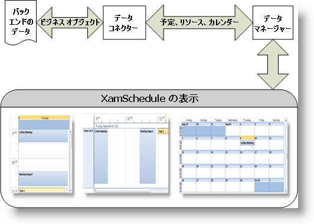

////

|metadata|
{
    "name": "xamschedule-understanding",
    "controlName": ["xamSchedule"],
    "tags": ["Scheduling"],
    "guid": "fd5a7a5e-0c35-4011-9384-10dc943dc3a2",  
    "buildFlags": [],
    "createdOn": "2016-05-25T18:21:58.6063493Z"
}
|metadata|
////

= xamSchedule の理解

XamSchedule は、Microsoft™ Outlook™ カレンダー機能の多くを複製するスケジュール ソリューションです。わずかなコードでアクティビティ情報を異なるビューで表示することができます。複数のカレンダーで複数のリソースの表示をサポートするので、異なるスケジュールを比較するための便利な方法を提供します。

豊かな UI によって、ビュー内でアクティビティを直接、リサイズ、ドラッグ、作成、および編集できます。構成可能なダイアログは、開始/終了時間などの基本的なアクティビティ プロパティや繰り返し、アラーム、およびタイム ゾーンのような詳細設定を行うために使用されます。

このソリューションには、ビュー (UI 要素)、データ マネージャー コントロールおよびデータ コネクターのファミリーが含まれます。

*ビュー:*

ソリューションには、 link:{ApiPlatform}controls.schedules{ApiVersion}~infragistics.controls.schedules.xamdayview.html[xamDayView]、 link:{ApiPlatform}controls.schedules{ApiVersion}~infragistics.controls.schedules.xamscheduleview.html[xamScheduleView] および link:{ApiPlatform}controls.schedules{ApiVersion}~infragistics.controls.schedules.xammonthview.html[xamMonthView] のビューがあります。これらによって、ひとつ以上のリソースの特定のカレンダーに関連付けられたアクティビティ (link:{ApiPlatform}controls.schedules{ApiVersion}~infragistics.controls.schedules.appointment.html[Appointments]、 link:{ApiPlatform}controls.schedules{ApiVersion}~infragistics.controls.schedules.task.html[Tasks]および link:{ApiPlatform}controls.schedules{ApiVersion}~infragistics.controls.schedules.journal.html[Journals]) を表示および操作することができます。

*link:{ApiPlatform}controls.schedules{ApiVersion}~infragistics.controls.schedules.xamscheduledatamanager.html[DataManager]:*

このオブジェクトは、データ (リソース、カレンダーおよびアクティビティ) をビューに提供し、稼働日や稼働時間およびユーザーの操作を制御する設定を含み、さまざまな設定を提供するプロパティも公開します。

*データ コネクター:*

データ コネクターは、スケジュール データ (リソース、カレンダーおよびアクティビティ) にバインドするために使用されます。データ コネクターは、データ マネージャーに関連付けられ、ビュー コントロールのそれぞれがデータにアクセスできる中心点を提供します。

*xamSchedule アーキテクチャの概要:*

link:xamschedule-understanding-data-connector.html[データ コネクターについて]

link:xamschedule-understanding-data-manager.html[データ マネージャーについて]

link:xamschedule-understanding-views.html[xamSchedule ビューについて]

link:xamschedule-understanding-resources-calendars.html[リソースおよびカレンダーについて]

link:xamschedule-understanding-activities.html[アクティビティについて]