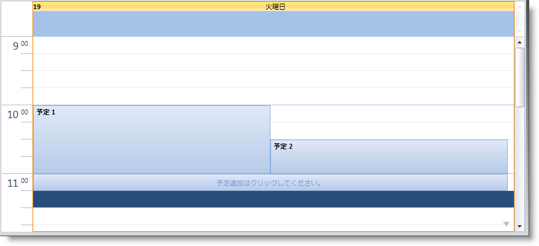

////

|metadata|
{
    "name": "xamschedule-using-activities-appointments",
    "controlName": ["xamSchedule"],
    "tags": ["Appointments","Data Binding","Data Presentation","Scheduling"],
    "guid": "c727d60b-800b-49a4-a5c3-821a13693a97",  
    "buildFlags": [],
    "createdOn": "2016-05-25T18:21:58.7923218Z"
}
|metadata|
////

= 予定

link:{ApiPlatform}controls.schedules{ApiVersion}~infragistics.controls.schedules.appointment.html[Appointment] エンティティは、スケジュール アプリケーションの核となる概念で、一定の時間中に発生するアクティビティについてのすべての関連情報を含みます。

== アセンブリ情報をインストールしています。

Appointment エンティティの作成は、3 つの異なる方法で実行できます。

link:{ApiPlatform}controls.schedules{ApiVersion}~infragistics.controls.schedules.listscheduledataconnector.html[ListScheduleDataConnector] の link:{ApiPlatform}controls.schedules{ApiVersion}~infragistics.controls.schedules.listscheduledataconnector~appointmentitemssource.html[AppointmentItemsSource] を Appointment インスタンスにバインドすると、開発者はコードまたは xaml で予定を作成し、それを ListScheduleDataConnector の AppointmentItemsSource として設定されたリストに追加できます。

*XAML の場合:*

----
<ig:Appointment
    Id="t1"
    OwningCalendarId="cal1"
    OwningResourceId="own1"
    Start="9/9/2010 9:12:00"
    End="9/9/2010 11:42:00" 
    Subject="Appointment 1"
    Description="My first Appointment in XAML"/>
----

*Visual Basic の場合:*

----
Dim appointment = New Infragistics.Controls.Schedules.Appointment() With { _
    .Id = "t1", _
    .OwningCalendarId = "cal1", _
    .OwningResourceId = "own1", _
    .Start = New DateTime(2010, 9, 9).AddHours(9).AddMinutes(12).ToUniversalTime(), _
    .[End] = New DateTime(2010, 9, 9).AddHours(9).AddMinutes(42).ToUniversalTime(), _
    .Subject = "Appointment 1", _
    .Description = "My first Appointment in XAML" _
}
----

*C# の場合:*

----
var appointment = new Infragistics.Controls.Schedules.Appointment 
{
    Id = "t1",
    OwningCalendarId = "cal1",
    OwningResourceId = "own1",
    Start = new DateTime(2010,9,9).AddHours(9).AddMinutes(12).ToUniversalTime(),
    End = new DateTime(2010,9,9).AddHours(9).AddMinutes(42).ToUniversalTime(),
    Subject = "Appointment 1",
    Description = "My first Appointment in XAML"
};
----

*注:* Appointment の開始時間/終了時間は UTC 時間として指定されます。詳細は、 link:xamschedule-using-timezone-support.html[「タイム ゾーンのサポート」]を参照してください。

第 2 のシナリオは、開発者が自身のエンティティを使用して、マッピング機能を使用してエンティティを ListScheduleDataConnector にバインドする場合です。このとき、内部的に ListScheduleDataConnector は、カスタム エンティティおよびマッピング情報から供給されたデータに基づいて Appointment エンティティを作成します。

第 3 のオプションは、範囲を選択して予定の link:{ApiPlatform}controls.schedules{ApiVersion}~infragistics.controls.schedules.activitybase~subject.html[Subject] のタイプを開始して [クリックして追加] オプションを選択するか、タイムスロットをダブルクリックして [予定] ダイアログを使用して、UI で予定を作成することです。

== 変更

このUI で Appointment エンティティを変更するには、ダイアログまたは Subject のインプレース編集を使用し、Start/End プレースホルダーをドラッグするか、Appointment 表示全体をドラッグします。アクティビティ ダイアログを介すか、アクティビティを選択して Delete キーを押して、アクティビティを削除する機能も提供されます。これらのケースでは、変更は UI から link:{ApiPlatform}controls.schedules{ApiVersion}~infragistics.controls.schedules.xamscheduledatamanager.html[DataManager] に渡されます。DataManager は DataConnector と通信し、変更はデータ ソースに適用されます。

*注:*

XamScheduleDataManager 上のカスタム link:{ApiPlatform}controls.schedules{ApiVersion}~infragistics.controls.schedules.xamscheduledatamanager~dialogfactory.html[DialogFactory] を使用して、独自のアクティビティ編集ダイアログを得ることが可能です。

*注* :

link:{ApiPlatform}controls.schedules{ApiVersion}~infragistics.controls.schedules.schedulesettings.html[ScheduleSettings] $$->$$ link:{ApiPlatform}controls.schedules{ApiVersion}~infragistics.controls.schedules.schedulesettings~appointmentsettings.html[AppointmentSettings] プロパティは、エンドユーザーが行う変更のタイプを制限するために使用できます。

== ビジュアリゼーション

XamSchedule ファミリーは複数のビュー コントロールをサポートしますが、一般的にひとつの予定の視覚的表現は、予定の開始と終了間の時間のブロックを埋める矩形です。この矩形の中に Subject プロパティが表示されます。ブロックが小さすぎる場合、「挿入」グラフィック要素が追加されます。上記の画像の「Coffee Meeting」を参照してください。

link:{ApiPlatform}controls.schedules{ApiVersion}~infragistics.controls.schedules.activitybase.html[ActivityBase] オブジェクトの表現として、Appointment はアラーム、タイム ゾーンのサポート、および繰り返し機能などの設定をサポートします。詳細は、以下の関連トピックを参照してください。

== 関連トピック

link:xamschedule-using-activities-tzna.html[タイム ゾーン ニュートラルなアクティビティとは]

link:xamschedule-using-activities-tasks.html[タスク]

link:xamschedule-using-activities-journals.html[履歴]

link:xamschedule-using-activities-recurrent.html[繰り返しアクティビティ]

link:xamschedule-using-activities-reminders.html[アラーム]