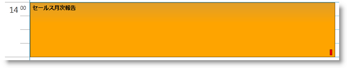
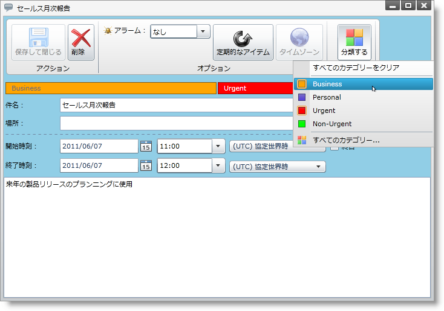
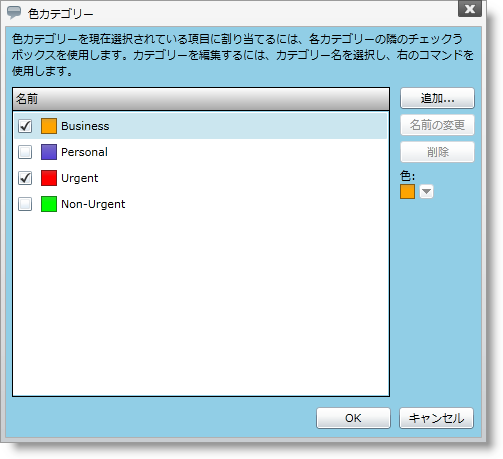

////

|metadata|
{
    "name": "xamschedule-using-activities-categories",
    "controlName": ["xamSchedule"],
    "tags": ["Data Presentation","Scheduling"],
    "guid": "4301b9c2-6108-4824-abc8-5e6cb5a5523d",  
    "buildFlags": [],
    "createdOn": "2016-05-25T18:21:58.9203672Z"
}
|metadata|
////

= アクティビティ カテゴリ

アクティビティ カテゴリは、カレンダーに表示されるアクティビティのさまざまなタイプを視覚的に (さまざまな色で) 識別するために使用されるカラー コードです。より正確に言えば、アクティビティ カテゴリは、名前、色、説明で定義されます。カテゴリがアクティビティに割り当てられると、そのアクティビティはそのカテゴリに対応する色で強調表示されます。

複数のカテゴリをひとつのアクティビティに割り当てることができます。この場合、カテゴリのひとつが*プライマリ カテゴリ*となってその予定が強調表示され、その他はアクティビティの右下角に追加された小さい色の四角形によって表される*セカンダリ カテゴリ* となります。どのカテゴリがプライマリであるかは、カテゴリが予定に割り当てられる順序によって自動的に決定されます。最後に割り当てられたカテゴリがその予定のプライマリ カテゴリになります。

たとえば、ひとつのアクティビティに、以下の色と以下の順序で 3 つのカテゴリが割り当てられるとします:青、赤およびオレンジ (最後に割り当て = プライマリ カテゴリ)。プライマリ カテゴリはアクティビティをオレンジで強調表示し、2 つのセカンダリ カテゴリはそれぞれ赤と青の四角形で表されます。

====== 図 1: 予定は常にプライマリ アクティビティ カテゴリの色を採用する

カレンダーで、複数セットのカテゴリを使用できます。たとえば、仕事の予定と個人の予定に異なるカテゴリを使用できます。

== アクティビティ カテゴリの定義

許可されるアクティビティ カテゴリは link:{ApiPlatform}controls.schedules{ApiVersion}~infragistics.controls.schedules.activitycategorycollection.html[ActivityCategoryCollection] で定義されます。許可されるカテゴリを定義するには、データ コネクタの link:{ApiPlatform}controls.schedules{ApiVersion}~infragistics.controls.schedules.listscheduledataconnector~activitycategoryitemssource.html[ActivityCategoryItemsSource] プロパティを ActivityCategoryCollection タイプのコレクションにバインドします。

以下のコードはカテゴリ項目を定義する方法を示します。

*XAML の場合:*

----
<Page.Resources>
    <ig:ActivityCategoryCollection x:Key="CategoryDataSource">
        <ig:ActivityCategory 
            CategoryName="My custom category"
            Description="Description for my custom category"
            Color="Cyan">
        </ig:ActivityCategory>
    </ig:ActivityCategoryCollection>
</Page.Resources>
…
<ig:XamScheduleDataManager
    x:Name="dataManager" CurrentUserId="own1">
    <ig:XamScheduleDataManager.DataConnector>
        <ig:ListScheduleDataConnector
            x:Name="dataConnector"
            ActivityCategoryItemsSource=
                "{Binding Source={StaticResource CategoryDataSource}}">
        </ig:ListScheduleDataConnector>
    </ig:XamScheduleDataManager.DataConnector>
</ig:XamScheduleDataManager>
----

*Visual Basic の場合:*

----
Me.dataConnector.ActivityCategoryItemsSource = _
    New ActivityCategoryCollection() From { _
        New ActivityCategory() With { _
                Key .CategoryName = "My custom category", _
                Key .Description = "Description for my custom category", _
                Key .Color = Colors.Cyan _
        } _
}
----

*C# の場合:*

----
this.dataConnector.ActivityCategoryItemsSource = new ActivityCategoryCollection() 
{
    new ActivityCategory() {
        CategoryName = "My custom category", 
        Description = "Description for my custom category",
        Color = Colors.Cyan
    }
};
----

== 割り当てられたカテゴリの変更

ユーザーが割り当てられたカテゴリを変更する最も簡単な方法は、変更したいアクティビティをダブルクリックして、次に [分類] ドロップダウン ボタンをクリックして、いくつかのカテゴリの選択を解除します (以下の図 2)。[すべてのカテゴリをクリア] オプションは選択したアクティビティに設定されたすべてのカテゴリを削除します。

====== 図 2: [分類] ドロップダウン ボタンからカテゴリを選択

== 普通のカテゴリ対カスタム カテゴリ

[分類] ドロップダウン ボタンで [すべてのカテゴリを選択] オプションを選択すると、[色カテゴリ] ダイアログを表示します。ユーザーはこのダイアログを使用して、選択したアクティビティで普通のカテゴリを設定/削除し、 link:{ApiPlatform}controls.schedules{ApiVersion}~infragistics.controls.schedules.schedulesettings.html[ScheduleSettings] の link:{ApiPlatform}controls.schedules{ApiVersion}~infragistics.controls.schedules.schedulesettings~allowcustomizedcategories.html[AllowCustomizedCategories] プロパティによって許可される場合には新しいカテゴリを定義することができます。AllowCustomizedCategories Boolean プロパティのデフォルト値は True です。

*XAML の場合:*

----
<ig:XamScheduleDataManager x:Name="dataManager" CurrentUserId="own1">
  <ig:XamScheduleDataManager.Settings>
    <ig:ScheduleSettings AllowCustomizedCategories="True|>
    </ig:ScheduleSettings>
  </ig:XamScheduleDataManager.Settings>
</ig:XamScheduleDataManager>
----

有効な場合には、カスタム カテゴリが選択したアクティビティのリソース オーナーの link:{ApiPlatform}controls.schedules{ApiVersion}~infragistics.controls.schedules.resource~customactivitycategories.html[CustomActivityCategories] コレクションで追加され、このリソースによって所有されるその他のアクティビティで使用できます。普通のカテゴリ (カテゴリ項目ソース プロパティを使用して設定) をすべてのリソース オーナーに使用できます。

[色カテゴリ] ダイアログによって、ユーザーは選択したアクティビティと関連付けられたカテゴリをチェック/チェックを解除できます。さらに、カスタム カテゴリを作成して後で変更できます。

====== 図 3: 色カテゴリ ダイアログ

*注:* 普通のカテゴリ (ActivityCategoriesItemSource プロパティで定義) はこのダイアログで変更できません。

== 関連トピック

link:xamschedule-using-activities-appointments.html[予定]

link:xamschedule-using-activities-tasks.html[タスク]

link:xamschedule-using-activities-journals.html[履歴]