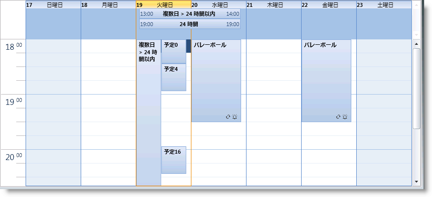

////
|metadata|
{
    "name": "xamschedule-using-activities-recurrent",
    "controlName": ["xamSchedule"],
    "tags": ["Appointments","How Do I","Recurrences","Scheduling"],
    "guid": "6d42a4f6-2b43-4d91-890a-92491e9e2797",
    "buildFlags": [],
    "createdOn": "2016-05-25T18:21:58.8123588Z"
}
|metadata|
////

= 繰り返しアクティビティ

XamSchedule コントロールには、繰り返しアクティビティを組み込みでサポートしています。開発者は繰り返し規則の完全なセットから選択して、アクティビティの link:{ApiPlatform}controls.schedules{ApiVersion}~infragistics.controls.schedules.activitybase~recurrence.html[Recurrence] プロパティをこれらの規則のコレクションに設定できます。これでアクティビティは、アクティビティの繰り返しインスタンスが作成されるテンプレートまたはルート アクティビティになります。link:{ApiPlatform}controls.schedules{ApiVersion}~infragistics.controls.schedules.activitybase.html[ActivityBase] クラスにいくつかのプロパティがあり (したがって、 link:{ApiPlatform}controls.schedules{ApiVersion}~infragistics.controls.schedules.appointment.html[Appointment]、 link:{ApiPlatform}controls.schedules{ApiVersion}~infragistics.controls.schedules.journal.html[Journal] および link:{ApiPlatform}controls.schedules{ApiVersion}~infragistics.controls.schedules.task.html[Task] などのすべての ActivityBase 派生のクラス)、繰り返しで特定の ActivityBase インスタンスが担う役割を決定するために使用できます (役割がある場合には)。

[options="header", cols="a,a,a,a,a"]
|====
| link:{ApiPlatform}controls.schedules{ApiVersion}~infragistics.controls.schedules.activitybase.html[アクティビティ]

| link:{ApiPlatform}controls.schedules{ApiVersion}~infragistics.controls.schedules.activitybase~recurrence.html[繰り返し]| link:{ApiPlatform}controls.schedules{ApiVersion}~infragistics.controls.schedules.activitybase~isrecurrenceroot.html[IsRecurrenceRoot]| link:{ApiPlatform}controls.schedules{ApiVersion}~infragistics.controls.schedules.activitybase~isoccurrence.html[IsOccurence]| link:{ApiPlatform}controls.schedules{ApiVersion}~infragistics.controls.schedules.activitybase~isvariance.html[IsVariance]

|繰り返さない
|null
|False
|False
|False

|繰り返しルート
| link:{ApiPlatform}controls.schedules{ApiVersion}~infragistics.controls.schedules.recurrencebase.html[RecurrenceBase] クラス
|true
|False
|False

|発生
|null
|False
|true
|False

|発生 (修正済み) 
|null
|False
|true
|true

|====

発生の UI 表現はアクティビティ矩形の右下隅に発生アイコンでマークされます。

*バリアンス:*

発生が修正または削除されると、バリアンスになります。アクティビティがバリアンス アクティビティかどうかをチェックするには、Activity オブジェクトの IsVariance プロパティを使用します。繰り返しに基づいて自動生成される発生と異なり、バリアンスはアクティビティ データ ソース内に保存されます。以下のリストは、繰り返し、発生、バリアンスに関係する ActivityBase のプロパティをいくつか説明します。

* link:{ApiPlatform}controls.schedules{ApiVersion}~infragistics.controls.schedules.activitybase~recurrence.html[Recurrence] - 繰り返し規則を定義する DateRecurrence クラスのインスタンス。これはルート アクティビティに限り適用されます。発生とバリアンスはこのプロパティに対して常に null を返します。
* link:{ApiPlatform}controls.schedules{ApiVersion}~infragistics.controls.schedules.activitybase~maxoccurrencedatetime.html[MaxOccurrenceDateTime] - ルート アクティビティに限り適用されます。ルート アクティビティに関連付けられている最新の発生またはバリアンスの終了時間よりも大きい日付/時間値を返します。これは、日付の範囲で繰り返しアクティビティを取得するクエリの最適化として使用されます。これはオプションのフィールドであることに注意してください。
* link:{ApiPlatform}controls.schedules{ApiVersion}~infragistics.controls.schedules.activitybase~rootactivityid.html[RootActivityId] - この発生またはバリアンスが関連付けられているルートの繰り返しアクティビティの Id。
* link:{ApiPlatform}controls.schedules{ApiVersion}~infragistics.controls.schedules.activitybase~originaloccurrencestart.html[OriginalOccurrenceStart] と link:{ApiPlatform}controls.schedules{ApiVersion}~infragistics.controls.schedules.activitybase~originaloccurrenceend.html[OriginalOccurrenceEnd] - バリアンスの元の発生時間を示します。これらは、このバリアンスが関連付けられている繰り返しによって定義されるシリーズ内の発生のインスタンスを識別するために使用されます。
* link:{ApiPlatform}controls.schedules{ApiVersion}~infragistics.controls.schedules.activitybase~isoccurrencedeleted.html[IsOccurrenceDeleted] - 発生が削除されるかどうかを示します。発生が削除されると、これもバリアンスになります。

繰り返しは、UI (アクティビティ繰り返しダイアログを使用) およびプログラムを使用して定義できます。以下のコードはコードで繰り返し予定を定義する方法を示します。

*Visual Basic の場合:*

[source,vb]
----
Dim recAppointment = New Appointment() With { _
    .Id = "t1", _
    .OwningCalendarId = "cal1", _
    .OwningResourceId = "own1", _
    .Start = New DateTime(2010, 9, 9).AddHours(9).AddMinutes(12), _
    .[End] = New DateTime(2010, 9, 9).AddHours(9).AddMinutes(42), _
    .Subject = "Recurrent Appointment 1", _
    .Description = "My first Recurrent Appointment in XAML" _
}
Dim dateRecurrence = New DateRecurrence()
Dim recuRules = New List(Of DateRecurrenceRuleBase)()
recuRules.Add(New DayOfWeekRecurrenceRule(DayOfWeek.Monday, 0))
recuRules.Add(New DayOfWeekRecurrenceRule(DayOfWeek.Wednesday, 0))
recuRules.Add(New DayOfWeekRecurrenceRule(DayOfWeek.Friday, 0))
recuRules.Add(New DayOfWeekRecurrenceRule(DayOfWeek.Sunday, 0))
dateRecurrence.Frequency = DateRecurrenceFrequency.Weekly
dateRecurrence.Rules =
    New ObservableCollectionExtended(Of DateRecurrenceRuleBase)(recuRules)
recAppointment.Recurrence = dateRecurrence
----

*C# の場合:*

[source,csharp]
----
var recAppointment = new Appointment
{
    Id = "t1",
    OwningCalendarId = "cal1",
    OwningResourceId = "own1",
    Start = new DateTime(2010, 9, 9).AddHours(9).AddMinutes(12),
    End = new DateTime(2010, 9, 9).AddHours(9).AddMinutes(42),
    Subject = "Recurrent Appointment 1",
    Description = "My first Recurrent Appointment in XAML"
};
var dateRecurrence = new DateRecurrence();
var recuRules = new List<DateRecurrenceRuleBase>();
recuRules.Add(new DayOfWeekRecurrenceRule(DayOfWeek.Monday, 0));
recuRules.Add(new DayOfWeekRecurrenceRule(DayOfWeek.Wednesday, 0));
recuRules.Add(new DayOfWeekRecurrenceRule(DayOfWeek.Friday, 0));
recuRules.Add(new DayOfWeekRecurrenceRule(DayOfWeek.Sunday, 0));
dateRecurrence.Frequency = DateRecurrenceFrequency.Weekly;
dateRecurrence.Rules =
    new ObservableCollectionExtended<DateRecurrenceRuleBase>(recuRules);
recAppointment.Recurrence = dateRecurrence;
----

上記のコード例は DayOfWeekRecurrenceRule を使用します。その他のサポートされる DateRecurrenceRules は以下の通りです。

* link:{ApiPlatform}controls.schedules{ApiVersion}~infragistics.controls.schedules.dayofmonthrecurrencerule.html[DayOfMonthRecurrenceRule]
* link:{ApiPlatform}controls.schedules{ApiVersion}~infragistics.controls.schedules.dayofweekrecurrencerule.html[DayOfWeekRecurrenceRule]
* link:{ApiPlatform}controls.schedules{ApiVersion}~infragistics.controls.schedules.dayofyearrecurrencerule.html[DayOfYearRecurrenceRule]
* link:{ApiPlatform}controls.schedules{ApiVersion}~infragistics.controls.schedules.hourrecurrencerule.html[HourRecurrenceRule]
* link:{ApiPlatform}controls.schedules{ApiVersion}~infragistics.controls.schedules.minuterecurrencerule.html[MinuteRecurrenceRule]
* link:{ApiPlatform}controls.schedules{ApiVersion}~infragistics.controls.schedules.monthofyearrecurrencerule.html[MonthOfYearRecurrenceRule]
* link:{ApiPlatform}controls.schedules{ApiVersion}~infragistics.controls.schedules.secondrecurrencerule.html[SecondRecurrenceRule]
* link:{ApiPlatform}controls.schedules{ApiVersion}~infragistics.controls.schedules.subsetrecurrencerule.html[SubsetRecurrenceRule]
* link:{ApiPlatform}controls.schedules{ApiVersion}~infragistics.controls.schedules.weekofyearrecurrencerule.html[WeekOfYearRecurrenceRule]

== 定期的なアクティビティのインスタンスを変更

定期的なアクティビティのインスタンスを変更する場合があります。変更には以下のルールを使用してください。

* 各インスタンスは別のアクティビティで定義されます。
* アクティビティ インスタンスの `Id` は、以下のコード スニペットで示されるようなパターンがあります。
* アクティビティ インスタンスの `RootActivityId` を定期的なアクティビティの `Id` に設定する必要があります。
* アクティビティ インスタンスの `OwningResourceId` は、定期的なアクティビティの `OwningResourceId` と同じにする必要があります。
* アクティビティ インスタンスの `OwningCalendarId` は、定期的なアクティビティの `OwningCalendarId` と同じである必要があります。

以下のコード スニペットは、タスクの定期的なアクティビティおよび繰り返しで 2 日目の変更を定義する方法を紹介します。

*Visual Basic の場合:*

[source,vb]
----
Dim myRecTask As New Task() With { _
	.Id = "t" + 2, _
	.OwningCalendarId = "cal1", _
	.OwningResourceId = "own1", _
	.Subject = "Task 1", _
	.Description = "My  Recurrent Task " + 1, _
	.Start = New DateTime(2016, 8, 14, 1, 0, 0), _
	.[End] = New DateTime(2016, 8, 14, 1, 0, 0).AddMinutes(15), _
	.IsTimeZoneNeutral = True _
}
Dim rec As New DateRecurrence()
rec.Count = 10
rec.Frequency = DateRecurrenceFrequency.Daily
rec.Interval = 1
myRecTask.Recurrence = rec
Dim varianceOcurrenceDate As String = _
    myRecTask.Start.AddDays(2).ToString("yyyyMMdd")
Dim varianceOcurrenceTime As String = _
    myRecTask.Start.ToString("HHmmss")
Dim varianceId As String = _
    [String].Format("{0}-{1}-{2}T{3}", myRecTask.Id, _
    myRecTask.RecurrenceVersion, varianceOcurrenceDate, _
    varianceOcurrenceTime)
Dim myVarianceTask As New Task() With { _
	.Id = varianceId, _
	.OwningCalendarId = myRecTask.OwningCalendarId, _
	.OwningResourceId = myRecTask.OwningResourceId, _
	.Subject = "Task 1", _
	.Description = "My Recurrent Task " + 1, _
	.Start = New DateTime(2016, 8, 14, 1, 0, 0).AddMinutes(60).AddDays(2), _
	.[End] = New DateTime(2016, 8, 14, 1, 0, 0).AddMinutes(75).AddDays(2), _
	.IsTimeZoneNeutral = True, _
	.RootActivityId = myRecTask.Id _
}
----

*C# の場合:*

[source,csharp]
----
Task myRecTask = new Task
{
    Id = "t" + 2,
    OwningCalendarId = "cal1",
    OwningResourceId = "own1",
    Subject = "Task 1",
    Description = "My  Recurrent Task " + 1,
    Start = new DateTime(2016, 8, 14, 1, 0, 0),
    End = new DateTime(2016, 8, 14, 1, 0, 0).AddMinutes(15),
    IsTimeZoneNeutral = true
};
DateRecurrence rec = new DateRecurrence();
rec.Count = 10;
rec.Frequency = DateRecurrenceFrequency.Daily;
rec.Interval = 1;
myRecTask.Recurrence = rec;
string varianceOcurrenceDate =
    myRecTask.Start.AddDays(2).ToString("yyyyMMdd");
string varianceOcurrenceTime =
    myRecTask.Start.ToString("HHmmss");
string varianceId = String.Format("{0}-{1}-{2}T{3}",
    myRecTask.Id,
    myRecTask.RecurrenceVersion,
    varianceOcurrenceDate,
    varianceOcurrenceTime);
    
Task myVarianceTask = new Task
{
    Id = varianceId,
    OwningCalendarId = myRecTask.OwningCalendarId,
    OwningResourceId = myRecTask.OwningResourceId,
    Subject = "Task 1",
    Description = "My Recurrent Task " + 1,
    Start = new DateTime(2016, 8, 14, 1, 0, 0).AddMinutes(60).AddDays(2),
    End = new DateTime(2016, 8, 14, 1, 0, 0).AddMinutes(75).AddDays(2),
    IsTimeZoneNeutral = true,
    RootActivityId = myRecTask.Id
};
----

== 関連トピック

link:xamschedule-using-activities-tzna.html[タイム ゾーン ニュートラルなアクティビティとは]

link:xamschedule-using-activities-appointments.html[予定]

link:xamschedule-using-activities-tasks.html[タスク]

link:xamschedule-using-activities-journals.html[履歴]

link:xamschedule-using-activities-reminders.html[アラーム]