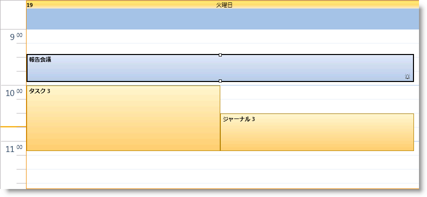
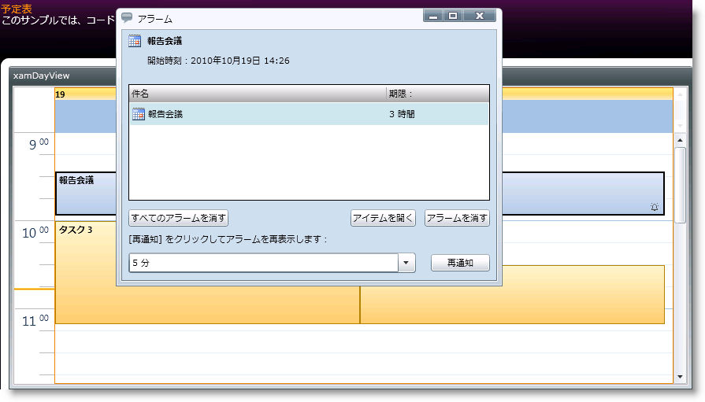

////

|metadata|
{
    "name": "xamschedule-using-activities-reminders",
    "controlName": ["xamSchedule"],
    "tags": ["Appointments","How Do I","Recurrences","Scheduling"],
    "guid": "2f0de47e-b757-4ad7-aa40-152d46a43fba",  
    "buildFlags": [],
    "createdOn": "2016-05-25T18:21:58.8183603Z"
}
|metadata|
////

= アラーム

XamSchedule はすべてのサポートされるアクティビティ タイプ (link:{ApiPlatform}controls.schedules{ApiVersion}~infragistics.controls.schedules.appointment.html[Appointment]、 link:{ApiPlatform}controls.schedules{ApiVersion}~infragistics.controls.schedules.journal.html[Journal] および link:{ApiPlatform}controls.schedules{ApiVersion}~infragistics.controls.schedules.task.html[Task] など) のアラームに対するサポートを組み込んでいます。アラームをプログラムで設定するために以下のプロパティを link:{ApiPlatform}controls.schedules{ApiVersion}~infragistics.controls.schedules.activitybase.html[ActivityBase] クラスで使用できます。

*注:* Appointment、Journal および Task はすべて ActivityBase から継承します。

* link:{ApiPlatform}controls.schedules{ApiVersion}~infragistics.controls.schedules.activitybase~reminderenabled.html[ReminderEnabled] - アクティビティのアラームが設定されるかどうかを指定します。デフォルト値は False です。
* link:{ApiPlatform}controls.schedules{ApiVersion}~infragistics.controls.schedules.activitybase~reminderinterval.html[ReminderInterval] - アラームを起動すべき時にアクティビティを開始する前の時間の量を定義するタイム スパン。
* link:{ApiPlatform}controls.schedules{ApiVersion}~infragistics.controls.schedules.activitybase~reminder.html[Reminder] - アラームを再通知したかどうか、またいつしたのかに関する情報を含み、アラームに関する追加情報を提供する link:{ApiPlatform}controls.schedules{ApiVersion}~infragistics.controls.schedules.reminder.html[Reminder] クラスのインスタンス。

*Visual Basic の場合:*

----
Dim remAppointment = New Appointment() With { _
    Key .Id = "t1", _
    Key .OwningCalendarId = "cal1", _
    Key .OwningResourceId = "own1", _
    Key .Start = New DateTime(2010, 9, 9).AddHours(9).AddMinutes(12), _
    Key .[End] = New DateTime(2010, 9, 9).AddHours(9).AddMinutes(42), _
    Key .Subject = "Appointment 1", _
    Key .Description = "My first Appointment in XAML", _
    Key .ReminderInterval = New TimeSpan(0, 0, 30), _
    Key .ReminderEnabled = True, _
    Key .Reminder = New Reminder() With { _
        Key .IsSnoozed = False, _
        Key .SnoozeInterval = New TimeSpan(0, 0, 40), _
        Key .Text = "My Reminder" _
    } _
}
----

*C# の場合:*

----
var remAppointment = new Appointment
{
    Id = "t1",
    OwningCalendarId = "cal1",
    OwningResourceId = "own1",
    Start = new DateTime(2010, 9, 9).AddHours(9).AddMinutes(12),
    End = new DateTime(2010, 9, 9).AddHours(9).AddMinutes(42),
    Subject = "Appointment 1",
    Description = "My first Appointment in XAML",
    ReminderInterval = new TimeSpan(0, 0, 30),
    ReminderEnabled = true,
    Reminder = new Reminder
    {
        IsSnoozed = false,
        SnoozeInterval = new TimeSpan(0, 0, 40),
        Text = "My Reminder" 
    }
};
----

アラームが有効に設定されたアクティビティの UI 表現は、アクティビティの矩形の右下隅にアラーム アイコン (たとえば、小さいベル) を表示します。

アラームがアクティビティに対して有効に設定されていると、 link:{ApiPlatform}controls.schedules{ApiVersion}~infragistics.controls.schedules.xamscheduledatamanager.html[xamScheduleDataManager] の link:{ApiPlatform}controls.schedules{ApiVersion}~infragistics.controls.schedules.xamscheduledatamanager~currentuser.html[CurrentUser] に関連付けられているアクティビティに限って表示および起動されることに注意してください。これは、アクティビティの link:{ApiPlatform}controls.schedules{ApiVersion}~infragistics.controls.schedules.activitybase~owningresourceid.html[OwningResourceId] がデータ マネージャーの link:{ApiPlatform}controls.schedules{ApiVersion}~infragistics.controls.schedules.xamscheduledatamanager~currentuserid.html[CurrentUserId] プロパティと同じ値に設定される場合、アラームが表示することを意味します。

エンドユーザーのアラームの操作は Microsoft Outlook に似ています。これにはアラームを再通知および破棄する機能が含まれます。アクティビティ ダイアログにもエンドユーザーがアラームと間隔を設定するためのオプションがあります。

== 関連トピック

link:xamschedule-using-activities-tzna.html[タイム ゾーン ニュートラルな予定とは]

link:xamschedule-using-activities-appointments.html[予定]

link:xamschedule-using-activities-tasks.html[タスク]

link:xamschedule-using-activities-journals.html[履歴]

link:xamschedule-using-activities-recurrent.html[定期的なアクティビティ]