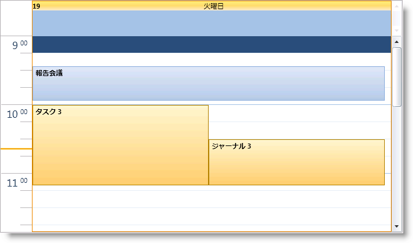

////

|metadata|
{
    "name": "xamschedule-using-activities-tasks",
    "controlName": ["xamSchedule"],
    "tags": ["Scheduling"],
    "guid": "6f293f9f-4e93-4f65-9149-8354c4514e6d",  
    "buildFlags": [],
    "createdOn": "2016-05-25T18:21:58.7983221Z"
}
|metadata|
////

= タスク

link:{ApiPlatform}controls.schedules{ApiVersion}~infragistics.controls.schedules.task.html[Task] エンティティは、XamSchedule コントロールがサポートするアクティビティ タイプのひとつです。予定エンティティに非常に似ていますが、ここで検討される違いがいくつかあります。

== 作成

Task 作成は 2 つの状況で発生します。最初の状況では、開発者は XAML またはコードで Task エンティティを定義します。Task は link:{ApiPlatform}controls.schedules{ApiVersion}~infragistics.controls.schedules.task~percentcomplete.html[PercentComplete] プロパティがあるのに link:{ApiPlatform}controls.schedules{ApiVersion}~infragistics.controls.schedules.appointment~location.html[Location] プロパティがないという点で link:{ApiPlatform}controls.schedules{ApiVersion}~infragistics.controls.schedules.appointment.html[Appointment] と異なります。PercentComplete という名前が示すように、このプロパティはタスクのために作成された進捗状況を保存するためのものであり、整数値を想定します。

*XAML の場合:*

----
<ig:Task
    Id="t1"
    OwningCalendarId="cal1"
    OwningResourceId="own1"
    Start="9/9/2010 9:12:00"
    End="9/9/2010 11:42:00" 
    Subject="Appointment 1"
    Description="My first Task in XAML"
    PercentComplete="75"/>
----

*Visual Basic の場合:*

----
Dim task = New Infragistics.Controls.Schedules.Task() With { _
    Key .Id = "t1", _
    Key .OwningCalendarId = "cal1", _
    Key .OwningResourceId = "own1", _
    Key .Start = New DateTime(2010, 9, 9).AddHours(9).AddMinutes(12).
        ToUniversalTime(), _
    Key .[End] = New DateTime(2010, 9, 9).AddHours(9).AddMinutes(42).
        ToUniversalTime(), _
    Key .Subject = "Task1 1", _
    Key .Description = "My first Task in XAML", _
    Key .PercentComplete = 75 _
}
----

*C# の場合:*

----
var task = new Infragistics.Controls.Schedules.Task 
{
    Id = "t1",
    OwningCalendarId = "cal1",
    OwningResourceId = "own1",
    Start = new DateTime(2010,9,9).AddHours(9).AddMinutes(12).
        ToUniversalTime(),
    End = new DateTime(2010,9,9).AddHours(9).AddMinutes(42).
        ToUniversalTime(),
    Subject = "Task1 1",
    Description = "My first Task in XAML",
    PercentComplete = 75
};
----

*注:* タスクの開始時間/終了時間は UTC 時間として指定されます。詳細は、 link:xamschedule-using-timezone-support.html[「タイム ゾーンのサポート」]を参照してください。

2 番目の状況では、カスタム エンティティからのデータは link:{ApiPlatform}controls.schedules{ApiVersion}~infragistics.controls.schedules.listscheduledataconnector.html[ListScheduleDataConnector] の link:{ApiPlatform}controls.schedules{ApiVersion}~infragistics.controls.schedules.listscheduledataconnector~taskitemssource.html[TaskItemsSource] にバインドされており、Task Bindings が提供されます。その情報に基づいて、ListScheduleDataConnector は Task エンティティを作成し、 link:{ApiPlatform}controls.schedules{ApiVersion}~infragistics.controls.schedules.xamscheduledatamanager.html[XamDataManager] に渡します。

UI による作成は Task エンティティに許可されていません。これは Task と Appointment のもうひとつの違いです。

== 修正と視覚化

UI によって、エンド ユーザーは、ダイアログを使用するか、 link:{ApiPlatform}controls.schedules{ApiVersion}~infragistics.controls.schedules.activitybase~subject.html[Subject] の「インプレース」編集で、Start/End プレースホルダーをドラッグするか、Task 全体をドラッグして、Task エンティティを変更することができます。アクティビティ ダイアログを介すか、アクティビティを選択して Delete キーを押して、アクティビティを削除する機能も提供されます。これらのケースでは、変更は UI から link:{ApiPlatform}controls.schedules{ApiVersion}~infragistics.controls.schedules.xamscheduledatamanager.html[DataManager] に渡されます。DataManager は DataConnector と通信し、変更はデータ ソースに適用されます。

*注:*

XamScheduleDataManager 上のカスタム link:{ApiPlatform}controls.schedules{ApiVersion}~infragistics.controls.schedules.xamscheduledatamanager~dialogfactory.html[DialogFactory] を使用して、独自のアクティビティ編集ダイアログを得ることが可能です。

あらゆるその他の面で、Task と Appointment は機能と動作が似ています。

== 関連トピック

link:xamschedule-using-activities-tzna.html[タイム ゾーン ニュートラルなアクティビティとは]

link:xamschedule-using-activities-appointments.html[予定]

link:xamschedule-using-activities-journals.html[履歴]

link:xamschedule-using-activities-recurrent.html[繰り返しアクティビティ]

link:xamschedule-using-activities-reminders.html[アラーム]