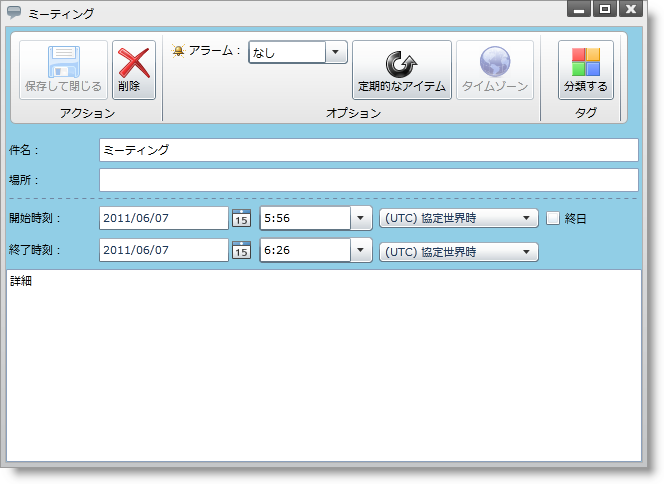
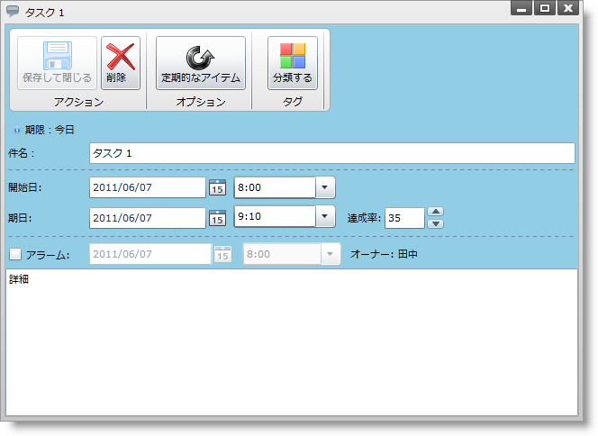
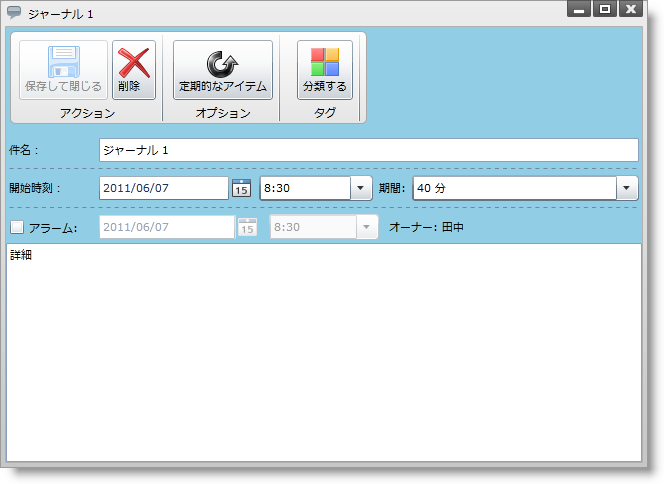
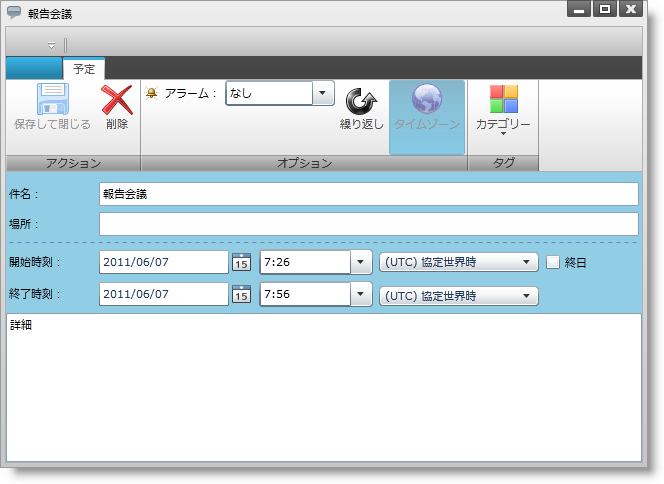
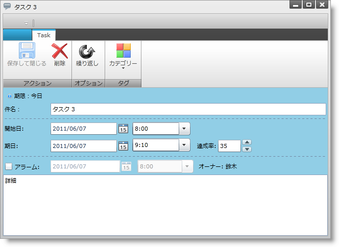
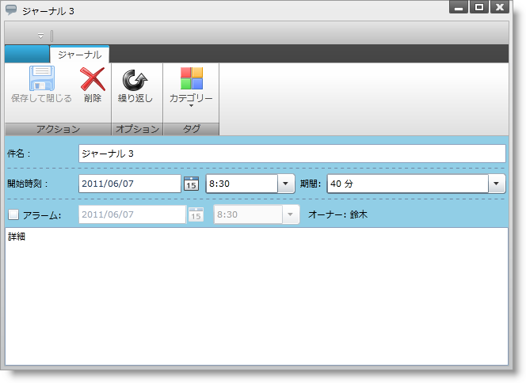

////
|metadata|
{
    "name": "xamschedule-using-activitydialogs",
    "controlName": ["xamSchedule"],
    "tags": ["How Do I","Scheduling"],
    "guid": "55e80de1-4d44-4eb5-aefd-d8d6e404caab",
    "buildFlags": [],
    "createdOn": "2016-05-25T18:21:58.9083688Z"
}
|metadata|
////

= アクティビティ ダイアログ

このトピックは、xamSchedule コントロールのユーザー アクティビティ ダイアログと、カスタム ダイアログの作成方法を説明します。

トピックは以下のとおりです。

* 概要
* 組み込みダイアログ
* カスタム ダイアログ

** カスタム ダイアログの指定

*** コード例

** 既存のダイアログのカスタマイズ

*** 使用されるメソッド
*** 組み込みダイアログに戻す
*** カスタム ダイアログのコンテンツを提供

* 「軽量」ダイアログと「フル機能」ダイアログ

** 「軽量」ダイアログと「フル機能」ダイアログの例
** フル機能ダイアログと軽量ダイアログの切り替え

* ダイアログの表示
* 関連トピック

== 概要

Infragistics xamSchedule コントロールはダイアログ ベースのユーザー操作を堅牢にサポートします。標準の組み込みダイアログだけでなく、カスタム ダイアログを作成するための機能を使用できます。

== 組み込みダイアログ

標準の組み込みダイアログは xamSchedule コントロール アセンブリで定義され、追加のアセンブリを一切参照することなく使用できます。これらのダイアログはリソース使用の観点から効率的になるよう設計されており、それ自体はユーザー インターフェイス (UI) を表示するために追加の外部アセンブリを参照しません。ただし、xamSchedule は必要とされるコントロールおよび機能の両方またはいずれか一方を含むその他のアセンブリを参照するカスタム ダイアログを使用するためのメカニズムを提供します。

表 1 に xamSchedule と共に提供される組み込みダイアログおよびそれらのユーザー操作をリストします。

===== 表 1: xamSchedule 組み込みダイアログによってサポートされるユーザー操作

[options="header", cols="a,a"]
|====
|ダイアログ名|ユーザーによる操作

| link:{ApiPlatform}controls.schedules{ApiVersion}~infragistics.controls.schedules.primitives.appointmentdialogcore.html[予定]
| link:{ApiPlatform}controls.schedules{ApiVersion}~infragistics.controls.schedules.appointment.html[予定]の作成および編集

| link:{ApiPlatform}controls.schedules{ApiVersion}~infragistics.controls.schedules.primitives.taskdialogcore.html[タスク]
| link:{ApiPlatform}controls.schedules{ApiVersion}~infragistics.controls.schedules.task.html[タスク]の作成および編集

| link:{ApiPlatform}controls.schedules{ApiVersion}~infragistics.controls.schedules.primitives.journaldialogcore.html[履歴]
| link:{ApiPlatform}controls.schedules{ApiVersion}~infragistics.controls.schedules.journal.html[履歴]の作成および編集

| link:{ApiPlatform}controls.schedules{ApiVersion}~infragistics.controls.schedules.primitives.activityrecurrencedialogcore.html[アクティビティ繰り返しダイアログ]
|すべてのアクティビティ タイプ (予定、履歴、タスク) の繰り返しルールの作成および編集

| link:{ApiPlatform}controls.schedules{ApiVersion}~infragistics.controls.schedules.primitives.activitycategorydialog.html[カテゴリ化]
|xamSchedule アクティビティのカテゴリ化

| link:{ApiPlatform}controls.schedules{ApiVersion}~infragistics.controls.schedules.primitives.reminderdialog.html[アラーム ダイアログ]
|期限切れの link:{ApiPlatform}controls.schedules{ApiVersion}~infragistics.controls.schedules.reminder.html[アラーム]を表示し、すべてのアクティビティ タイプのアラームをスヌーズ/解除

| link:{ApiPlatform}controls.schedules{ApiVersion}~infragistics.controls.schedules.primitives.activityrecurrencechooserdialog.html[アクティビティ繰り返し選択ダイアログ]
|繰り返しシリーズまたはシリーズの個々の発生間で編集のために選択すべてのアクティビティ タイプのサポート。

| link:{ApiPlatform}controls.schedules{ApiVersion}~infragistics.controls.schedules.primitives.timezonechooserdialog.html[タイム ゾーン選択ダイアログ:]
|ローカル タイム ゾーンを指定 (xamSchedule コントロールによって自動的に構築できない場合) 

|====

== カスタム ダイアログ

=== カスタム ダイアログの指定

コントロール アーキテクチャによって開発者は上記の組み込みダイアログの代わりに xamSchedule コントロールによって使用されるカスタム ダイアログを指定できます。カスタム ダイアログを提供するには、以下の通りに実行します。

[start=1]
. 最初に、 link:{ApiPlatform}controls.schedules{ApiVersion}~infragistics.controls.schedules.scheduledialogfactorybase.html[ScheduleDialogFactoryBase] から継承するクラスを作成し、置き換えたいダイアログを提供するためのひとつ以上のメソッドをオーバーライドします。
[start=2]
. 次に、 link:{ApiPlatform}controls.schedules{ApiVersion}~infragistics.controls.schedules.xamscheduledatamanager.html[XamScheduleDataManager] で link:{ApiPlatform}controls.schedules{ApiVersion}~infragistics.controls.schedules.xamscheduledatamanager~dialogfactory.html[DialogFactory] プロパティを作成したクラスのインスタンスに設定します。

==== コード例

*Visual Basic の場合:*
[source,vb]
----
dataManager.DialogFactory = New MyScheduleDialogFactory()
----

*C# の場合:*
[source,csharp]
----
dataManager.DialogFactory = new MyScheduleDialogFactory();
----

*注:*

組み込みダイアログの使用を元に戻すには、dataManager.DialogFactory プロパティを null に設定するだけです。

=== 既存のダイアログのカスタマイズ

==== 使用されるメソッド

カスタム バージョンの特定のダイアログは、オーバーライドできる多数の仮想メソッドを公開する抽象的な ScheduleDialogFactoryBase クラスと共に実装できます (表 2)。

===== 表 2: ダイアログのカスタマイズのためのメソッドとパラメーター

[options="header", cols="a,a,a"]
|====
|メソッド|説明|パラメーター

| link:{ApiPlatform}controls.schedules{ApiVersion}~infragistics.controls.schedules.scheduledialogfactorybase~supportedactivitydialogtypes.html[SupportedActivityDialogTypes]
|カスタム ダイアログ ファクトリがカスタム アクティビティ ダイアログを提供できるアクティビティ タイプを示す、フラグが設定された link:{ApiPlatform}controls.schedules{ApiVersion}~infragistics.controls.schedules.activitytypes.html[ActivityTypes] 列挙体を返します。
|None

| link:{ApiPlatform}controls.schedules{ApiVersion}~infragistics.controls.schedules.scheduledialogfactorybase~createactivitydialog.html[CreateActivityDialog]
|指定されたアクティビティのためのダイアログのコンテンツを表す FrameworkElement 派生インスタンスを返します。このメソッドは上記の SupportedActivityDialogTypes オーバーライドによって返されるあらゆるアクティビティ タイプに対して値を返すことができることに注意してください。
|FrameworkElement コンテナー、XamScheduleDataManager dataManager、ActivityBase アクティビティ、bool allowModifications、bool allowRemove

| link:{ApiPlatform}controls.schedules{ApiVersion}~infragistics.controls.schedules.scheduledialogfactorybase~createactivityrecurrencechooserdialog.html[CreateActivityRecurrenceChooserDialog]
|ActivityRecurrenceChooserDialog のコンテンツを表す FrameworkElement 派生のインスタンスを返します。
|FrameworkElement コンテナー、XamScheduleDataManager dataManager、ActivityBase アクティビティ、RecurrenceChooserType chooserType、ActivityRecurrenceChooserDialog.RecurrenceChooserResult chooserResult

| link:{ApiPlatform}controls.schedules{ApiVersion}~infragistics.controls.schedules.scheduledialogfactorybase~createactivityrecurrencedialog.html[CreateActivityRecurrenceDialog]
|ActivityRecurrenceDialog のコンテンツを表す FrameworkElement 派生のインスタンスを返します。
|FrameworkElement コンテナー、XamScheduleDataManager dataManager、ActivityBase アクティビティ、bool allowModifications

| link:{ApiPlatform}controls.schedules{ApiVersion}~infragistics.controls.schedules.scheduledialogfactorybase~createreminderdialog.html[CreateReminderDialog]
|ReminderDialog のコンテンツを表す FrameworkElement 派生のインスタンスを返します。
|FrameworkElement コンテナー、XamScheduleDataManager dataManager

| link:{ApiPlatform}controls.schedules{ApiVersion}~infragistics.controls.schedules.scheduledialogfactorybase~createtimezonechooserdialog.html[CreateTimeZoneChooserDialog]
|TimeZoneChooserDialog のコンテンツを表す FrameworkElement 派生のインスタンスを返します。
|FrameworkElement コンテナー、XamScheduleDataManager dataManager、TimeZoneInfoProvider tzInfoProvider、TimeZoneChooserDialog.TimeZoneChooserResult chooserResult

|====

==== 実装例

Appointments を編集するためのカスタム ダイアログを提供するために、

このサンプル コードで ScheduleDialogFactory 派生クラスを作成します。

*Visual Basic の場合:*

----
Public Class MyCustomScheduleDialogFactory
    Inherits ScheduleDialogFactoryBase
    Public Overrides ReadOnly Property SupportedActivityDialogTypes() _
    As ActivityTypes
        Get
            Return ActivityTypes.Appointment
        End Get
    End Property
	
    Public Overrides Function CreateActivityDialog(container As _
    FrameworkElement, dataManager As XamScheduleDataManager, _
    activity As ActivityBase, allowModifications As Boolean, _
    allowRemove As Boolean) As FrameworkElement
        Select Case activity.ActivityType
            Case ActivityType.Appointment
                If True Then
                    ' ダイアログのコンテンツを
                    ' 表す要素を作成します
                    Return GetMyCustomDialog()
                End If
            Case Else
                If True Then
                    ' サポートされないアクティビティ タイプに null を返します
                    Return Nothing
                End If
        End Select
    End Function
End Class
----

*C# の場合:*
[source,csharp]
----
public class MyCustomScheduleDialogFactory : ScheduleDialogFactoryBase
{
    public override ActivityTypes SupportedActivityDialogTypes
    {
        get { return ActivityTypes.Appointment; }
    }
	
    public override FrameworkElement CreateActivityDialog(
        FrameworkElement        container,
        XamScheduleDataManager  dataManager,
        ActivityBase            activity,
        bool                    allowModifications,
        bool                    allowRemove)
    {
        switch (activity.ActivityType)
        {
            case ActivityType.Appointment:
            {
                // ダイアログのコンテンツを
                // 表す要素を作成します
                return GetMyCustomDialog();
            }
            default:
            {                                               
                // サポートされないアクティビティ タイプに null を返します
                return null;
            }
        }
    }
}
----

組み込みダイアログの使用を元に戻すには、XamScheduleDataManager DialogFactory プロパティを null に設定するだけです。

==== カスタム ダイアログのコンテンツを提供

上記の例で、コードは GetMyCustomDialog() という名前のメソッドを呼び出します。メソッドの名前は開発者の判断で決定します。カスタム ダイアログのコンテンツを表す FrameworkElement 派生クラスを作成して返す必要があります。どの要素を返すのかという観点から 2 つの基本的なオプションがあります。

* アプリケーションが実行するプラットフォーム (つまり Silverlight、WPF または WPF/XBAP) に適切な Window を返します。これにはカスタム ダイアログのユーザー インターフェイス (UI) を表示するために必要なすべての要素を含みます。
* ダイアログの要素を含む非ウィンドウの FrameworkElement 派生クラスを返します。xamSchedule はアプリケーションが実行するプラットフォームに適切な最上位のウィンドウにホストすることを担当します。

=== 複雑な予定または ActivityRecurrence ダイアログの実装

[予定] ダイアログまたは [ActivityRecurrence] ダイアログの代替えとしてカスタムダイアログを作成している場合には、これらのかなり複雑なダイアログを完全に実装するために必要とされる膨大な作業を軽減するために link:{ApiPlatform}controls.schedules{ApiVersion}~infragistics.controls.schedules.primitives.appointmentdialogcore.html[AppointmentDialogCore] クラスと link:{ApiPlatform}controls.schedules{ApiVersion}~infragistics.controls.schedules.primitives.activityrecurrencedialogcore.html[ActivityRecurrenceDialogCore] クラスの両方またはいずれか一方の使用を検討したい場合があります。これらの 2 つのクラスは、コントロールから派生しており、各ダイアログに含まれている機能の大半を実装します。

*注:*

以下の段落で AppointmentDialogCore への参照は TaskDialogCore と JournalDialogCore にも適用されます。3 つのクラスはすべて、3 つの全ダイアログでサポートされる共通のビヘイビアーと機能のためのロジックを含む、抽象基本クラス ActivityDialogCore から派生します。

AppointmentDialogCore の場合、このコントロールのデフォルトの Style には、Ribbon を除き、組み込み [予定] ダイアログに含まれるすべてのダイアログ要素が含まれます (ただし、Ribbon のようなナビゲーション コントロールを配置できるタイプ ContentControl の NavigationControlSite プロパティを公開します)。ActivityRecurrenceDialogCore の場合、このコントロールのデフォルトの Style には、組み込みの ActivityRecurrenceDialog に含まれるすべてのダイアログ要素が含まれます。

これらのコントロールを使用できる方法は 2 通りあります。ひとつのアプローチは、カスタム ダイアログで Core クラスのいずれかのインスタンスを作成してその周りにその他のダイアログ要素を追加することです。もうひとつの方法は、ニーズに合わせてコントロールをフォーマットする Style を作成することです。

コントロールを使用することの主なメリットは、一般的なダイアログの環境を処理するコマンドに加えてテンプレート内でバインドできる公開されたビュー モデル プロパティを利用できることです。コントロールによって公開されるコマンドは以下の通りです。

* ActivityDialogCore コマンド (3つの全アクティビティ ダイアログに適用 - AppointmentDialogCore、TaskDialogCore、JournalDialogCore) :

** link:{ApiPlatform}controls.schedules{ApiVersion}~infragistics.controls.schedules.primitives.activitydialogcoresaveandclosecommand.html[ActivityDialogCoreSaveAndCloseCommand] - データ ソースを適切に更新するために適切な link:{ApiPlatform}controls.schedules{ApiVersion}~infragistics.controls.schedules.xamscheduledatamanager.html[XamScheduleDataManager] データ編集メソッド (つまり、 link:{ApiPlatform}controls.schedules{ApiVersion}~infragistics.controls.schedules.xamscheduledatamanager~beginedit.html[BeginEdit]、 link:{ApiPlatform}controls.schedules{ApiVersion}~infragistics.controls.schedules.xamscheduledatamanager~endedit.html[EndEdit]、 link:{ApiPlatform}controls.schedules{ApiVersion}~infragistics.controls.schedules.xamscheduledatamanager~canceledit.html[CancelEdit]) を使用して、修正された予定データを保存し、ダイアログを閉じます。
** link:{ApiPlatform}controls.schedules{ApiVersion}~infragistics.controls.schedules.primitives.activitydialogcoreclosecommand.html[ActivityDialogCoreCloseCommand] - 必要な場合にユーザーに保存オプションをプロンプトしてからダイアログを閉じます。
** link:{ApiPlatform}controls.schedules{ApiVersion}~infragistics.controls.schedules.primitives.activitydialogcoredisplayrecurrencedialogcommand.html[ActivityDialogCoreDisplayRecurrenceDialogCommand] - 編集される予定の ActivityRecurrenceDialog を表示します。
** link:{ApiPlatform}controls.schedules{ApiVersion}~infragistics.controls.schedules.primitives.activitydialogcoreshowtimezonepickerscommand.html[ActivityDialogCoreShowTimeZonePickersCommand] - テンプレートのコントロールがバインドできる AppointmentDialogCore. link:{ApiPlatform}controls.schedules{ApiVersion}~infragistics.controls.schedules.primitives.activitydialogcore~timezonepickervisibility.html[TimeZonePickerVisibility] プロパティを設定します。
** link:{ApiPlatform}controls.schedules{ApiVersion}~infragistics.controls.schedules.primitives.activitydialogcorehidetimezonepickerscommand.html[ActivityDialogCoreHideTimeZonePickersCommand] - テンプレートのコントロールがバインドできる AppointmentDialogCore.TimeZonePickerVisibility プロパティを設定します。

* ActivityRecurrenceDialogCore コマンド:

** link:{ApiPlatform}controls.schedules{ApiVersion}~infragistics.controls.schedules.primitives.recurrencedialogcoresaveandclosecommand.html[RecurrenceDialogCoreSaveAndCloseCommand] - 修正された繰り返しデータを編集される予定に保存します。
** link:{ApiPlatform}controls.schedules{ApiVersion}~infragistics.controls.schedules.primitives.recurrencedialogcoreclosecommand.html[RecurrenceDialogCoreCloseCommand] - 修正した Recurrence データを破棄してダイアログを閉じます。
** link:{ApiPlatform}controls.schedules{ApiVersion}~infragistics.controls.schedules.primitives.recurrencedialogcoreremoverecurrencecommand.html[RecurrenceDialogCoreRemoveRecurrenceCommand] - 非繰り返しの予定となった、繰り返しデータを編集される予定から削除して、ダイアログを閉じます。

== 「軽量」ダイアログと「フル機能」ダイアログ

xamSchedule コントロールのフットプリントで組み込みアクティビティ (予定、タスク、履歴) ダイアログの影響を最小限に抑えるために、参照を必要としないように、または追加のコントロールを含むその他のアセンブリをロードするように設計されています。

リボン コントロールを通常含んでいる [アクティビティ] ダイアログの場合、組み込みバージョンのダイアログには、Application Menu、Quick AccessToolbar、RibbonGroups の縮小のような高度な機能はありませんが、「本物」のリボン コントロール (たとえば、XamRibbon) の基本的な外観と機能を持つカスタムの「シミュレートされた」リボンが含まれています。その結果、組み込みの [予定]、[タスク] および [履歴] ダイアログを使用する時に追加のアセンブリを必要としません。

ほとんどのアプリケーションは、この「シミュレートされた」リボンがある [アクティビティ] ダイアログで十分です。とりわけ、ランタイムにロードしなければならないアセンブリの数を削減することを重視しているアプリケーションには十分です。

フル機能のリボン アクティビティ ダイアログを必要とするアプリケーションのニーズに対応するために、xamSchedule には、組み込みの「軽量の」[予定] ダイアログで使用される「シミュレートされた」リボン コントロールの代わりに、ダイアログの UI で xamRibbon コントロールを使用する「フル機能」バージョンのダイアログが含まれています。以下は軽量バージョンのダイアログとフル機能バージョンのダイアログの例です。

=== 「軽量」ダイアログと「フル機能」ダイアログの例

*Visual Basic の場合:* 
[source,vb]
---- 
dataManager.DialogFactory = Nothing
---- 

*C# の場合:*
[source,csharp]
---- 
dataManager.DialogFactory = null;
---- 

 

図 1: 軽量の [予定] ダイアログ 

 

図 2: 軽量の [タスク] ダイアログ 

 

図 3: 軽量の [履歴] ダイアログ 

=== フル機能ダイアログと軽量ダイアログの切り替え

このバージョンのアクティビティ ダイアログは XamRibbon コントロールを使用し、別の NuGet パッケージで提供されます。

*Infragistics.WPF.Schedules.Dialogs*

フル機能のアクティビティ ダイアログを使用するには、プロジェクトに適切な NuGet パッケージへの参照を追加して、以下のように XamScheduleDataManager DialogFactory を設定します。

*Visual Basic の場合:* 
[source,vb]
---- 
dataManager.DialogFactory = _
  New Infragistics.Controls.Schedules.ScheduleDialogFactory()
---- 

*C# の場合:*
[source,csharp]
---- 
dataManager.DialogFactory =
  new Infragistics.Controls.Schedules.ScheduleDialogFactory();
---- 

 

図 4: フル機能 [予定] ダイアログ 

 

図 5: フル機能の [タスク] ダイアログ 

 

図 6: フル機能の [履歴] ダイアログ 

*注:*

カスタム ダイアログのために上記の標準の ScheduleDialogFactoryBase 派生クラス アプローチを使用して、「フル機能」の [予定] ダイアログ アセンブリが実装されます。

== 定期的な予定ダイアログ

定期的な予定ダイアログは、ユーザーが任意のアクティビティ ダイアログで繰り返しボタンを押したときに表示されます。

image::images/xamSchedule_Dialogs7.png[]

=== 定期的な予定の説明を表示/非表示にします。

定期的な予定ダイアログは、以下の画像のように定期的な予定の説明を強調表示して示すことができます。

image::images/xamSchedule_Dialogs8.png[]

定期的な予定の表示は以下の手順で構成できます。

* プロジェクトの既存または新しいリソース ファイル (.resx file) で文字列のリソースを作成します。
* 文字列リソースの名前を "DLG_Recurrence_ShouldShowRecurrenceDescription" に設定します。
* 文字列リソースの値を表示の要件に基づいて "true" または " に設定します。
* "InitializeComponent()" 呼び出しの前のメイン ウィンドウのコンストラクターに以下の行を含みます (このリソースを登録することにより、xamSchedule ビューすべての定期的な予定ダイアログが影響されます)。

*Visual Basic の場合:*
[source,vb]
----
XamDayView.RegisterResources("NameSpace.ResourceClassName", GetType(MainWindow).Assembly)
----

*C# の場合:*
[source,csharp]
----
XamDayView.RegisterResources("NameSpace.ResourceClassName", typeof(MainWindow).Assembly);
----

*注:*

リソース ファイルが位置する名前空間を "Namespace" で置き換えると、リソース ファイル名前で "ResourceClassName" を名前で置き換えて、メイン ウィンドウのクラス名で "MainWindow" を置き換えます。

*注:*

定期的な予定の説明は、英語、ドイツ語、フランス語を使用した場合にデフォルトで表示されますが、スペイン語と日本語では表示されません。

== ダイアログの表示

xamSchedule コントロールは、ユーザーによるコントロールの操作に基づいて (xamDayView でタイムスロットをダブルクリックする時など)、このトピックで説明しているさまざまなダイアログを自動的に表示します。その結果、xamSchedule コントロールを通常操作する間にダイアログが必ず表示するためにコードを記述する必要はなくなります。

ただし、アプリケーションで、アプリケーションの UI のその他の部分の操作に基づいてダイアログを表示する必要がない場合、手動で表示する方法があります。ダイアログを表示するには、XamScheduleDataManager クラスの以下のメソッドを使用できます。

* link:{ApiPlatform}controls.schedules{ApiVersion}~infragistics.controls.schedules.xamscheduledatamanager~displayactivitydialog.html[DisplayActivityDialog]
* link:{ApiPlatform}controls.schedules{ApiVersion}~infragistics.controls.schedules.xamscheduledatamanager~displayactivitycategorydialog.html[DisplayActivityCategoryDialog]
* link:{ApiPlatform}controls.schedules{ApiVersion}~infragistics.controls.schedules.xamscheduledatamanager~displayactivitycategorycreationdialog.html[DisplayActivityCategoryCreationDialog]
* link:{ApiPlatform}controls.schedules{ApiVersion}~infragistics.controls.schedules.xamscheduledatamanager~displayactivityrecurrencedialog.html[DisplayActivityRecurrenceDialog]
* link:{ApiPlatform}controls.schedules{ApiVersion}~infragistics.controls.schedules.xamscheduledatamanager~displayactivityrecurrencechooserdialog.html[DisplayActivityRecurrenceChooserDialog]
* link:{ApiPlatform}controls.schedules{ApiVersion}~infragistics.controls.schedules.xamscheduledatamanager~displayreminderdialog.html[DisplayReminderDialog]
* link:{ApiPlatform}controls.schedules{ApiVersion}~infragistics.controls.schedules.xamscheduledatamanager~displaytimezonechooserdialog.html[DisplayTimeZoneChooserDialog]

== 関連トピック

link:xamschedule-understanding-activities.html[アクティビティについて]

link:xamschedule-understanding-views.html[xamSchedule ビューについて]