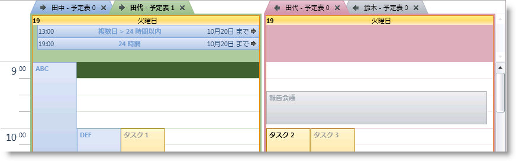
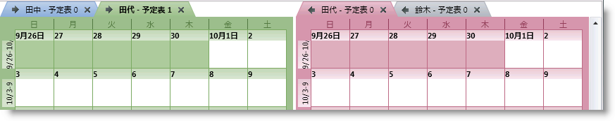
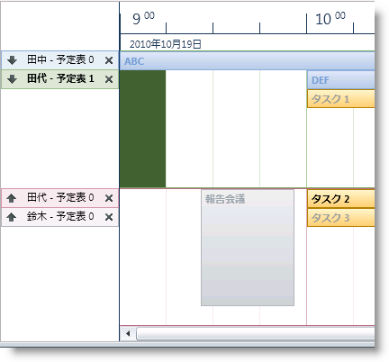

////

|metadata|
{
    "name": "xamschedule-using-control-calendargrouping",
    "controlName": ["xamSchedule"],
    "tags": ["Grouping","How Do I","Scheduling"],
    "guid": "8d54807f-1a33-43fc-892d-90e8531b0be3",  
    "buildFlags": [],
    "createdOn": "2016-05-25T18:21:58.8773664Z"
}
|metadata|
////

= カレンダーのグループ化

XamSchedule コントロールは一度にひとつ以上の link:{ApiPlatform}controls.schedules{ApiVersion}~infragistics.controls.schedules.resourcecalendar.html[ResourceCalendars] を表示できます。コントロールのアーキテクチャによって、開発者は ResourceCalendars を link:{ApiPlatform}controls.schedules{ApiVersion}~infragistics.controls.schedules.calendargroup.html[CalendarGroups] にグループ化できます。これは、 link:{ApiPlatform}controls.schedules{ApiVersion}~infragistics.controls.schedules.xamscheduledatamanager.html[XamScheduleDataManager] の link:{ApiPlatform}controls.schedules{ApiVersion}~infragistics.controls.schedules.xamscheduledatamanager~calendargroups.html[CalendarGroups] コレクションを移植することによって実行できます。このコレクションは、ビュー コントロールの link:{ApiPlatform}controls.schedules{ApiVersion}~infragistics.controls.schedules.schedulecontrolbase~calendargroupsoverride.html[CalendarGroupsOverride] コレクションが移植されない限り、この DataManager を共有する link:{ApiPlatform}controls.schedules{ApiVersion}~infragistics.controls.schedules.xamdayview.html[xamDayView]、 link:{ApiPlatform}controls.schedules{ApiVersion}~infragistics.controls.schedules.xamscheduleview.html[xamScheduleView] または link:{ApiPlatform}controls.schedules{ApiVersion}~infragistics.controls.schedules.xammonthview.html[XamMonthView] コントロールによって使用されます。

*XAML の場合:*

----
<ig:XamScheduleDataManager>
  <ig:XamScheduleDataManager.CalendarGroups>
    <ig:CalendarGroup InitialCalendarIds="own1,own2[cal1]"
        InitialSelectedCalendarId="own2[cal1]" />
    <ig:CalendarGroup InitialCalendarIds="own2[cal0],own3" />
  </ig:XamScheduleDataManager.CalendarGroups>
</ig:XamScheduleDataManager>
----

link:{ApiPlatform}controls.schedules{ApiVersion}~infragistics.controls.schedules.calendargroup~initialcalendarids.html[InitialCalendarIds] プロパティは、カレンダーが link:{ApiPlatform}controls.schedules{ApiVersion}~infragistics.controls.schedules.resource~id.html[OwnerId][ link:{ApiPlatform}controls.schedules{ApiVersion}~infragistics.controls.schedules.resourcecalendar~id.html[CalendarId]] の形式で指定される場合にカレンダー識別子を使用したカンマ区切りの文字列を受け付けます。CalendarId が省略されると、 link:{ApiPlatform}controls.schedules{ApiVersion}~infragistics.controls.schedules.resource.html[OwningResource] の link:{ApiPlatform}controls.schedules{ApiVersion}~infragistics.controls.schedules.resource~primarycalendar.html[メイン カレンダー]が表示されます。link:{ApiPlatform}controls.schedules{ApiVersion}~infragistics.controls.schedules.calendargroup~initialselectedcalendarid.html[InitialSelectedCalendarId] プロパティは、同じ形式の単一の ResourceCalendar の ID を取得しますが、それはグループ内で最初に選択されるカレンダーを識別するために使用されます。

以下のリストは、開発者がコードで同じ例を指定する方法を示します。

*Visual Basic の場合:*

----
Dim calGroup1 = New CalendarGroup() With { _
        Key .InitialCalendarIds = "own1, own2[cal1]", _
        Key .InitialSelectedCalendarId = "own2[cal1]" _
}
Dim calGroup2 = New CalendarGroup() With { _
        Key .InitialCalendarIds = "own2[cal0], own3" _
}
dataManager.CalendarGroups.Add(calGroup1)
dataManager.CalendarGroups.Add(calGroup2)
----

*C# の場合:*

----
var calGroup1 = new CalendarGroup {
    InitialCalendarIds = "own1, own2[cal1]",
    InitialSelectedCalendarId = "own2[cal1]"
};
var calGroup2 = new CalendarGroup {
    InitialCalendarIds = "own2[cal0], own3"
};
dataManager.CalendarGroups.Add(calGroup1);
dataManager.CalendarGroups.Add(calGroup2);
----

カレンダーがグループ化された後で、開発者はグループを表示する方法を選択できます。xamSchedule のすべてのビューは link:{ApiPlatform}controls.schedules{ApiVersion}~infragistics.controls.schedules.calendardisplaymode.html[CalendarDisplay] モードをサポートします。この機能は、以下の値のいずれかに設定できる link:{ApiPlatform}controls.schedules{ApiVersion}~infragistics.controls.schedules.schedulecontrolbase~calendardisplaymode.html[CalendarDisplayMode] プロパティによって制御されます。

* link:{ApiPlatform}controls.schedules{ApiVersion}~infragistics.controls.schedules.calendardisplaymode.html[Overlay] - コントロールに複数の表示可能な ResourceCalendar がある場合、それぞれはタブ ヘッダーとともに表示されます。CalendarGroup に複数の表示可能な ResourceCalendar がある場合、そのカレンダーに関連付けられているアクティビティは通常通りに表示されますが、グループ内のすべてのその他の ResourceCalendars に関連付けられているアクティビティはミュートで表示されます。
* link:{ApiPlatform}controls.schedules{ApiVersion}~infragistics.controls.schedules.calendardisplaymode.html[Separate] - すべての表示可能な ResourceCalendar はカレンダーを識別するヘッダーとともに固有のグループに表示されます。
* link:{ApiPlatform}controls.schedules{ApiVersion}~infragistics.controls.schedules.calendardisplaymode.html[Merged] - タブもヘッダーもありません。すべての表示可能な ResourceCalendars からのすべてのアクティビティは一緒に表示されます。

デフォルトで、CalendarDisplayMode は null に設定され、各コントロールは Outlook にある動作をまねるデフォルト値を選択します。XamMonthView と xamDayView はデフォルトで 「Overlay」に設定されており、xamScheduleView はデフォルトで「Separate」に設定されます。

以下の画像は、CalendarDisplayMode が「Overlay」に設定された時に各コントロールがどのように表示されるのかを示します。それぞれが 2 つの表示可能な ResourceCalendars を含む 2 つの CalendarGroups が定義されています。

== xamDayView

== xamMonthView

== xamScheduleView

== 関連トピック

link:xamschedule-using-control-visibledates.html[日付の表示]

link:xamschedule-using-control-selactivities.html[選択されたアクティビティ コレクション]

link:xamschedule-using-control-confday.html[xamDayView の構成]

link:xamschedule-using-control-confschedule.html[xamScheduleView の構成]

link:xamschedule-using-control-confmonth.html[xamMonthView の構成]