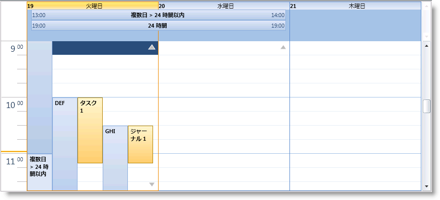
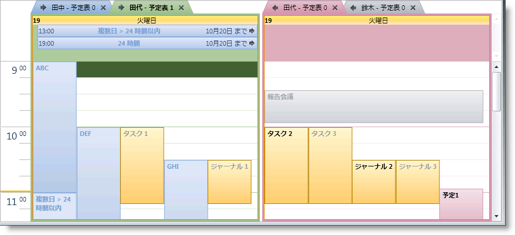
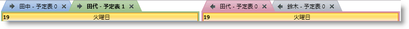
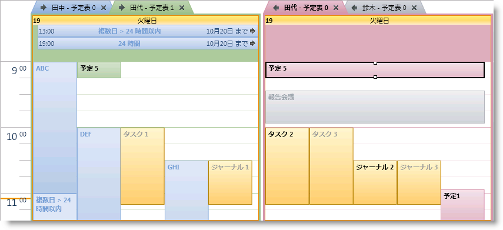
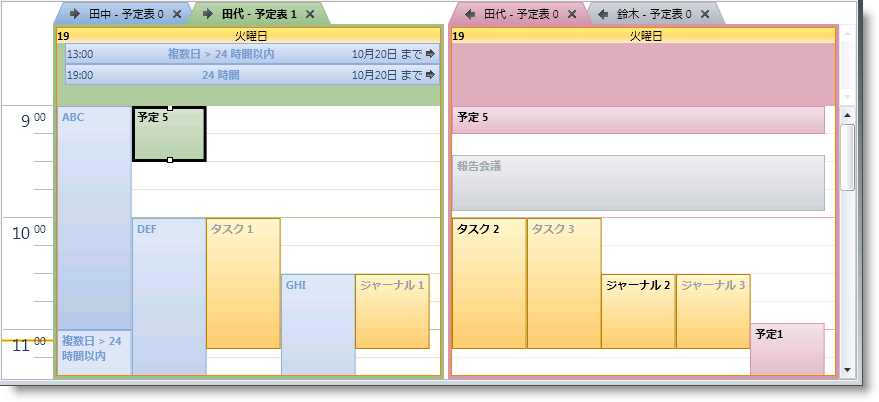
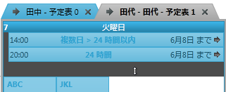

////

|metadata|
{
    "name": "xamschedule-using-control-confday",
    "controlName": ["xamSchedule"],
    "tags": ["How Do I","Scheduling"],
    "guid": "4607f9b5-53ed-42d7-a802-79ee441ee222",  
    "buildFlags": [],
    "createdOn": "2016-05-25T18:21:58.8833683Z"
}
|metadata|
////

= xamDayView の構成

これは、xamSchedule コントロールのビューを説明する 5 つのトピックのひとつです。

* link:{ApiPlatform}controls.schedules{ApiVersion}~infragistics.controls.schedules.xamdayview.html[xamDayView]  _(これは現在のトピックです)_ 
* link:{ApiPlatform}controls.schedules{ApiVersion}~infragistics.controls.schedules.xamscheduleview.html[xamScheduleView]
* link:{ApiPlatform}controls.schedules{ApiVersion}~infragistics.controls.schedules.xammonthview.html[xamMonthView]
* link:{ApiPlatform}controls.schedules{ApiVersion}~infragistics.controls.schedules.xamoutlookcalendarview.html[xamOutlookCalendarView]
* link:{ApiPlatform}controls.schedules{ApiVersion}~infragistics.controls.schedules.xamdatenavigator.html[xamDateNavigator]

トピックは以下のセクションで構成されています。

* 概要
* 目的
* アクティビティをスケジュールで表示
* データ ソースの構成
* ユーザー相互作用と操作性
* xamDayView 構成オプション
* 関連トピック

== 概要

xamDayView は、XamSchedule ファミリに含まれる 5 つのビュー コントロールのひとつです。この描画は、横に配列された 1 日または複数日を表示しますが、各日は指定された間隔 (たとえば 15 分) に基づいて縦に配列されたタイムスロットのシリーズに区分されます(図 1)

====== 図 1: xamMonthView コントロールの例

タイムスロットの先頭に、指定されたタイム ゾーンの特定のタイムスロットに関連付けられた時間を示すひとつまたは 2 つのタイム ゾーン ヘッダー領域が付けられます。このビューには、24 時間以上のアクティビティが表示される「複数日アクティビティ」領域が含まれます。これらの領域はいずれもスクロールをサポートします。

== 目的

このビューの目的は、週の日に対してアクティビティの時間ベースの表現を提供することです。

== アクティビティをスケジュールで表示

link:{ApiPlatform}controls.schedules{ApiVersion}~infragistics.controls.schedules.activitybase.html[アクティビティ]は、 link:{ApiPlatform}controls.schedules{ApiVersion}~infragistics.controls.schedules.activitybase~start.html[Start] 時間と link:{ApiPlatform}controls.schedules{ApiVersion}~infragistics.controls.schedules.activitybase~end.html[End] 時間の間のタイムスロットを埋める矩形として表示されます。

== データ ソースの構成

ビューに表示されるアクティビティおよび link:{ApiPlatform}controls.schedules{ApiVersion}~infragistics.controls.schedules.resourcecalendar.html[リソース カレンダー]のデータは link:{ApiPlatform}controls.schedules{ApiVersion}~infragistics.controls.schedules.xamscheduledatamanager.html[XamScheduleDataManager] のインスタンスによって提供されます。そのインスタンスは、xamDayView の link:{ApiPlatform}controls.schedules{ApiVersion}~infragistics.controls.schedules.schedulecontrolbase~datamanager.html[DataManager] プロパティで構成されます。

== ユーザー相互作用と操作性

XamDayView で、ユーザーは以下を実行できます。

* キーボードを使用して時間帯とアクティビティをナビゲート
* 以下により、マウスのワン クリックによるアクティビティを作成

** タイムスロットを選択して (キーボードまたはマウスで) 入力を開始することによって
** 時間帯の上にマウスを移動すると表示される「クリックして追加」プロンプトをクリックすることによって

* サイズ変更グリップを使用して、アクティビティのサイズを変更 (つまり、アクティビティの Start または End を変更) 
* アクティビティをひとつのスケジュールから別のスケジュール (つまり、同じ xamScheduleDataManager と関連付けられた異なる xamSchedule コントロールの中で) にドラッグ
* アクティビティの link:{ApiPlatform}controls.schedules{ApiVersion}~infragistics.controls.schedules.activitybase~subject.html[Subject] をクリックして編集
* 日をダブルクリックして (アクティビティ ダイアログを介して) 新しいアクティビティを作成
* ダブルクリックすることによってアクティビティを編集
* より多くのアクティビティ矢印を使用してアクティビティにナビゲート
* スクロールバーまたはマウス ホイールを使用してスケジュールをスクロール
* 選択したアクティビティを削除

** Delete キーで
** アクティビティ ダイアログから

* カレンダーのグループ領域をスクロールしてサイズ変更
* 複数日アクティビティ領域のサイズ変更

== xamDayView 構成オプション

* link:{ApiPlatform}controls.schedules{ApiVersion}~infragistics.controls.schedules.scheduletimecontrolbase~weekdisplaymode.html[WeekDisplayMode] - この設定にはオプションが 3 つあります。

** link:{ApiPlatform}controls.schedules{ApiVersion}~infragistics.controls.schedules.weekdisplaymode.html[None] - link:{ApiPlatform}controls.schedules{ApiVersion}~infragistics.controls.schedules.schedulecontrolbase~visibledates.html[VisibleDates] コレクションで指定される日または複数日を表示します
** link:{ApiPlatform}controls.schedules{ApiVersion}~infragistics.controls.schedules.weekdisplaymode.html[Week] - 7 日をすべて表示します
** link:{ApiPlatform}controls.schedules{ApiVersion}~infragistics.controls.schedules.weekdisplaymode.html[WorkWeek] - 週の稼働日を表示します。デフォルト値 Monday to Friday は、 link:{ApiPlatform}controls.schedules{ApiVersion}~infragistics.controls.schedules.xamscheduledatamanager.html[XamDataManager] の link:{ApiPlatform}controls.schedules{ApiVersion}~infragistics.controls.schedules.xamscheduledatamanager~settings.html[Settings] にある link:{ApiPlatform}controls.schedules{ApiVersion}~infragistics.controls.schedules.schedulesettings~workdays.html[WorkDays] プロパティによって変更できます。

* link:{ApiPlatform}controls.schedules{ApiVersion}~infragistics.controls.schedules.scheduletimecontrolbase~showworkinghoursonly.html[ShowWorkingHoursOnly] は、開発者が 1 日の稼働時間のみを表示することを可能にするブール値プロパティです。デフォルト値 (9am-5pm) は、XamDataManager の Settings にある link:{ApiPlatform}controls.schedules{ApiVersion}~infragistics.controls.schedules.schedulesettings~workinghours.html[WorkingHours] プロパティによって変更できます(link:xamschedule-using-manager-working-hours.html[「稼働時間」トピック]を参照してください)。
* 第 2 のタイムゾーン設定 - xamDayView はデフォルトでひとつの第 1 のタイム ゾーン ヘッダーを表示します。ただし、開発者が第 2 のタイムゾーンヘッダーを表示することを可能にする link:{ApiPlatform}controls.schedules{ApiVersion}~infragistics.controls.schedules.scheduletimecontrolbase~secondarytimezonevisibility.html[SecondaryTimeZoneVisibility] と呼ばれるプロパティがあります。link:{ApiPlatform}controls.schedules{ApiVersion}~infragistics.controls.schedules.scheduletimecontrolbase~secondarytimezoneid.html[TimeZoneId] と link:{ApiPlatform}controls.schedules{ApiVersion}~infragistics.controls.schedules.scheduletimecontrolbase~secondarytimezonelabel.html[ラベル]を設定するためのプロパティもあります。以下はサンプルです。

*Visual Basic の場合:*

----
dayView.SecondaryTimeZoneVisibility = _
    System.Windows.Visibility.Visible
dayView.SecondaryTimeZoneLabel = _
    "SecodaryLabel"
dayView.SecondaryTimeZoneId = _
    "Central Standard Time"
----

*C# の場合:*

----
dayView.SecondaryTimeZoneVisibility =
    System.Windows.Visibility.Visible;
dayView.SecondaryTimeZoneLabel =
    "SecodaryLabel";
dayView.SecondaryTimeZoneId =
    "Central Standard Time";
----

* link:{ApiPlatform}controls.schedules{ApiVersion}~infragistics.controls.schedules.xamdayview~multidayactivityareavisibility.html[MultiDayActivityAreaVisibility] プロパティを設定することによって、開発者は MultiDay アクティビティ領域の表示/非表示を制御できます。

*Visual Basic の場合:*

----
dayView.MultiDayActivityAreaVisibility = _
    System.Windows.Visibility.Visible
----

*C# の場合:*

----
dayView.MultiDayActivityAreaVisibility =
    System.Windows.Visibility.Visible;
----

* カレンダー表示オプション - 複数のカレンダーで作業をする時に役に立つ設定がいくつかあります。 

** link:{ApiPlatform}controls.schedules{ApiVersion}~infragistics.controls.schedules.schedulecontrolbase~calendardisplaymode.html[CalendarDisplayMode] - このプロパティには、 link:{ApiPlatform}controls.schedules{ApiVersion}~infragistics.controls.schedules.calendardisplaymode.html[Overlay]、 link:{ApiPlatform}controls.schedules{ApiVersion}~infragistics.controls.schedules.calendardisplaymode.html[Separate] および link:{ApiPlatform}controls.schedules{ApiVersion}~infragistics.controls.schedules.calendardisplaymode.html[Merged] の 3 つのオプションがあります。

*Visual Basic の場合:*

----
dayView.CalendarDisplayMode = CalendarDisplayMode.Overlay
----

*C# の場合:*

----
dayView.CalendarDisplayMode = CalendarDisplayMode.Overlay;
----

*Visual Basic の場合:*

----
dayView.CalendarDisplayMode = CalendarDisplayMode.Separate
----

*C# の場合:*

----
dayView.CalendarDisplayMode = CalendarDisplayMode.Separate;
----

*Visual Basic の場合:*

----
dayView.CalendarDisplayMode = CalendarDisplayMode.Merged
----

*C# の場合:*

----
dayView.CalendarDisplayMode = CalendarDisplayMode.Merged;
----

** link:{ApiPlatform}controls.schedules{ApiVersion}~infragistics.controls.schedules.schedulecontrolbase~showcalendarclosebutton.html[ShowCalendarCloseButton] プロパティと link:{ApiPlatform}controls.schedules{ApiVersion}~infragistics.controls.schedules.schedulecontrolbase~showcalendaroverlaybutton.html[ShowCalendarOverlayButton] プロパティは、カレンダー ボタンの表示/非表示を制御します。

* 表示日 - 開発者は link:{ApiPlatform}controls.schedules{ApiVersion}~infragistics.controls.schedules.schedulecontrolbase~visibledates.html[VisibleDates] コレクションを移植するだけで、ひとつのカレンダーに複数日を表示できます。

*Visual Basic の場合:*

----
'最初に既存の日にちをクリアして、次に新しい日にちを設定します
dayView.VisibleDates.Clear()
dayView.VisibleDates.Add(New System.DateTime(2010, 9, 23))
dayView.VisibleDates.Add(New System.DateTime(2010, 9, 25))
----

*C# の場合:*

----
//最初に既存の日にちをクリアして、次に新しい日にちを設定します
dayView.VisibleDates.Clear();
dayView.VisibleDates.Add(new System.DateTime(2010, 9, 23));
dayView.VisibleDates.Add(new System.DateTime(2010, 9, 25));
----

* link:{ApiPlatform}controls.schedules{ApiVersion}~infragistics.controls.schedules.scheduletimecontrolbase~timeslotinterval.html[TimeslotInterval] - このプロパティによって開発者はデフォルトの 15 分のタイムスロットを変更できます。

*Visual Basic の場合:*

----
dayView.TimeslotInterval = New System.TimeSpan(0, 30, 0)
----

*C# の場合:*

----
dayView.TimeslotInterval = new System.TimeSpan(0, 30, 0);
----

* 単一のカレンダーまたはカレンダー グループ (CalendarDisplayMode プロパティで設定された値に基づいて) は等しいサイズになります。他と比較してひとつのグループにより多くのカレンダーがある場合に、一部のタブ タイトルは表示されない場合があります。link:{ApiPlatform}controls.schedules{ApiVersion}~infragistics.controls.schedules.schedulecontrolbase~allowcalendargroupresizing.html[AllowCalendarGroupResizing] Boolean プロパティを設定することによって、エンドユーザーによるカレンダー グループのサイズ変更を有効/無効にします。グループをサイズ変更する時、グループは引き続き等しいサイズとなります。これにより、結合されたサイズがコンテナーより大きくなるポイントに導かれ、このポイントにスクロールバーが自動的に表示されます。サイズ変更ポイントをダブルクリックすると、カレンダー グループの初期サイズに戻します。

*Visual Basic の場合:*

----
dayView.CalendarDisplayMode = CalendarDisplayMode.Overlay
----

*C# の場合:*

----
dayView.CalendarDisplayMode = CalendarDisplayMode.Overlay;
----

*Visual Basic の場合:*

----
dayView.CalendarDisplayMode = CalendarDisplayMode.Separate
----

*C# の場合:*

----
dayView.CalendarDisplayMode = CalendarDisplayMode.Separate;
----

* 場合によっては、すべてのアクティビティを表示するために複数日アクティビティ領域は小さくできます。この場合矢印が表示して、エンドユーザーはアクティビティをスクロールできます。Boolean プロパティ link:{ApiPlatform}controls.schedules{ApiVersion}~infragistics.controls.schedules.xamdayview~allowmultidayactivityarearesizing.html[AllowMultiDayActivityAreaResizing] を true に設定することによって、エンドユーザーによる複数日アクティビティ領域のサイズ変更を許可できます。また、 link:{ApiPlatform}controls.schedules{ApiVersion}~infragistics.controls.schedules.xamdayview~multidayactivityareaheight.html[MultiDayActivityAreaHeight] プロパティを使用して、カスタムの高さを指定することもできます。サイズ変更ポイントをダブルクリックすると、複数日アクティビティ領域の初期のサイズ設定ビヘイビアーに戻して、MultiDayActivityAreaHeight プロパティを *NaN* に設定します。

*Visual Basic の場合:*

----
dayView.AllowMultiDayActivityAreaResizing = True
----

*C# の場合:*

----
dayView.AllowMultiDayActivityAreaResizing = true;
----

== 関連トピック

link:xamschedule-using-control-visibledates.html[日付の表示]

link:xamschedule-using-control-selactivities.html[選択されたアクティビティ コレクション]

link:xamschedule-using-control-calendargrouping.html[カレンダーのグループ化]

link:xamschedule-using-control-confschedule.html[xamScheduleView の構成]

link:xamschedule-using-control-confmonth.html[xamMonthView の構成]

link:xamschedule-using-control-confoutlookcalendar.html[xamOutlookCalendarView の構成]

link:xamschedule-using-control-confdatenavigator.html[xamDateNavigator の構成]