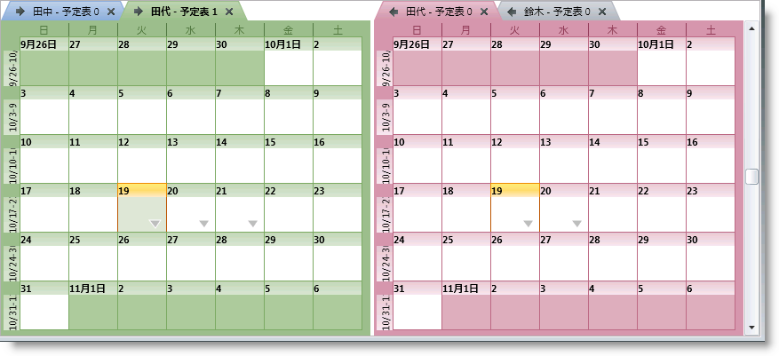
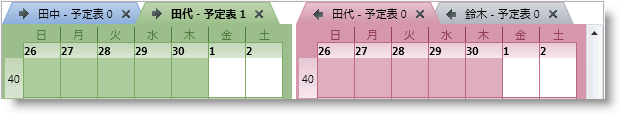
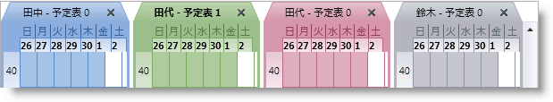
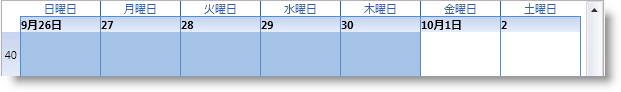
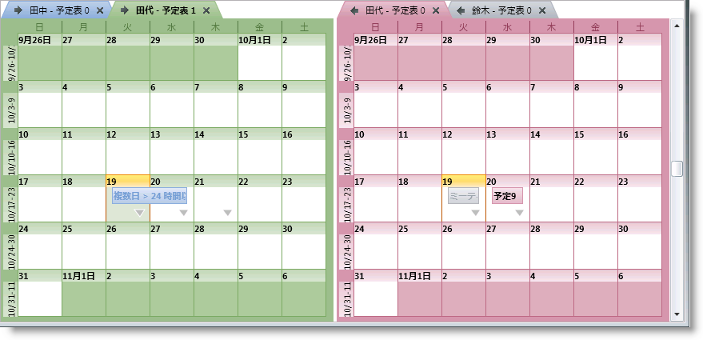
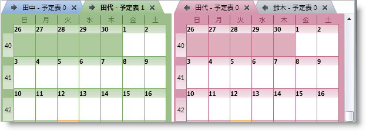
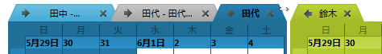
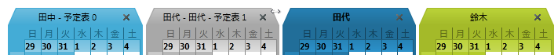

////

|metadata|
{
    "name": "xamschedule-using-control-confmonth",
    "controlName": ["xamSchedule"],
    "tags": ["How Do I","Scheduling"],
    "guid": "0542d0b1-9151-4f91-ba69-88f6c8a55ea9",  
    "buildFlags": [],
    "createdOn": "2016-05-25T18:21:58.8963651Z"
}
|metadata|
////

= xamMonthView の構成

これは、xamSchedule コントロールのビューを説明する 5 つのトピックのひとつです。

* link:{ApiPlatform}controls.schedules{ApiVersion}~infragistics.controls.schedules.xamdayview.html[xamDayView]
* link:{ApiPlatform}controls.schedules{ApiVersion}~infragistics.controls.schedules.xamscheduleview.html[xamScheduleView]
* link:{ApiPlatform}controls.schedules{ApiVersion}~infragistics.controls.schedules.xammonthview.html[xamMonthView] _(これは現在のトピックです)_ 
* link:{ApiPlatform}controls.schedules{ApiVersion}~infragistics.controls.schedules.xamoutlookcalendarview.html[xamOutlookCalendarView]
* link:{ApiPlatform}controls.schedules{ApiVersion}~infragistics.controls.schedules.xamdatenavigator.html[xamDateNavigator]

トピックは以下のセクションで構成されています。

* 概要
* 目的
* アクティビティをスケジュールで表示
* データ ソースの構成
* ユーザー相互作用と操作性
* xamMonthView 構成オプション
* 関連トピック

== 概要

xamMonthView は、XamSchedule ファミリに含まれる 5 つのビュー コントロールのひとつです。予定表を週単位のビューで表示します。その月の週は上から下に垂直方向で表示され、その週の日は水平方向で表示されます(図 1)

== 目的

このビューの使用目的は、スケジュールのアクティビティを「より大きい画像」で提供することです。XamMonthView は、より大きい時間帯でアクティビティのための表示ソリューションとなることを目標とします。これは、xamSchedule のその他のビューと同じように、ユーザーによるアクティビティの操作を可能にする、拡張されたユーザー操作機能をサポートします(以下の「ユーザー操作と使いやすさ」を参照してください)。

== アクティビティをスケジュールで表示

その他のビューの場合のように、アクティビティは link:{ApiPlatform}controls.schedules{ApiVersion}~infragistics.controls.schedules.activitybase~start.html[Start] 時間と link:{ApiPlatform}controls.schedules{ApiVersion}~infragistics.controls.schedules.activitybase~end.html[End] 時間の間の日全体に広がる四角形として表示されます。

== データ ソースの構成

ビューに表示される link:{ApiPlatform}controls.schedules{ApiVersion}~infragistics.controls.schedules.activitybase.html[アクティビティ]および link:{ApiPlatform}controls.schedules{ApiVersion}~infragistics.controls.schedules.resourcecalendar.html[リソース カレンダー]のデータは link:{ApiPlatform}controls.schedules{ApiVersion}~infragistics.controls.schedules.xamscheduledatamanager.html[XamScheduleDataManager] のインスタンスによって提供されます。そのインスタンスは、xamMonthView の link:{ApiPlatform}controls.schedules{ApiVersion}~infragistics.controls.schedules.schedulecontrolbase~datamanager.html[DataManager] プロパティで構成されます。

== ユーザー相互作用と操作性

XamMonthView で、ユーザーは以下を実行できます。

* キーボードを使用して日とアクティビティをナビゲート
* 以下により、マウスのワン クリックによるアクティビティを作成

** 時間帯を選択して (キーボードまたはマウスで) 直接入力することによって
** 時間帯の上にマウスを移動すると表示される「クリックして追加」プロンプトをクリックすることによって

* サイズ変更グリップを使用して、アクティビティのサイズを変更 (つまり、アクティビティの Start または End を変更) 
* アクティビティをひとつのスケジュールから別のスケジュール (つまり、同じ xamScheduleDataManager と関連付けられた異なる xamSchedule コントロールの中で) にドラッグ
* アクティビティの link:{ApiPlatform}controls.schedules{ApiVersion}~infragistics.controls.schedules.activitybase~subject.html[Subject] をクリックして編集
* 日をダブルクリックして (アクティビティ ダイアログを介して) 新しいアクティビティを作成
* ダブルクリックすることによってアクティビティを編集
* より多くのアクティビティ矢印を使用してアクティビティにナビゲート
* スクロールバーまたはマウス ホイールを使用してスケジュールをスクロール
* 選択したアクティビティを削除

** Delete キーで
** アクティビティ ダイアログから

* カレンダーのグループ領域をスクロールしてサイズ変更

注: このビューのタイムスロットが実際的に複数の日であるため、アクティビティの作成やリサイズのような操作は、操作される Start/End 時間を 12am (または論理的な 1 日のオフセットおよび期間に定義されるどのような値でも) に設定します。

== xamMonthView 構成オプション

* link:{ApiPlatform}controls.schedules{ApiVersion}~infragistics.controls.schedules.xammonthview~showworkingdaysofweekonly.html[ShowWorkingDaysOfWeekOnly] によって稼働日のみを表示できます (Boolean、デフォルト: Monday÷Friday)。稼働日コレクションを使用します。デフォルトの設定は、 link:{ApiPlatform}controls.schedules{ApiVersion}~infragistics.controls.schedules.xamscheduledatamanager.html[XamScheduleDataManager] > link:{ApiPlatform}controls.schedules{ApiVersion}~infragistics.controls.schedules.xamscheduledatamanager~settings.html[Settings] の link:{ApiPlatform}controls.schedules{ApiVersion}~infragistics.controls.schedules.schedulesettings~workdays.html[WorkDays] プロパティから変更できます。
* カレンダー表示オプション - 複数のカレンダーの表示を管理するいくつかの設定 (xamDayView 同様) 

** link:{ApiPlatform}controls.schedules{ApiVersion}~infragistics.controls.schedules.schedulecontrolbase~calendardisplaymode.html[CalendarDisplayMode] - 使用可能なオプションは、 link:{ApiPlatform}controls.schedules{ApiVersion}~infragistics.controls.schedules.calendardisplaymode.html[Overlay]、 link:{ApiPlatform}controls.schedules{ApiVersion}~infragistics.controls.schedules.calendardisplaymode.html[Separate] および link:{ApiPlatform}controls.schedules{ApiVersion}~infragistics.controls.schedules.calendardisplaymode.html[Merged] です。

*Visual Basic の場合:*

----
monthView.CalendarDisplayMode = CalendarDisplayMode.Overlay
----

*C# の場合:*

----
monthView.CalendarDisplayMode = CalendarDisplayMode.Overlay;
----

*Visual Basic の場合:*

----
monthView.CalendarDisplayMode = CalendarDisplayMode.Separate
----

*C# の場合:*

----
monthView.CalendarDisplayMode = CalendarDisplayMode.Separate;
----

*Visual Basic の場合:*

----
monthView.CalendarDisplayMode = CalendarDisplayMode.Merged
----

*C# の場合:*

----
monthView.CalendarDisplayMode = CalendarDisplayMode.Merged;
----

** link:{ApiPlatform}controls.schedules{ApiVersion}~infragistics.controls.schedules.schedulecontrolbase~showcalendarclosebutton.html[ShowCalendarCloseButton] および link:{ApiPlatform}controls.schedules{ApiVersion}~infragistics.controls.schedules.schedulecontrolbase~showcalendaroverlaybutton.html[ShowCalendarOverlayButton] - カレンダー ボタンの表示/非表示を制御します。

オーバーレイ ボタンはオーバーレイ モードでしか使用できず、閉じるボタンは結合モードで使用できません。

* 表示日 - link:{ApiPlatform}controls.schedules{ApiVersion}~infragistics.controls.schedules.schedulecontrolbase~visibledates.html[VisibleDates] コレクションを構成します。

VisibleDates コレクションを作成して特定の日を表示します。xamMonthView で、ビューはこれらの日を含む週を描画し、最大 6 週間表示します。

*Visual Basic の場合:*

----
monthView.VisibleDates.Clear()
monthView.VisibleDates.Add(New System.DateTime(2010, 9, 22))
monthView.VisibleDates.Add(New System.DateTime(2010, 9, 28))
----

*C# の場合:*

----
monthView.VisibleDates.Clear();
monthView.VisibleDates.Add(new System.DateTime(2010, 09, 22));
monthView.VisibleDates.Add(new System.DateTime(2010,09,28));
----

* link:{ApiPlatform}controls.schedules{ApiVersion}~infragistics.controls.schedules.xammonthview~showweeknumbers.html[ShowWeekNumbers] - True の時、カレンダーの年の先頭に相対する週番号を表示します (ブール値)。

このプロパティは週のデフォルトのヘッダー ラベルを変更して週番号を表示します。

* link:{ApiPlatform}controls.schedules{ApiVersion}~infragistics.controls.schedules.schedulecontrolbase~allowcalendargroupresizing.html[AllowCalendarGroupResizing] - ユーザーによるカレンダー グループのサイズ変更を有効/無効にします (ブール値)。

個々のカレンダーまたはカレンダー グループ (CalendarDisplayMode プロパティに設定される値に基づいて) は等しいサイズになります。他と比較してひとつのグループにより多くのカレンダーがある場合に、一部のタブ タイトルは表示されない場合があります。ユーザーがグループをサイズ変更する時、グループは引き続き等しいサイズとなります。これにより、結合されたサイズがコンテナーより大きくなる場合があり、この時点でスクロールバーが自動的に表示されます。サイズ変更ポイントをダブルクリックすると、カレンダー グループの初期サイズに戻します。

*Visual Basic の場合:*

----
monthView.CalendarDisplayMode = CalendarDisplayMode.Overlay
----

*C# の場合:*

----
monthView.CalendarDisplayMode = CalendarDisplayMode.Overlay;
----

*Visual Basic の場合:*

----
monthView.CalendarDisplayMode = CalendarDisplayMode.Separate
----

*C# の場合:*

----
monthView.CalendarDisplayMode = CalendarDisplayMode.Separate;
----

== 関連トピック

link:xamschedule-using-control-visibledates.html[日付の表示]

link:xamschedule-using-control-selactivities.html[選択されたアクティビティ コレクション]

link:xamschedule-using-control-calendargrouping.html[カレンダーのグループ化]

link:xamschedule-using-control-confday.html[xamDayView の構成]

link:xamschedule-using-control-confschedule.html[xamScheduleView の構成]

link:xamschedule-using-control-confoutlookcalendar.html[xamOutlookCalendarView の構成]

link:xamschedule-using-control-confdatenavigator.html[xamDateNavigator の構成]