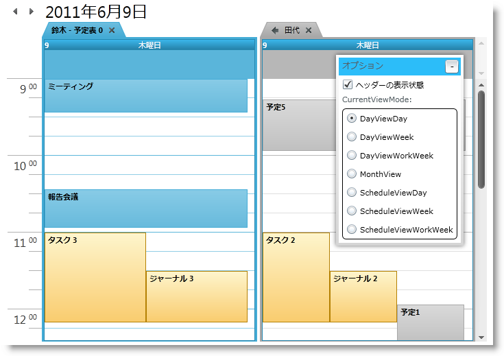

////

|metadata|
{
    "name": "xamschedule-using-control-confoutlookcalendar",
    "controlName": ["xamSchedule"],
    "tags": ["Data Presentation","Scheduling","Selection"],
    "guid": "18635102-7a0e-4a5c-9812-984432d86e5a",  
    "buildFlags": [],
    "createdOn": "2016-05-25T18:21:58.9323679Z"
}
|metadata|
////

= xamOutlookCalendarView の構成

これは、xamSchedule コントロールのビューを説明する 5 つのトピックのひとつです。

* link:{ApiPlatform}controls.schedules{ApiVersion}~infragistics.controls.schedules.xamdayview.html[xamDayView]
* link:{ApiPlatform}controls.schedules{ApiVersion}~infragistics.controls.schedules.xamscheduleview.html[xamScheduleView]
* link:{ApiPlatform}controls.schedules{ApiVersion}~infragistics.controls.schedules.xammonthview.html[xamMonthView]
* link:{ApiPlatform}controls.schedules{ApiVersion}~infragistics.controls.schedules.xamoutlookcalendarview.html[xamOutlookCalendarView]  _(これは現在のトピックです)_ 
* link:{ApiPlatform}controls.schedules{ApiVersion}~infragistics.controls.schedules.xamdatenavigator.html[xamDateNavigator]

トピックは以下のセクションで構成されています。

* 概要
* 目的
* xamOutlookCalendarView 構成オプション

** コントロール固有の設定
** 複製された設定

* 関連トピック

== 概要

xamOutllokCalendarDayView は、xamDayView、xamScheduleView および xamMonthView すべてをひとつの使用が簡単なシェルに結合するように設計されされています。コントロールの使用を簡単にするには、基盤となるビューのプロパティは、適切な View コントロールに値を渡すことを担当する xamOutlookCalendarView で複製されます(図 1)

====== 図 1: xamOutlookCalendarView コントロールの例

== 目的

このビューの目的は、xamDayView、xamScheduleView および xamMonthView をひとつの使用が簡単なシェルに結合するコントロールを提供することです。

== xamOutlookCalendarView 構成オプション

===== コントロール固有の設定

* ビュー モード

このビュー モードは、 link:{ApiPlatform}controls.schedules{ApiVersion}~infragistics.controls.schedules.xamoutlookcalendarview~currentviewmode.html[CurrentViewMode] プロパティによって制御されます。表示されるコントロールおよびコントロールの設定を示す現在のビューを返すか、設定します。使用可能な値は以下のとおりです。

** link:{ApiPlatform}controls.schedules{ApiVersion}~infragistics.controls.schedules.outlookcalendarviewmode.html[DayViewDay] - 1 日以上を表示する xamDayView コントロールを示します。前の値が DayViewWeek または DayViewWorkWeek の場合、表示日のカウントは変更されません。前のビューが異なる場合、1 日が表示されます。
** link:{ApiPlatform}controls.schedules{ApiVersion}~infragistics.controls.schedules.outlookcalendarviewmode.html[DayViewWeek] - 丸 1 週間を表示する xamDayView コントロールを示します。
** link:{ApiPlatform}controls.schedules{ApiVersion}~infragistics.controls.schedules.outlookcalendarviewmode.html[DayViewWorkWeek] - 稼働日を表示する xamDayView コントロールを示します。
** link:{ApiPlatform}controls.schedules{ApiVersion}~infragistics.controls.schedules.outlookcalendarviewmode.html[MonthView] - xamMonthView コントロールを示します。
** link:{ApiPlatform}controls.schedules{ApiVersion}~infragistics.controls.schedules.outlookcalendarviewmode.html[ScheduleViewDay] - 1 日以上を表示する xamScheduleView コントロールを示します。前の値が ScheduleViewWeek または ScheduleViewWorkWeek の場合、表示日のカウントは変更されません。前のビューが異なる場合、1 日が表示されます。
** link:{ApiPlatform}controls.schedules{ApiVersion}~infragistics.controls.schedules.outlookcalendarviewmode.html[ScheduleViewWeek] - 丸 1 週間を表示する xamScheduleView コントロールを示します。
** link:{ApiPlatform}controls.schedules{ApiVersion}~infragistics.controls.schedules.outlookcalendarviewmode.html[ScheduleViewWorkWeek] - 稼働日を表示する xamScheduleView コントロールを示します。

* ヘッダー領域

ヘッダー領域は、2 つのナビゲーション ボタンと日付範囲で構成されます。ヘッダーの表示/非表示は、 link:{ApiPlatform}controls.schedules{ApiVersion}~infragistics.controls.schedules.xamoutlookcalendarview~headervisibility.html[HeaderVisibility] プロパティによって制御されます。日付範囲のテキストは、読み取り専用の link:{ApiPlatform}controls.schedules{ApiVersion}~infragistics.controls.schedules.xamoutlookcalendarview~currentviewdaterangetext.html[CurrentViewDateRangeText] プロパティにアクセスすることによって使用できます。
* 日付ナビゲーション

xamOutlookCalendarView によって、ヘッダー領域ナビゲーション ボタンを使用してユーザーはナビゲートできます。より豊かなユーザー エクスペリエンスのために、コントロールは link:{ApiPlatform}controls.schedules{ApiVersion}~infragistics.controls.schedules.xamoutlookcalendarview~datenavigator.html[DateNavigator] プロパティを公開します。このプロパティによって、xamDateNavigator インスタンスを設定して、組み込みの自動のコントロール間同期を使用するために xamOutlookCalendarView と連携して使用できます。

===== 複製された設定

すべてのビュー コントロールに共通するプロパティが多数あります。XamOutlookCalendarView コントロールは、コントロールの使用を簡単にするためにこれらのプロパティを複製します。この API アプローチによって、最小限の労力で使用するビューのタイプを変更できます。共通のプロパティは以下のとおりです。

* link:{ApiPlatform}controls.schedules{ApiVersion}~infragistics.controls.schedules.xamoutlookcalendarview~datamanager.html[DataManager]
* link:{ApiPlatform}controls.schedules{ApiVersion}~infragistics.controls.schedules.xamoutlookcalendarview~activecalendar.html[ActiveCalendar]
* link:{ApiPlatform}controls.schedules{ApiVersion}~infragistics.controls.schedules.xamoutlookcalendarview~calendardisplaymode.html[CalendarDisplayMode]
* link:{ApiPlatform}controls.schedules{ApiVersion}~infragistics.controls.schedules.xamoutlookcalendarview~calendargroupsoverride.html[CalendarGroupsOverride]
* link:{ApiPlatform}controls.schedules{ApiVersion}~infragistics.controls.schedules.xamoutlookcalendarview~calendargroupsresolved.html[CalendarGroupsResolved]
* link:{ApiPlatform}controls.schedules{ApiVersion}~infragistics.controls.schedules.xamoutlookcalendarview~defaultbrushprovider.html[DefaultBrushProvider]
* link:{ApiPlatform}controls.schedules{ApiVersion}~infragistics.controls.schedules.xamoutlookcalendarview~selectedactivities.html[SelectedActivities]
* link:{ApiPlatform}controls.schedules{ApiVersion}~infragistics.controls.schedules.xamoutlookcalendarview~selectedtimerange.html[SelectedTimeRange]
* link:{ApiPlatform}controls.schedules{ApiVersion}~infragistics.controls.schedules.xamoutlookcalendarview~showcalendarclosebutton.html[ShowCalendarCloseButton]
* link:{ApiPlatform}controls.schedules{ApiVersion}~infragistics.controls.schedules.xamoutlookcalendarview~showcalendaroverlaybutton.html[ShowCalendarOverlayButton]

その他のプロパティは、Day および Schedule ビューのみに固有です。

* link:{ApiPlatform}controls.schedules{ApiVersion}~infragistics.controls.schedules.xamoutlookcalendarview~currenttimeindicatorvisibility.html[CurrentTimeIndicatorVisibility]
* link:{ApiPlatform}controls.schedules{ApiVersion}~infragistics.controls.schedules.xamoutlookcalendarview~primarytimezonelabel.html[PrimaryTimeZoneLabel]
* link:{ApiPlatform}controls.schedules{ApiVersion}~infragistics.controls.schedules.xamoutlookcalendarview~secondarytimezoneid.html[SecondaryTimeZoneId]
* link:{ApiPlatform}controls.schedules{ApiVersion}~infragistics.controls.schedules.xamoutlookcalendarview~secondarytimezonelabel.html[SecondaryTimeZoneLabel]
* link:{ApiPlatform}controls.schedules{ApiVersion}~infragistics.controls.schedules.xamoutlookcalendarview~secondarytimezonevisibility.html[SecondaryTimeZoneVisibility]
* link:{ApiPlatform}controls.schedules{ApiVersion}~infragistics.controls.schedules.xamoutlookcalendarview~showworkinghoursonly.html[ShowWorkingHoursOnly]
* link:{ApiPlatform}controls.schedules{ApiVersion}~infragistics.controls.schedules.xamoutlookcalendarview~timeslotinterval.html[TimeSlotInterval]
* link:{ApiPlatform}controls.schedules{ApiVersion}~infragistics.controls.schedules.xamoutlookcalendarview~workinghourssource.html[WorkingHoursSource]

これらのプロパティの詳細については、プロパティが複製される xamSchedule ビューのドキュメントを参照してください。

== 関連トピック

link:xamschedule-using-control-visibledates.html[日付の表示]

link:xamschedule-using-control-selactivities.html[選択されたアクティビティ コレクション]

link:xamschedule-using-control-calendargrouping.html[カレンダーのグループ化]

link:xamschedule-using-control-confday.html[xamDayView の構成]

link:xamschedule-using-control-confschedule.html[xamScheduleView の構成]

link:xamschedule-using-control-confmonth.html[xamMonthView の構成]

link:xamschedule-using-control-confdatenavigator.html[xamDateNavigator の構成]