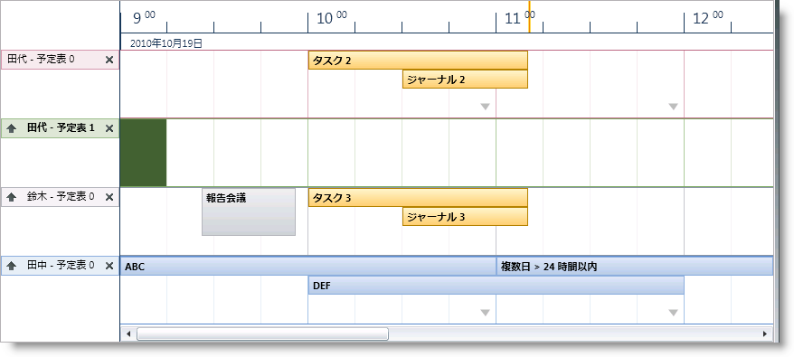
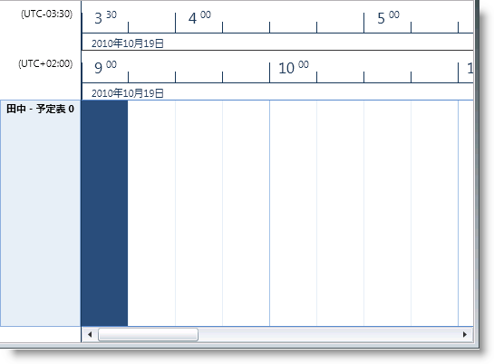
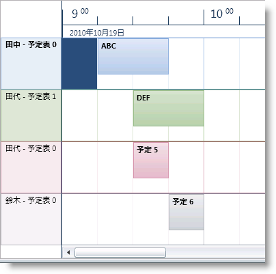
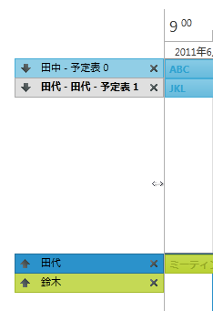

////

|metadata|
{
    "name": "xamschedule-using-control-confschedule",
    "controlName": ["xamSchedule"],
    "tags": ["How Do I","Scheduling"],
    "guid": "18089588-4de3-442b-883b-c6d84bf01187",  
    "buildFlags": [],
    "createdOn": "2016-05-25T18:21:58.8893656Z"
}
|metadata|
////

= xamScheduleView の構成

これは、xamSchedule コントロールのビューを説明する 5 つのトピックのひとつです。

* link:{ApiPlatform}controls.schedules{ApiVersion}~infragistics.controls.schedules.xamdayview.html[xamDayView]
* link:{ApiPlatform}controls.schedules{ApiVersion}~infragistics.controls.schedules.xamscheduleview.html[xamScheduleView] _ (これは現在のトピックです) _ 
* link:{ApiPlatform}controls.schedules{ApiVersion}~infragistics.controls.schedules.xammonthview.html[xamMonthView]
* link:{ApiPlatform}controls.schedules{ApiVersion}~infragistics.controls.schedules.xamoutlookcalendarview.html[xamOutlookCalendarView]
* link:{ApiPlatform}controls.schedules{ApiVersion}~infragistics.controls.schedules.xamdatenavigator.html[xamDateNavigator]

トピックは以下のセクションで構成されています。

* 概要
* 目的
* アクティビティをスケジュールで表示
* データ ソースの構成
* ユーザー相互作用と操作性
* xamScheduleView 構成オプション
* 関連トピック

== 概要

link:{ApiPlatform}controls.schedules{ApiVersion}~infragistics.controls.schedules.xamscheduleview.html[XamScheduleView] は、XamSchedule ファミリに含まれる 5 つのビュー コントロールのひとつです。これは、一部の例外を伴う link:{ApiPlatform}controls.schedules{ApiVersion}~infragistics.controls.schedules.xamdayview.html[xamDayView] に似ています。主な違いは、XamScheduleView では、日のタイムスロットが一行で水平方向に表示されることです (xamDayView の単一列で垂直方向に表示されるのに対して) (図 1)

====== 図 1: xamScheduleView コントロールの例

== 目的

このビューは、ひとつ以上の link:{ApiPlatform}controls.schedules{ApiVersion}~infragistics.controls.schedules.resourcecalendar.html[カレンダー]/ link:{ApiPlatform}controls.schedules{ApiVersion}~infragistics.controls.schedules.resource.html[リソース]のスケジュールを比較するためのより簡単な方法を提供するという意味です(以下の「ユーザー操作と使いやすさ」を参照してください)。

== アクティビティをスケジュールで表示

xamDayView の場合、アクティビティは link:{ApiPlatform}controls.schedules{ApiVersion}~infragistics.controls.schedules.activitybase~start.html[開始]および link:{ApiPlatform}controls.schedules{ApiVersion}~infragistics.controls.schedules.activitybase~end.html[終了]時間のタイムスロットを埋める四角形として表示されます。

== データ ソースの構成

ビューに表示されるアクティビティおよびリソース カレンダーのデータは link:{ApiPlatform}controls.schedules{ApiVersion}~infragistics.controls.schedules.xamscheduledatamanager.html[XamDataManager] のインスタンスによって提供されます。そのインスタンスは、xamMonthView の link:{ApiPlatform}controls.schedules{ApiVersion}~infragistics.controls.schedules.schedulecontrolbase~datamanager.html[DataManager] プロパティで構成されます。

== ユーザー相互作用と操作性

XamScheduleView で、ユーザーは以下を実行できます。

* キーボードを使用して時間帯とアクティビティをナビゲート
* 以下により、マウスのワン クリックによるアクティビティを作成

** 時間帯を選択し (キーボードまたはマウスで) 直接入力することによって
** 時間帯の上にマウスを移動すると表示される「クリックして追加」プロンプトをクリックすることによって

* サイズ変更グリップを使用して、アクティビティのサイズを変更 (つまり、アクティビティの Start または End を変更) 
* アクティビティをひとつのスケジュールから別のスケジュール (つまり、同じ xamScheduleDataManager と関連付けられた異なる xamSchedule コントロールの中で) にドラッグ
* アクティビティの link:{ApiPlatform}controls.schedules{ApiVersion}~infragistics.controls.schedules.activitybase~subject.html[Subject] をクリックして編集
* 日をダブルクリックして (アクティビティ ダイアログを介して) 新しいアクティビティを作成
* ダブルクリックすることによってアクティビティを編集
* より多くのアクティビティ矢印を使用してアクティビティにナビゲート
* スクロールバーを使用してスケジュールをスクロール
* 選択したアクティビティを削除

** Delete キーで
** アクティビティ ダイアログから

* 予定表グループのサイズ変更
* 予定表のヘッダー領域のサイズ変更

== xamScheduleView 構成オプション

[start=1]
. link:{ApiPlatform}controls.schedules{ApiVersion}~infragistics.controls.schedules.scheduletimecontrolbase~weekdisplaymode.html[WeekDisplayMode] - この設定にはオプションが 3 つあります。

** link:{ApiPlatform}controls.schedules{ApiVersion}~infragistics.controls.schedules.weekdisplaymode.html[None] - VisibleDays コレクションで指定された日を表示します
** link:{ApiPlatform}controls.schedules{ApiVersion}~infragistics.controls.schedules.weekdisplaymode.html[Week] - 7 日をすべて表示します
** link:{ApiPlatform}controls.schedules{ApiVersion}~infragistics.controls.schedules.weekdisplaymode.html[WorkWeek] - 週の稼働日を表示します。デフォルトの月曜から金曜の稼働日は、XamDataManager の link:{ApiPlatform}controls.schedules{ApiVersion}~infragistics.controls.schedules.xamscheduledatamanager~settings.html[Settings] の link:{ApiPlatform}controls.schedules{ApiVersion}~infragistics.controls.schedules.schedulesettings~workinghours.html[WorkingDays] プロパティを介して変更できます。

[start=2]
. link:{ApiPlatform}controls.schedules{ApiVersion}~infragistics.controls.schedules.scheduletimecontrolbase~showworkinghoursonly.html[ShowWorkingHoursOnly] は、開発者が 1 日の稼働時間のみを表示することを可能にするブール値プロパティです。デフォルト値 (9am-5pm) は、XamDataManager の Settings にある link:{ApiPlatform}controls.schedules{ApiVersion}~infragistics.controls.schedules.schedulesettings~workinghours.html[WorkingHours] プロパティによって変更できます(link:xamschedule-using-manager-working-hours.html[「稼働時間」トピック]を参照してください)。 
[start=3]
. 第 2 のタイム ゾーン設定 - xamScheduleView はデフォルトで第 1 のタイム ゾーン ヘッダーを表示します。ただし、開発者が第 2 のタイム ゾーン ヘッダーを表示できる link:{ApiPlatform}controls.schedules{ApiVersion}~infragistics.controls.schedules.scheduletimecontrolbase~secondarytimezonevisibility.html[SecondaryTimeZoneVisibility] と呼ばれるプロパティがあります。link:{ApiPlatform}controls.schedules{ApiVersion}~infragistics.controls.schedules.scheduletimecontrolbase~secondarytimezoneid.html[TimeZoneId] と link:{ApiPlatform}controls.schedules{ApiVersion}~infragistics.controls.schedules.scheduletimecontrolbase~secondarytimezonelabel.html[ラベル]を設定するためのプロパティもあります。以下はサンプルです。

*Visual Basic の場合:*

----
scheduleView.SecondaryTimeZoneVisibility = _
    System.Windows.Visibility.Visible
scheduleView.SecondaryTimeZoneLabel = _
    "(UTC-03:30)"
scheduleView.SecondaryTimeZoneId = _
    "Newfoundland Standard Time"
----

*C# の場合:*

----
scheduleView.SecondaryTimeZoneVisibility =
    System.Windows.Visibility.Visible;
scheduleView.SecondaryTimeZoneLabel =
    "(UTC-03:30)";
scheduleView.SecondaryTimeZoneId =
    "Newfoundland Standard Time";
----

[start=4]
. link:{ApiPlatform}controls.schedules{ApiVersion}~infragistics.controls.schedules.schedulecontrolbase~calendardisplaymode.html[CalendarDisplayMode] - このプロパティには、 link:{ApiPlatform}controls.schedules{ApiVersion}~infragistics.controls.schedules.calendardisplaymode.html[Overlay]、 link:{ApiPlatform}controls.schedules{ApiVersion}~infragistics.controls.schedules.calendardisplaymode.html[Separate] および link:{ApiPlatform}controls.schedules{ApiVersion}~infragistics.controls.schedules.calendardisplaymode.html[Merged] の 3 つのオプションがあります。

[options="header", cols="a,a,a"]
|====
|オーバーレイ|分割|マージ

|CalendarDisplayMode.Overlay
|CalendarDisplayMode.Separate
|CalendarDisplayMode.Merged

|image::images/xamSchedule_Schedule03.png[]
|image::images/xamSchedule_Schedule04.png[]
|image::images/xamSchedule_Schedule05.png[]

|====

Overlay および Separate モードを使用している場合、開発者は [閉じる] および [オーバーレイ] ボタンを表示するために選択することができます (Overlay モードだけに効果がある)。これらのボタンの表示によって、エンドユーザーはカレンダーを異なるグループに移動したり、閉じることができます。

*Visual Basic の場合:*

----
scheduleView.ShowCalendarCloseButton = True
scheduleView.ShowCalendarOverlayButton = True
----

*C# の場合:*

----
scheduleView.ShowCalendarCloseButton = true;
scheduleView.ShowCalendarOverlayButton = true;
----

[options="header", cols="a,a"]
|====
|オーバーレイ|分割

|CalendarDisplayMode.Overlay
|CalendarDisplayMode.Separate

|image::images/xamSchedule_Schedule06.png[]
|image::images/xamSchedule_Schedule07.png[]

|====

[start=5]
. 表示日 - 開発者は link:{ApiPlatform}controls.schedules{ApiVersion}~infragistics.controls.schedules.schedulecontrolbase~visibledates.html[VisibleDates] コレクションを移植するだけで、ひとつのカレンダーに複数日を表示できます。
[start=6]
. link:{ApiPlatform}controls.schedules{ApiVersion}~infragistics.controls.schedules.scheduletimecontrolbase~timeslotinterval.html[TimeslotInterval] - このプロパティによって開発者はデフォルトの 15 分のタイムスロットを変更できます。

*Visual Basic の場合:*

----
scheduleView.TimeslotInterval = New System.TimeSpan(0, 30, 0)
----

*C# の場合:*

----
scheduleView.TimeslotInterval = new System.TimeSpan(0, 30, 0);
----

[start=7]
. 単一のカレンダーまたはカレンダー グループ (CalendarDisplayMode プロパティで設定された値に基づいて) は等しいサイズになります。他と比較してひとつのグループにより多くのカレンダーがある場合に、エンドユーザーがこれらのグループをサイズ変更できるようにしたい場合があります。これは、 link:{ApiPlatform}controls.schedules{ApiVersion}~infragistics.controls.schedules.schedulecontrolbase~allowcalendargroupresizing.html[AllowCalendarGroupResizing] Boolean プロパティを設定して達成できます。サイズ変更ポイントをダブルクリックすると、カレンダー グループの初期サイズに戻します。

[options="header", cols="a,a"]
|====
|オーバーレイ|分割

|CalendarDisplayMode.Overlay
|CalendarDisplayMode.Separate

|image::images/xamSchedule_scheduleView-resizing-groups-1.png[]
|image::images/xamSchedule_scheduleView-resizing-groups-2.png[]

|====

[start=8]
. エンドユーザーがカレンダーのヘッダー領域をサイズ変更できるようにするには、 link:{ApiPlatform}controls.schedules{ApiVersion}~infragistics.controls.schedules.xamscheduleview~allowcalendarheaderarearesizing.html[AllowCalendarHeaderAreaResizing] Boolean プロパティを true に設定します。また、 link:{ApiPlatform}controls.schedules{ApiVersion}~infragistics.controls.schedules.xamscheduleview~calendarheaderareawidth.html[CalendarHeaderAreaWidth] プロパティを使用して、カスタムの幅を指定することもできます。サイズ変更ポイントをダブルクリックすると、初期のカレンダー ヘッダーの幅に戻します。

*Visual Basic の場合:*

----
scheduleView.AllowCalendarHeaderAreaResizing = True
----

*C# の場合:*

----
scheduleView.AllowCalendarHeaderAreaResizing = true;
----

== 関連トピック

link:xamschedule-using-control-visibledates.html[日付の表示]

link:xamschedule-using-control-selactivities.html[選択されたアクティビティ コレクション]

link:xamschedule-using-control-calendargrouping.html[カレンダーのグループ化]

link:xamschedule-using-control-confday.html[xamDayView の構成]

link:xamschedule-using-control-confmonth.html[xamMonthView の構成]

link:xamschedule-using-control-confoutlookcalendar.html[xamOutlookCalendarView の構成]

link:xamschedule-using-control-confdatenavigator.html[xamDateNavigator の構成]