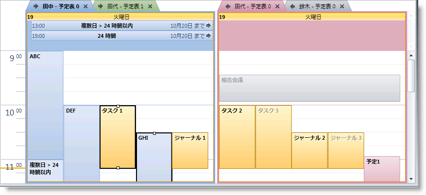

////

|metadata|
{
    "name": "xamschedule-using-control-selactivities",
    "controlName": ["xamSchedule"],
    "tags": ["How Do I","Scheduling","Selection"],
    "guid": "8d2a0489-4486-4586-a03f-94d44b24a625",  
    "buildFlags": [],
    "createdOn": "2016-05-25T18:21:58.8683644Z"
}
|metadata|
////

= 選択されたアクティビティ コレクション

xamSchedule には、 link:{ApiPlatform}controls.schedules{ApiVersion}~infragistics.controls.schedules.xamdayview.html[xamDayView]、 link:{ApiPlatform}controls.schedules{ApiVersion}~infragistics.controls.schedules.xammonthview.html[xamMonthView]、 link:{ApiPlatform}controls.schedules{ApiVersion}~infragistics.controls.schedules.xamscheduleview.html[xamScheduleView] をはじめとする多数のビュー コントロールが含まれています。これらのコントロールはそれぞれエンドユーザーにひとつ以上のスケジュール アクティビティを選択するための機能を提供します。

xamSchedule ビュー コントロールのひとつでアクティビティをクリックすると、以下のアクションが実行されます。

[start=1]
. アクティビティが適切に編集されていない場合には、フォーカスはビュー コントロールに設定されます。
[start=2]
. まだアクティブでない場合、アクティビティが関連付けられている link:{ApiPlatform}controls.schedules{ApiVersion}~infragistics.controls.schedules.resourcecalendar.html[ResourceCalendar] がアクティブになります。これはビュー コントロールの link:{ApiPlatform}controls.schedules{ApiVersion}~infragistics.controls.schedules.schedulecontrolbase~activecalendar.html[ActiveCalendar] プロパティを設定して、その link:{ApiPlatform}controls.schedules{ApiVersion}~infragistics.controls.schedules.schedulecontrolbase~activecalendarchanged_ev.html[ActiveCalendarChanged] イベントを起動します。
[start=3]
. ResourceCalendar が link:{ApiPlatform}controls.schedules{ApiVersion}~infragistics.controls.schedules.calendargroup.html[CalendarGroup] にある場合、グループの link:{ApiPlatform}controls.schedules{ApiVersion}~infragistics.controls.schedules.calendargroupbase~selectedcalendar.html[SelectedCalendar] プロパティは ResourceCalendar に設定されます。
[start=4]
. 異なる ResourceCalendars に関連付けられているすべての現在選択されているアクティビティは、 link:{ApiPlatform}controls.schedules{ApiVersion}~infragistics.controls.schedules.schedulecontrolbase~selectedactivities.html[SelectedActivities] コレクションから削除されます。
[start=5]
. ［Ctrl］キーが押される場合:

.. SelectedActivities コレクションにすでにアクティビティがある場合には削除されます。
.. SelectedActivities コレクションにアクティビティがまだない場合には追加されます。
.. link:{ApiPlatform}controls.schedules{ApiVersion}~infragistics.controls.schedules.schedulecontrolbase~selectedactivitieschanged_ev.html[SelectedActivitiesChanged] イベントが発生します。

[start=6]
. ［Ctrl］キーが押されていない場合:

.. 同じ ResourceCalendars に関連付けられているすべての他のアクティビティは、SelectedActivities コレクションから削除されます。
.. SelectedActivities コレクションにアクティビティがまだない場合には追加されます。
.. 上記の 4、5a および 5b で SelectedActivities コレクションに変更が行われた場合には、SelectedActivitiesChanged イベントが発生します。

[start=7]
. それぞれの CalendarGroups で SelectedCalendar に関連付けられているすべてのアクティビティは、その他の ResourceCalendars に関連付けられているアクティビティよりも太字で表示されます。
[start=8]
. SelectedActivities コレクションのすべてのアクティビティは、その他のアクティビティよりも太字で表示され、アクティビティのリサイズが許可される場合にはリサイズ ハンドルを表示します。

*注:* SelectedActivities コレクション、ActiveCalendar プロパティおよび CalendarGroup の SelectedCalendar プロパティをコードで設定できます。この場合のコーラーの責任は、意味を持たせるためにこれらのプロパティを同期することです。たとえば、アクティビティを選択するためには、コーラｰはその他の ResourceCalendars からアクティビティの SelectedActivities コレクションをクリアして、ActiveCalendar プロパティを適切に設定する必要があります。

以下の例は、SelectedActivities コレクションの変更をリッスンする方法を示します。

*Visual Basic の場合:*

----
dayView.SelectedActivitiesChanged += _
    New EventHandler(Of SelectedActivitiesChangedEventArgs) _
   (dayView_SelectedActivitiesChanged)
Private Sub dayView_SelectedActivitiesChanged(sender As Object, _
    e As SelectedActivitiesChangedEventArgs)
        For Each activity As var In dayView.SelectedActivities
        ' ここで開発者は、activity.Id のようなすべての ActivityBase
        ' 情報と activity.DataItem プロパティの実際のアクティビティ
        ' を持っています。
        Next
End Sub
----

*C# の場合:*

----
dayView.SelectedActivitiesChanged +=
    new EventHandler<SelectedActivitiesChangedEventArgs>
    (dayView_SelectedActivitiesChanged);
void dayView_SelectedActivitiesChanged(object sender,
    SelectedActivitiesChangedEventArgs e)
{
    foreach (var activity in dayView.SelectedActivities)
    {
        // ここで開発者は、activity.Id のようなすべての ActivityBase
        // 情報と activity.DataItem プロパティの実際のアクティビティ
        // を持っています。
    }
}
----

== 関連トピック

link:xamschedule-using-control-visibledates.html[日付の表示]

link:xamschedule-using-control-calendargrouping.html[カレンダーのグループ化]

link:xamschedule-using-control-confday.html[xamDayView の構成]

link:xamschedule-using-control-confschedule.html[xamScheduleView の構成]

link:xamschedule-using-control-confmonth.html[xamMonthView の構成]