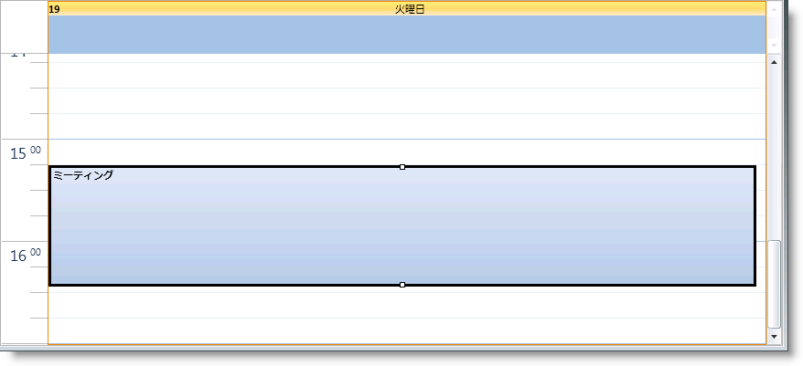
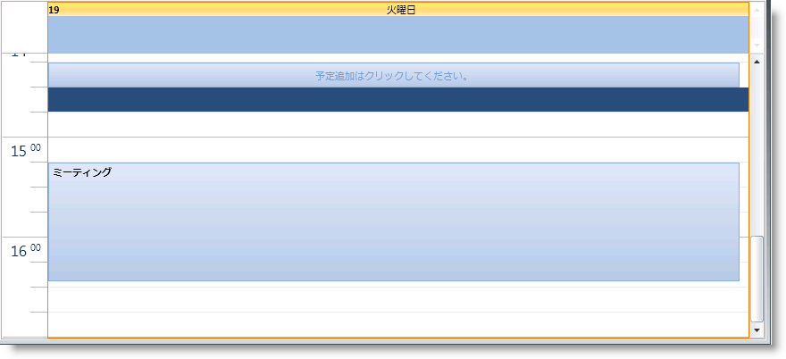

////

|metadata|
{
    "name": "xamschedule-using-enduserinteraction",
    "controlName": ["xamSchedule"],
    "tags": ["How Do I","Recurrences","Scheduling"],
    "guid": "ea4cc988-ecc4-48dc-b7f5-cf9d8ceb21ef",  
    "buildFlags": [],
    "createdOn": "2016-05-25T18:21:58.9023665Z"
}
|metadata|
////

= エンドユーザーによるアクティビティの操作

xamSchedule コントロールには数多くの操作に対する組み込みサポートが含まれ、これによってエンドユーザーは link:{ApiPlatform}controls.schedules{ApiVersion}~infragistics.controls.schedules.resourcecalendar.html[カレンダー]および link:{ApiPlatform}controls.schedules{ApiVersion}~infragistics.controls.schedules.activitybase.html[アクティビティ]での操作や応答ができます。操作に関連する一部のアクティビティは、アクティビティ、コネクターまたはアクティビティ設定の状態によって許可されない場合があります。

link:{ApiPlatform}controls.schedules{ApiVersion}~infragistics.controls.schedules.schedulesettings.html[ScheduleSettings] (link:{ApiPlatform}controls.schedules{ApiVersion}~infragistics.controls.schedules.xamscheduledatamanager.html[XamScheduleDataManager] の link:{ApiPlatform}controls.schedules{ApiVersion}~infragistics.controls.schedules.xamscheduledatamanager~settings.html[Settings] プロパティを介して公開される) には、各アクティビティ型に対して公開される link:{ApiPlatform}controls.schedules{ApiVersion}~infragistics.controls.schedules.activitysettings.html[[activity type]Settings] という名前のプロパティがあります (例、 link:{ApiPlatform}controls.schedules{ApiVersion}~infragistics.controls.schedules.schedulesettings~appointmentsettings.html[AppointmentSettings] は link:{ApiPlatform}controls.schedules{ApiVersion}~infragistics.controls.schedules.appointment.html[Appointment] オブジェクトに影響する)。これらのアクティビティ設定は、エンドユーザーによって許可されるユーザー操作のタイプを抑制および制御するために使用されます。たとえば、 link:{ApiPlatform}controls.schedules{ApiVersion}~infragistics.controls.schedules.activitysettings~allowedit.html[AllowEdit] プロパティが False に設定されている場合、そのアクティビティ型はプロパティの操作 (例、編集、リサイズなど) を許可しません。

また、 link:{ApiPlatform}controls.schedules{ApiVersion}~infragistics.controls.schedules.resource.html[Resource] には link:{ApiPlatform}controls.schedules{ApiVersion}~infragistics.controls.schedules.resource~islocked.html[IsLocked] プロパティがあります。これを Ture に設定すると、ユーザーはリソースの追加、削除、または編集アクティビティができません。同様に、 link:{ApiPlatform}controls.schedules{ApiVersion}~infragistics.controls.schedules.activitybase.html[ActivityBase] には link:{ApiPlatform}controls.schedules{ApiVersion}~infragistics.controls.schedules.activitybase~islocked.html[IsLocked] プロパティがあり、ユーザーが編集できないようにします。

== ドラッグ & ドロップ

エンドユーザーは、マウスなどのポインティング デバイスを使用してアクティビティをドラッグして、マウスが配置されるタイムスロットに基づき link:{ApiPlatform}controls.schedules{ApiVersion}~infragistics.controls.schedules.activitybase~start.html[Start] 時間と link:{ApiPlatform}controls.schedules{ApiVersion}~infragistics.controls.schedules.activitybase~end.html[End] 時間を変更します。ドラッグが開始されたコントロール内だけでなく、ソース コントロールとして link:{ApiPlatform}controls.schedules{ApiVersion}~infragistics.controls.schedules.schedulecontrolbase~datamanager.html[DataManager] が同じ link:{ApiPlatform}controls.schedules{ApiVersion}~infragistics.controls.schedules.xamscheduledatamanager.html[XamScheduleDataManager] に設定されたすべての link:{ApiPlatform}controls.schedules{ApiVersion}~infragistics.controls.schedules.schedulecontrolbase.html[ScheduleControlBase] 派生コントロール (例、 link:{ApiPlatform}controls.schedules{ApiVersion}~infragistics.controls.schedules.xammonthview.html[XamMonthView]、 link:{ApiPlatform}controls.schedules{ApiVersion}~infragistics.controls.schedules.xamdayview.html[XamDayView] および link:{ApiPlatform}controls.schedules{ApiVersion}~infragistics.controls.schedules.xamscheduleview.html[XamScheduleView]) でもドラッグはサポートされます。

ほとんどのケースで、ドラッグはアクティビティのオリジナルの link:{ApiPlatform}controls.schedules{ApiVersion}~infragistics.controls.schedules.activitybase~duration.html[Duration] を保持しますが、ドロップ ターゲット (つまり、マウスがリリースされるタイムスロット) に基づいてアクティビティの期間は変化します。たとえば、期間が論理的な 1 日の期間 (つまり、デフォルトは 24 時間) 未満であるアクティビティを複数日のアクティビティ領域にドラッグすると、アクティビティの期間は論理的な 1 日の期間に変わります。同様に、期間が 24 時間または 24 時間を超えるアクティビティを xamDayView のタイムスロットにドラッグすると、 link:{ApiPlatform}controls.schedules{ApiVersion}~infragistics.controls.schedules.xamdayview~multidayactivityareavisibility.html[MultiDayActivityAreaVisibility] が Collapsed に設定されていない場合は期間は 30 分に変わります。

Ctrl キーを押しながらドラッグすると、オリジナルのアクティビティのコピーが作成されます。

*注:* 関連付けられた link:{ApiPlatform}controls.schedules{ApiVersion}~infragistics.controls.schedules.xamscheduledatamanager~dataconnector.html[DataConnector] は、この操作を可能にするために新しいアクティビティの作成をサポートする必要があります。

また、関連付けられた DataConnector の機能に基づいて、アクティビティはカレンダー間やリソース間でもドラッグすることができます。ActivitySettings は、同じカレンダー内に限ってアクティビティをドラッグするのか、同じリソースのカレンダー間をドラッグするのか、それとも任意のリソースのカレンダー間でドラッグするのかを示すために使用される link:{ApiPlatform}controls.schedules{ApiVersion}~infragistics.controls.schedules.activitysettings~allowdragging.html[AllowDragging] プロパティを公開します。

== サイズ変更

アクティビティが選択されると、アクティビティがリサイズを許可している場合、Start/End プレースホルダーのリサイズが表示されます。これらをドラッグしてアクティビティの Start 時間または End 時間、およびアクティビティの Duration を調整できます。

アクティビティ設定の link:{ApiPlatform}controls.schedules{ApiVersion}~infragistics.controls.schedules.activitysettings~allowresizing.html[AllowResizing] プロパティは、エンドユーザーがアクティビティをリサイズできるかどうか、そして許可されるリサイズのタイプを制御するために使用されます。

アクティビティの実際の Start 時間または End 時間がコントロール内に表示されない場合 (例、アクティビティが 9/25 12am から始まって 9/28 12am で終わり、コントロールが 9/26 だけを表示している)、リサイズ インジケーターはビューの外にあるエッジには表示されません。

== 編集

選択したアクティビティのタイトルをクリックすると、「インプレース」編集操作が開始されます。link:{ApiPlatform}controls.schedules{ApiVersion}~infragistics.controls.schedules.activitybase~subject.html[Subject] を編集後に Enter キーを押すと (または、タイムスロットをクリックして、選択したアクティビティからフォーカスを解除)、変更が適用されます。Escape をクリックすると編集操作はキャンセルされます。

== アセンブリ情報をインストールしています。

新しいアクティビティを作成する方法がいくつかあります。タイムスロットをダブルクリック可能で、アクティビティ ダイアログが表示され、クリックされたタイムスロットに関連付けられた時間に基づいて初期化されます。ひとつ以上のタイムスロットを選択し、入力または Enter を押して、新しいアクティビティを「インプレースで」作成することもできます。

アクティビティを作成するもうひとつの手段は、「クリックして追加」プロンプトを使用することです。これは短時間タイムスロット上にマウスを重ねた後でタイムスロットに表示される要素です。この要素をクリックすると、そのタイムスロットに新しいアクティビティが作成され、エンドユーザーはインプレース編集を開始します。

*注:* 現時点では、 link:{ApiPlatform}controls.schedules{ApiVersion}~infragistics.controls.schedules.appointment.html[Appointment] エンティティの作成だけが UI でサポートされています。link:{ApiPlatform}controls.schedules{ApiVersion}~infragistics.controls.schedules.task.html[Tasks] および link:{ApiPlatform}controls.schedules{ApiVersion}~infragistics.controls.schedules.journal.html[Journal] アクティビティは、UI から作成できません。

== 削除中

UI からアクティビティを削除するための 2 つの方法が組み込まれています。UI でひとつ以上のアクティビティを選択し、Delete キーを押します。複数のアクティビティを選択するには、Ctrl キーを押す必要があります。選択したアクティビティが繰り返しアクティビティの発生である場合、その発生またはシリーズを削除するかどうかを尋ねるメッセージがプロンプト表示されます。

もうひとつの方法は、アクティビティ ダイアログ内の Delete ボタンを使用することです。アクティビティが発生または繰り返しのルート アクティビティである場合 (つまり、ユーザーがシリーズを編集している)、これは発生またはシリーズのいずれかを削除します。

== 関連トピック

link:xamschedule-understanding-activities.html[アクティビティについて]

link:xamschedule-using-manager-permission.html[権限]

link:xamschedule-using-control-confday.html[xamDayView の構成]

link:xamschedule-using-control-confschedule.html[xamScheduleView の構成]

link:xamschedule-using-control-confmonth.html[xamMonthView の構成]