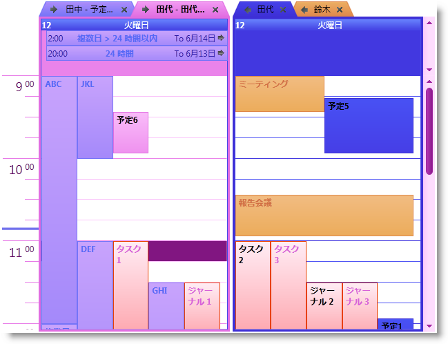

////

|metadata|
{
    "name": "xamschedule-using-styling-washingcolorschemes",
    "controlName": ["xamSchedule"],
    "tags": ["Styling"],
    "guid": "da2cfbc3-b43b-4a39-9879-7ac3785934fe",  
    "buildFlags": [],
    "createdOn": "2016-05-25T18:21:58.8423654Z"
}
|metadata|
////

= 配色のウォッシュ (xamSchedule)

== トピックの概要

=== 目的

このトピックでは、 _xamSchedule_   の配色に関して色の変更方法を解説します。

=== 前提条件

このトピックの本題に入る前に、以下のトピックをお読みください。

[options="header", cols="a,a"]
|====
|トピック|目的

| link:xamschedule-understanding.html[xamSchedule の理解]
|このトピックでは、 _xamSchedule_ コントロールの概要を解説します。

| link:xamschedule-using-styling-custom.html[カスタムの配色]
|このトピックでは、 _xamSchedule_ のカスタム配色の作成方法を解説します。

|====

=== このトピックの内容

* <<_Ref332787501,はじめに>>
* <<_Ref332787913, _XamSchedule_   配色のウォッシュ手順>>
* <<OLE_LINK48,コード例>>
* <<_Ref329347147,XAML による配色のウォッシュ – コード例>>
* <<_Ref329347158,C# による配色のウォッシュ – コード例>>
* <<_Ref329347164,Visual Basic による配色のウォッシュ – コード例>>
* <<_Ref332787979,関連コンテンツ>>

[[_Ref332787501]]
== はじめに

=== カラー ウォッシュとは

link:{RootAssembly}{ApiVersion}~infragistics.windows.themes.resourcewasher.html[ResourceWasher] では、 _xamSchedule_   の配色を指定した色でウォッシュして、ルック アンド フィールの全く異なるアプリケーションにすることができます。

注:

[NOTE]
====
_xamSchedule_   コントロールのユーザー インターフェイスは、複数の {ProductName} コントロール (link:{ApiPlatform}controls.editors.xamcalendar{ApiVersion}~infragistics.controls.editors.xamcalendar.html[xamCalendar]、 link:{ApiPlatform}controls.menus.xammenu{ApiVersion}~infragistics.controls.menus.xammenu.html[xamMenu]、 pick:[sl=" link:{ApiPlatform}controls.menus.xamribbon{ApiVersion}~infragistics.controls.menus.xamribbon.html[xamRibbon]"]  pick:[wpf=" link:{ApiPlatform}ribbon{ApiVersion}~infragistics.windows.ribbon.xamribbon.html[xamRibbon]"] 。_xamSchedule_   で使用できるコントロールは、使用している機能 (link:xamschedule-using-activitydialogs.html[簡易ダイアログや 詳細ダイアログなど]) など) からなります。従って、すべてのユーザー インターフェイスで統一を図るには、他のコントロールもウォッシュすることをお勧めします。
====

[[_Ref332787913]]
== _XamSchedule_   配色のウォッシュ手順

=== はじめに

Resource Washer 自体は ResourceDictionary なので、Resource Washer はアプリケーションやページ リソースに追加します。既存の配色も、カスタム配色もウォッシュできます。

=== プレビュー

以下の 2 枚のスクリーンショットは、標準 IG 配色とマゼンタでウォッシュした IG 配色で  _xamSchedule_   を比較し、対比させたものです。

標準 IG 配色の場合:

image::images/xamSchedule_Washing1.png[]

マゼンタでウォッシュした IG 配色:

=== 手順

以下の手順は、 _xamSchedule の_  配色をウォッシュするための基本的な手順です。詳細については、以下のコード例を参照してください。

[start=1]
. ResourceWasher を作成します。

XAML かコードで `ResourceWasher` のインスタンスを作成します。

[start=2]
. ResourceWasher を構成します。

個々のニーズに応じて `ResourceWasher` を構成します ( pick:[sl=" link:{RootAssembly}{ApiVersion}~infragistics.resourcewasher~washcolor.html[WashColor]"]  pick:[wpf=" link:{RootAssembly}{ApiVersion}~infragistics.windows.themes.resourcewasher~washcolor.html[WashColor]"]  プロパティと  pick:[sl=" link:{RootAssembly}{ApiVersion}~infragistics.resourcewasher~sourcedictionary.html[SourceDictionary]"]  pick:[wpf=" link:{RootAssembly}{ApiVersion}~infragistics.windows.themes.resourcewasher~sourcedictionary.html[SourceDictionary]"]  プロパティの設定など)。ResourceWasher の使用方法については、 link:reswash.html[ResourceWasher のトピック]も参照してください。

[start=3]
. Resources に ResourceWasher を追加します。

アプリケーションまたはページのリソースに `ResourceWasher` を追加します。

== コード例

=== コード例の概要

以下の表は、このトピックで使用したコード例をまとめたものです。

[options="header", cols="a,a"]
|====
|例|解説

|<<_Ref329347147,XAML による配色のウォッシュ – コード例>>
|このコード例では、XAML による配色のウォッシュ方法を紹介します。

|<<_Ref329347158,C# による配色のウォッシュ – コード例>>
|このコード例では、C# による配色のウォッシュ方法を紹介します。

|<<_Ref329347164,Visual Basic による配色のウォッシュ – コード例>>
|このコード例では、VB による配色のウォッシュ方法を紹介します。

|====

[[_Ref329347147]]
== XAML による配色のウォッシュ – コード例

=== 解説

このコード例では、XAML による配色のウォッシュ方法を紹介します。

=== コード

*XAML の場合:*

ifdef::wpf[]
----
<Page
  x:Class="IGSchedule.Samples.MyPage"
  xmlns="http://schemas.microsoft.com/winfx/2006/xaml/presentation"
  xmlns:x="http://schemas.microsoft.com/winfx/2006/xaml"
  xmlns:mc="http://schemas.openxmlformats.org/markup-compatibility/2006"
  xmlns:d="http://schemas.microsoft.com/expression/blend/2008"
  mc:Ignorable="d"
  ...
  xmlns:ig="http://schemas.infragistics.com/xaml"
  xmlns:igThemes="http://infragistics.com/Themes" >
  <Page.Resources>
    <ig Themes :ResourceWasher WashColor="Magenta">
      <ig Themes :ResourceWasher.SourceDictionary>
        <ResourceDictionary>
          
        </ResourceDictionary>
      </ig Themes :ResourceWasher.SourceDictionary>
    </ig Themes :ResourceWasher>
  </Page.Resources>
  <ig:XamDayView x:Name="dayView" ... />
</Page>
----
endif::wpf[]

[[_Ref329347158]]
== C# による配色のウォッシュ – コード例

=== 解説

このコード例では、C# による配色のウォッシュ方法を紹介します。

=== コード

*C# の場合:*

[source,csharp]
----
// create an instance of the IG color scheme
IGColorScheme igcs = new IGColorScheme();
// create new style, which will set the "ColorScheme"
// of the xamSchedule's data manager and the value
// will be the IG color scheme instance we've created above
System.Windows.Style style = new System.Windows.Style();
style.TargetType = typeof(XamScheduleDataManager);
style.Setters.Add(new Setter()
{
    Property = XamScheduleDataManager.ColorSchemeProperty,
    Value = igcs
});
// add this style in the merged dictionaries of a
// ResourceDictionary, which is set as in the
// "SourceDictionary" property of the Resource Washer
ResourceDictionary rd = new ResourceDictionary();
rd.Add("style1", style);
ResourceWasher rw = new ResourceWasher();
rw.SourceDictionary = rd;
// set the color you want to wash the color scheme with
rw.WashColor = Colors.Magenta;
// set the washed color scheme to the xamSchedule's data manager
this.dataManager.ColorScheme = igcs;
----

[[_Ref329347164]]
== Visual Basic による配色のウォッシュ – コード例

=== 解説

このコード例では、VB による配色のウォッシュ方法を紹介します。

=== コード

*Visual Basic の場合:*

[source,vb]
----
' create an instance of the IG color scheme
Dim igcs As New IGColorScheme()
' create new style, which will set the "ColorScheme"
' of the xamSchedule's data manager and the value
' will be the IG color scheme instance we've created above
Dim style As New System.Windows.Style()
style.TargetType = GetType(XamScheduleDataManager)
style.Setters.Add(New Setter() With { _
      .[Property] = XamScheduleDataManager.ColorSchemeProperty, _
      .Value = igcs _
})
' add this style in the merged dictionaries of a
' ResourceDictionary, which is set as in the
' "SourceDictionary" property of the Resource Washer
Dim rd As New ResourceDictionary()
rd.Add("style1", style)
Dim rw As New ResourceWasher()
rw.SourceDictionary = rd
' set the color you want to wash the color scheme with
rw.WashColor = Colors.Magenta
' set the washed color scheme to the xamSchedule's data manager
Me.dataManager.ColorScheme = igcs
----

[[_Ref332787979]]
== 関連コンテンツ

=== トピック

このトピックについては、以下のトピックも参照してください。

[options="header", cols="a,a"]
|====
|トピック|目的

| link:reswash-about.html[リソース ウォッシャーについて]
|このトピックでは、`Resource Washer` コントロールを紹介します。

| link:reswash-using.html[リソース ウォッシャーの使用]
|このトピックでは、`Resource Washer` コンポーネントを紹介し、アプリケーションの全体的な配色の変更方法を解説します。

| link:xamschedule-using-styling-custom.html[カスタムの配色]
|_xamSchedule_ のカスタム カラー スキームの作成を説明します。

|====