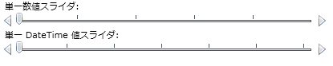

////

|metadata|
{
    "name": "xamslider-xamslider-tick-marks",
    "controlName": ["xamSlider"],
    "tags": ["Getting Started","How Do I","Styling"],
    "guid": "{8ACC1064-03D7-4B94-8326-A8DF8437BABE}",  
    "buildFlags": [],
    "createdOn": "2016-05-25T18:21:59.0483764Z"
}
|metadata|
////

= xamSlider の目盛

xamSlider コントロールには、コントロールでエンドユーザーが値を区別する手助けとなる目盛があります。使用する目盛のタイプは、ユーザーが使用しているスライダーのタイプによって異なります。たとえば、xamNumericSlider または xamNumericRangeSlider の数値スライダーを使用している場合、 link:{ApiPlatform}controls.editors.xamslider{ApiVersion}~infragistics.controls.editors.slidertickmarks.html[SliderTickMarks] オブジェクトを使用する必要があります。一方、xamDateTimeSlider または xamDateTimeRangeSlider の DateTime スライダーを使用している場合、 link:{ApiPlatform}controls.editors.xamslider{ApiVersion}~infragistics.controls.editors.datetimeslidertickmarks.html[DateTimeSliderTickMarks] オブジェクトを使用する必要があります。2 タイプの目盛は交換可能ではありません。ただし、両方とも以下の一般的に使用されるプロパティを共有します:

* link:{ApiPlatform}controls.editors.xamslider{ApiVersion}~infragistics.controls.editors.slidertickmarksbase~horizontaltickmarkstemplate.html[HorizontalTickMarksTemplate]
* link:{ApiPlatform}controls.editors.xamslider{ApiVersion}~infragistics.controls.editors.slidertickmarksbase~includesliderends.html[IncludeSliderEnds]
* link:{ApiPlatform}controls.editors.xamslider{ApiVersion}~infragistics.controls.editors.slidertickmarksbase~numberoftickmarks.html[NumberOfTickMarks]
* link:{ApiPlatform}controls.editors.xamslider{ApiVersion}~infragistics.controls.editors.slidertickmarks`1~tickmarksvalues.html[TickMarksValues]
* link:{ApiPlatform}controls.editors.xamslider{ApiVersion}~infragistics.controls.editors.slidertickmarks`1~tickmarksfrequency.html[TickMarksFrequency]
* link:{ApiPlatform}controls.editors.xamslider{ApiVersion}~infragistics.controls.editors.slidertickmarksbase~usefrequency.html[UseFrequency]
* link:{ApiPlatform}controls.editors.xamslider{ApiVersion}~infragistics.controls.editors.slidertickmarksbase~verticaltickmarkstemplate.html[VerticalTickMarksTemplate]

前述したプロパティに加えて、DateTimeSliderTickMarks オブジェクトは、 link:{ApiPlatform}controls.editors.xamslider{ApiVersion}~infragistics.controls.editors.datetimeslidertickmarks~frequencytype.html[FrequencyType] 列挙値に設定できる link:{ApiPlatform}controls.editors.xamslider{ApiVersion}~infragistics.controls.editors.frequencytype.html[FrequencyType] プロパティも公開します。xamDateTimeSlider および xamDateTimeRangeSlider コントロールは、目盛を配列するために FrequencyType プロパティと組み合わせて TickMarksFrequency プロパティを使用します。TickMarksFrequency プロパティをスカラ値、FrequencyType プロパティを測定単位として考えることができます。たとえば、値が 1/1/2009 から 12/31/2009 の範囲で、TickMarksFrequency プロパティを 3 に設定する場合、3 日毎、3 カ月毎、3 年毎のいずれで目盛を表示すべきかを決定するために FrequencyType プロパティを設定する必要があります。

ifdef::win-phone[]
image::images/xamSlider_xamSlider_Tick_Marks_01.png[]
endif::win-phone[]

ifdef::sl,wpf[]

endif::sl,wpf[]

以下の例のコードは、目盛プロパティの追加と設定を示しています。

*XAML の場合:*

----
<StackPanel>
    <!--20 番目毎の間隔で目盛が付けられた単一値の数値スライダー-->
    <TextBlock Text=" Numeric single-value slider:" />
    <ig:XamNumericSlider  Name="xamNumericSlider1" MinValue="0" MaxValue="100">
        <ig:XamNumericSlider .TickMarks>
            <ig:SliderTickMarks TickMarksFrequency="20" UseFrequency="True" />
        </ig:XamNumericSlider .TickMarks>
    </ig:XamNumericSlider >
    <!--2 カ月毎で目盛が付けられた単一値 DateTime スライダー-->
    <TextBlock Text="DateTime single-value slider:" />
    <ig:XamDateTimeSlider Name="xamDateTimeSlider1" MinValue="1/1/2009" MaxValue="12/31/2009">
        <ig:XamDateTimeSlider.TickMarks>
            <ig:DateTimeSliderTickMarks 
                TickMarksFrequency="2" 
                FrequencyType="Months" 
                UseFrequency="True" />
        </ig:XamDateTimeSlider.TickMarks>
    </ig:XamDateTimeSlider>
</StackPanel>
----

*Visual Basic の場合:*

----
Imports Infragistics.Controls.Interactions
Imports Infragistics
...
'単一値数値スライダー用の目盛
Dim numericTickMarks As New SliderTickMarks With {.TickMarksFrequency = 20, .UseFrequency = True}
Me.xamNumericSlider1.TickMarks.Add(numericTickMarks)
'単一値 DateTime スライダー用の目盛
Dim dateTickMarks As New DateTimeSliderTickMarks With {.TickMarksFrequency = 2, .FrequencyType = FrequencyType.Months, .UseFrequency = True}
Me.xamDateTimeSlider1.TickMarks.Add(dateTickMarks)
...
----

*C# の場合:*

----
using Infragistics.Controls.Interactions;
using Infragistics;
...
//単一値数値スライダー用の目盛
SliderTickMarks numericTickMarks = new SliderTickMarks
{
    TickMarksFrequency = 20,
    UseFrequency = true
};
this.xamNumericSlider1.TickMarks.Add(numericTickMarks);
//単一値 DateTime スライダー用の目盛
DateTimeSliderTickMarks dateTickMarks = new DateTimeSliderTickMarks
{
    TickMarksFrequency = 2,
    FrequencyType = FrequencyType.Months,
    UseFrequency = true
};
this.xamDateTimeSlider1.TickMarks.Add(dateTickMarks);
...
----

== 関連トピック

link:xamslider-about-xamslider.html[xamSlider について]

link:xamslider-getting-started-with-xamslider.html[xamSlider を使用した作業の開始]

link:xamslider-xamslider-thumbs.html[xamSlider につまみを追加]

link:xamslider-interaction-modes.html[操作モード]

ifdef::wpf,sl[]
link:xamslider-tooltips.html[ツールチップ]
endif::wpf,sl[]

link:xamslider-value-tick-marks.html[目盛値]

link:xamslider-retrieve-the-thumb-values.html[つまみの値の取得]

link:xamslider-programmatically-add-or-remove-thumbs-at-runtime.html[プログラムによってランタイムでつまみを追加または削除]