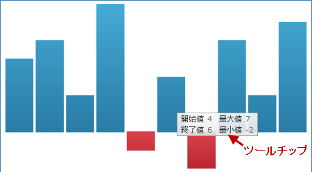

////

|metadata|
{
    "name": "xamsparkline-adding-a-tooltip",
    "controlName": ["xamSparkline"],
    "tags": ["Charting","How Do I","Tips and Tricks"],
    "guid": "9e88c011-0817-4321-b8fb-d0191a7f64f2",  
    "buildFlags": [],
    "createdOn": "2016-05-25T18:21:59.1973538Z"
}
|metadata|
////

= ツールチップの追加

== トピックの概要

=== 目的

このトピックは、コード例を示して、 link:{ApiPlatform}controls.charts.xamsparkline{ApiVersion}.html[xamSparkline]™ コントロールにヒントを追加する方法を説明します。

=== 前提条件

以下の表に、このトピックを理解するための前提条件として求められるトピックをリストします。

[options="header", cols="a,a"]
|====
|トピック|目的

| link:xamsparkline-xamsparkline-overview.html[xamSparkline の概要]
|コントロールと他の関連トピックの概要。

| link:xamsparkline-configuring-xamsparkline.html[xamSparkline の構成]
|スパークラインコントロールで行うことができるさまざまな構成を説明します。

|====

=== 本トピックの内容

このトピックには次のセクションがあります。

* <<_Ref317179371,ツールチップの追加>>

** <<_Ref317179380,概要>>
** <<_Ref317179386,プロパティ設定>>
** <<_Ref317179392,例>>
** <<_Ref317246129,コード>>

* <<_Ref317078582,関連コンテンツ>>

[[_Ref317179371]]
== ツールチップの追加

[[_Ref317179380]]

=== 概要

link:{ApiPlatform}controls.charts.xamsparkline{ApiVersion}~infragistics.controls.charts.xamsparkline~tooltipvisibility.html[ToolTipVisibility] プロパティを設定すると、ツールチップが追加されます。このプロパティが visible に設定されている場合、ツールチップは以下の既定値を表示します。

* 最初のデータ ポイント値。
* 最後のデータ ポイント値。
* データ ポイント最高値。
* データ ポイント最低値。

既定では (カスタマイズ設定が適用されていない場合)、ヒントは上記の 4 種類の値として、最初、最後、最高、最低の各データ ポイントを表示します。

_xamSparkline_   ツールチップの構成の詳細については、 link:xamsparkline-configuring-the-tooltip.html[ツールチップの構成]トピックを参照してください。

[[_Ref317179386]]

=== プロパティ設定

以下の表では、Sparkline Tooltip をプロパティ設定にマップします。

[options="header", cols="a,a,a"]
|====
|以下を行うために:|プロパティ|次に設定

|ツールチップを有効にする
|ToolTipVisibility
| _Visible_ 

|====

[[_Ref317179392]]

=== 例

概要テキスト ブロックのスクリーンショットは、以下の設定の結果 Sparkline ツールチップがどのように表示されるかを示しています。

[options="header", cols="a,a"]
|====
|プロパティ|値

| link:{ApiPlatform}controls.charts.xamsparkline{ApiVersion}~infragistics.controls.charts.xamsparkline~tooltipvisibility.html[ToolTipVisibility]
| _Visible_ 

|====

[[_Ref317246129]]

=== コード

*XAML の場合:*

[source,xaml]
----
<ig:XamSparkline ToolTipVisibility="Visible" />
----

*C# の場合:*

[source,csharp]
----
this.xamSparkline1.ToolTipVisibility = System.Windows.Visibility.Visible;
----

*Visual Basic の場合:*

[source,vb]
----
Me.xamSparkline1.ToolTipVisibility = System.Windows.Visibility.Visible
----

[[_Ref317078582]]
== 関連コンテンツ

=== トピック

以下のトピックでは、このトピックに関連する情報を提供しています。

[options="header", cols="a,a"]
|====
|トピック|目的

| link:xamsparkline-xamsparkline-overview.html[xamSparkline の概要]
|このトピックは、 _xamSparkline_ コントロールの概要、その利点、およびサポートされるチャート タイプを提供します。

| link:xamsparkline-configuring-xamsparkline.html[xamSparkline の構成]
|このトピックは、 _xamSparkline_ コントロールを構成するあらゆる方法の概要について説明します。構成の詳細情報へのリンク (別のトピックで参照可能) も記載されています。

| link:xamsparkline-configuring-the-tooltip.html[ツールチップの構成]
|このトピックは、コード例を示して、 _xamSparkline_ でツールチップを構成し、カスタマイズする方法を説明します。

| link:xamsparkline-xamsparkline-property-reference.html[xamSparkline プロパティ参照]
|このトピックは、xamSparkline コントロールの主なプロパティを説明します。

|====