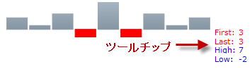

////

|metadata|
{
    "name": "xamsparkline-configuring-the-tooltip",
    "controlName": ["xamSparkline"],
    "tags": ["Charting","How Do I","Tips and Tricks"],
    "guid": "e4b44283-6a8d-4caa-8a31-5d905228173d",  
    "buildFlags": [],
    "createdOn": "2016-05-25T18:21:59.2233858Z"
}
|metadata|
////

= ツールチップの構成

== トピックの概要

=== 目的

このトピックは、コード例を示して、 link:{ApiPlatform}controls.charts.xamsparkline{ApiVersion}.html[xamSparkline]™ コントロールでツールチップを構成し、カスタマイズする方法を説明します。

=== 前提条件

以下の表に、このトピックを理解するための前提条件として求められるトピックをリストします。

[options="header", cols="a,a"]
|====
|タイプ|コンテンツ

|概念
|
* データ テンプレート 
|==== 

=== トピック
[options="header", cols="a,a"] 

|==== 

|トピック|目的 

| link:xamsparkline-xamsparkline-overview.html[xamSparkline の概要] 

|このトピックは、 _xamSparkline_ コントロールの概要、その利点、およびサポートされるチャート タイプを提供します。 

| link:xamsparkline-configuring-xamsparkline.html[xamSparkline の構成] 

|このトピックは、 _xamSparkline_ コントロールを構成するあらゆる方法の概要について説明します。構成の詳細情報へのリンク (別のトピックで参照可能) も記載されています。 

| link:xamsparkline-adding-a-tooltip.html[ツールチップの追加] 

|このトピックは、コード例を示して、 _xamSparkline_ コントロールでツールチップを追加する方法を説明します。 

|====

=== 本トピックの内容

このトピックには次のセクションがあります。

* <<_Ref319997461,概要>>
* <<_Ref318973062,ヒント構成点>>
* <<_Ref318973093,コード例: Data Template を使用したヒントの構成>>

** <<_Ref319065250,概要>>
** <<_Ref319940726,プロパティ設定>>
** <<_Ref319940733,プレビュー>>
** <<_Ref319940740,コード>>

* <<_Ref317078582,関連コンテンツ>>

[[_Ref319997461]]
== 概要

[[_Ref319088121]]

=== 概要

カスタマイズの前にツールチップを有効にする必要があり、ToolTipVisibility プロパティを  _true_   に設定して表示することができます。

ツールチップをカスタマイズする方法には 2 通りあり、どの link:{ApiPlatform}controls.charts.xamsparkline{ApiVersion}~infragistics.controls.charts.xamsparkline~tooltip.html[ToolTip] プロパティを表示するために設定するかによって異なります。

* String - link:{ApiPlatform}controls.charts.xamsparkline{ApiVersion}~infragistics.controls.charts.xamsparkline~tooltip.html[ToolTip] プロパティを以下のような文字列に設定：

`ToolTip="Testing the Tooltip"`

* Data Template - link:{ApiPlatform}controls.charts.xamsparkline{ApiVersion}~infragistics.controls.charts.xamsparkline~tooltip.html[ToolTip] プロパティが `DataTemplate` に設定される場合、その DataTemplate の `DataContext` オブジェクトは、 link:{ApiPlatform}controls.charts.xamsparkline{ApiVersion}~infragistics.controls.charts.sparklinetooltipcontext.html[SparklineTooltipContext] に設定され、これは DataTemplate でカスタマイズできる 4 つのプロパティを公開します。これらのプロパティは、 link:{ApiPlatform}controls.charts.xamsparkline{ApiVersion}~infragistics.controls.charts.sparklinetooltipcontext~first.html[First]、 link:{ApiPlatform}controls.charts.xamsparkline{ApiVersion}~infragistics.controls.charts.sparklinetooltipcontext~last.html[Last]、 link:{ApiPlatform}controls.charts.xamsparkline{ApiVersion}~infragistics.controls.charts.sparklinetooltipcontext~high.html[High]、および link:{ApiPlatform}controls.charts.xamsparkline{ApiVersion}~infragistics.controls.charts.sparklinetooltipcontext~low.html[Low] です。

ほとんどの場合、Data Template を使用してカスタマイズすることをお勧めします。文字列は Data Template ほど便利ではありません。Data Template は、単にヒントを文字列に設定する場合よりも、ヒントの外観を実装する場合の柔軟性が高いためです。たとえば、以下を行うことができます。

[[_Ref318973062]]
== ヒント構成点

=== ヒント構成点の概要

以下の表は、ヒントの構成可能な点を示しています。

[options="header", cols="a,a,a"]
|====
|構成可能な点|詳細|プロパティ

|ヒントの内容
|カスタム テキストを表示するようヒントを設定したり、DataTemplate を使用している場合は、データ ポイントをテキストとともに表示したりするなど、さらに内容をカスタマイズすることができます。
| link:{ApiPlatform}controls.charts.xamsparkline{ApiVersion}~infragistics.controls.charts.xamsparkline~tooltip.html[ToolTip]

|どのデータ ポイントを表示するか
|構成可能なデータ ポイントは、First、Last、High、および Low の各値です。
|
* link:{ApiPlatform}controls.charts.xamsparkline{ApiVersion}~infragistics.controls.charts.sparklinetooltipcontext~first.html[First] 

* link:{ApiPlatform}controls.charts.xamsparkline{ApiVersion}~infragistics.controls.charts.sparklinetooltipcontext~last.html[Last] 

* link:{ApiPlatform}controls.charts.xamsparkline{ApiVersion}~infragistics.controls.charts.sparklinetooltipcontext~high.html[High] 

* link:{ApiPlatform}controls.charts.xamsparkline{ApiVersion}~infragistics.controls.charts.sparklinetooltipcontext~low.html[Low] 

|DataTemplate 要素
|詳細は、DataTemplate (MSDN) の記事を参照してください。
|DataTemplate で使用でき、`TextBlock` の `Text` プロパティなどのバインディングをサポートする要素

|====

[[_Ref318973093]]
== コード例: Data Template を使用したヒントの構成

[[_Ref319065250]]

=== 概要

以下のコードでは、データ テンプレートは、 link:{ApiPlatform}controls.charts.xamsparkline{ApiVersion}~infragistics.controls.charts.sparklinetooltipcontext.html[SparklineToolTipContext] オブジェクト (link:{ApiPlatform}controls.charts.xamsparkline{ApiVersion}~infragistics.controls.charts.sparklinetooltipcontext~first.html[First]、 link:{ApiPlatform}controls.charts.xamsparkline{ApiVersion}~infragistics.controls.charts.sparklinetooltipcontext~last.html[Last]、 link:{ApiPlatform}controls.charts.xamsparkline{ApiVersion}~infragistics.controls.charts.sparklinetooltipcontext~high.html[High] および link:{ApiPlatform}controls.charts.xamsparkline{ApiVersion}~infragistics.controls.charts.sparklinetooltipcontext~low.html[Low]) のすべての使用可能なプロパティを使用して、以下のようなカスタマイズされた外観を達成できます。

* フォント サイズ - 10

* データ ポイントごとに異なる色:

* 最初および最後のデータ ポイント - 赤

* 最高および最低のデータ ポイント - 青

[[_Ref319065259]]

=== プロパティ設定

以下の表では、Sparkline Tooltip をプロパティ設定にマップします。

[options="header", cols="a,a"]
|====
|使用するプロパティ:|次に設定

| link:{ApiPlatform}controls.charts.xamsparkline{ApiVersion}~infragistics.controls.charts.xamsparkline~tooltipvisibility.html[ToolTipVisibility]
|_Visible_

| link:{ApiPlatform}controls.charts.xamsparkline{ApiVersion}~infragistics.controls.charts.xamsparkline~tooltip.html[ToolTip]
|_DataTemplate_

|====

[[_Ref319065317]]

=== プレビュー

[[_Ref319065326]]

=== コード

*XAML の場合:*

[source,xaml]
----
<ig:XamSparkline ToolTipVisibility="Visible" />
<ig:XamSparkline.ToolTip>
    <DataTemplate>
        <Grid>
            <Grid.RowDefinitions>
                <RowDefinition />
                <RowDefinition />
                <RowDefinition />
                <RowDefinition />
            </Grid.RowDefinitions>
            <Grid.ColumnDefinitions>
                <ColumnDefinition />
                <ColumnDefinition />
            </Grid.ColumnDefinitions>
            <TextBlock Grid.Row="0" Grid.Column="0" Text="First: " Foreground="Red"/>
            <TextBlock Grid.Row="0" Grid.Column="1" Text="{Binding First}" Foreground="Red" />
            <TextBlock Grid.Row="1" Grid.Column="0" Text="Last: " Foreground="Red"/>
            <TextBlock Grid.Row="1" Grid.Column="1" Text="{Binding Last}" Foreground="Red"/>
            <TextBlock Grid.Row="2" Grid.Column="0" Text="High: " Foreground="Blue"/>
            <TextBlock Grid.Row="2" Grid.Column="1" Text="{Binding High}" Foreground="Blue"/>
            <TextBlock Grid.Row="3" Grid.Column="0" 
Text="Low: " Foreground="Blue"/>
            <TextBlock Grid.Row="3" Grid.Column="1" Text="{Binding Low}" Foreground="Blue"/>
         </Grid>                        
     </DataTemplate>
</ig:XamSparkline.ToolTip>
----

[[_Ref317078582]]
== 関連コンテンツ

=== トピック

以下のトピックでは、このトピックに関連する情報を提供しています。

[options="header", cols="a,a"]
|====
|トピック|目的

| link:xamsparkline-xamsparkline-overview.html[xamSparkline の概要]
|このトピックは、 _xamSparkline_ コントロールの概要、その利点、およびサポートされるチャート タイプを提供します。

| link:xamsparkline-configuring-xamsparkline.html[xamSparkline の構成]
|このトピックは、 _xamSparkline_ コントロールを構成するあらゆる方法の概要について説明します。構成の詳細情報へのリンク (別のトピックで参照可能) も記載されています。

| link:xamsparkline-adding-a-tooltip.html[ツールチップの追加]
|このトピックは、コード例を示して、 _xamSparkline_ コントロールでツールチップを追加する方法を説明します。

| link:xamsparkline-xamsparkline-property-reference.html[xamSparkline プロパティ参照]
|このトピックは、 _xamSparkline_ コントロールの主なプロパティを説明します。

|====