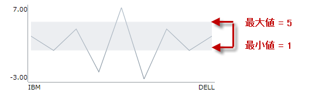

////

|metadata|
{
    "name": "xamsparkline-defining-a-normal-range",
    "controlName": ["xamSparkline"],
    "tags": ["API","Charting","Layouts"],
    "guid": "cd91bf69-eeb4-422d-b97a-d62402997c6f",  
    "buildFlags": [],
    "createdOn": "2016-05-25T18:21:59.2493562Z"
}
|metadata|
////

= 標準範囲の定義

== トピックの概要

=== 目的

このトピックは、コード例を示して、 link:{ApiPlatform}controls.charts.xamsparkline{ApiVersion}.html[xamSparkline]™ の標準範囲を定義する方法を説明します。

=== 前提条件

以下の表に、このトピックを理解するための前提条件として求められるトピックをリストします。

[options="header", cols="a,a"]
|====
|トピック|目的

| link:xamsparkline-xamsparkline-overview.html[xamSparkline の概要]
|このトピックは、 _xamSparkline_ コントロールの概要、その利点、およびサポートされるチャート タイプを提供します。

| link:xamsparkline-configuring-xamsparkline.html[xamSparkline を構成]
|このトピックは、 _xamSparkline_ コントロールを構成するあらゆる方法の概要について説明します。構成の詳細情報へのリンク (別のトピックで参照可能) も記載されています。

|====

=== 本トピックの内容

このトピックには次のセクションがあります。

* <<_Ref317087505,標準範囲の定義>>

** <<_Ref317163220,概要>>
** <<_Ref317163245,プロパティ設定>>
** <<_Ref317163255,例>>
** <<_Ref317178255,コード>>

* <<_Ref317163399,関連コンテンツ>>

[[_Ref317087505]]
== 標準範囲の定義

[[_Ref317163220]]

=== 概要

標準範囲は、データを視覚化しているときに、あらかじめ定義された意味のある範囲を表す水平方向に延びる背景の縞模様です。標準範囲は、好みの色でアウトラインを描いた網掛けエリアとして設定できます。

標準範囲は、最大データ ポイントまたはそれを超える範囲より広げることができます。たとえば、しきい値インジケーターとして使用するため、線のように細くすることもできます。標準範囲の幅と外観 (アウトライン、塗りつぶし、色) を構成することもできます。

標準範囲を表示するためには最低限、可視性、範囲の下境界線、範囲の上境界線を設定する必要があります。これらの設定は、それぞれ以下のプロパティによって管理されます。

* link:xamsparkline-xamsparkline-property-reference.html#NormalRangeVisibility[NormalRangeVisibility]

* link:xamsparkline-xamsparkline-property-reference.html#NormalRangeMaximum[NormalRangeMaximum]

* link:xamsparkline-xamsparkline-property-reference.html#NormalRangeMinimum[NormalRangeMinimum]

既定では、標準範囲は表示されません。有効となっている場合、標準範囲はライト グレーの概観で表示されます。

[[_Ref317163245]]

=== プロパティ設定

以下の表では、マーカーの表示に関するタスクをそれらを構成するプロパティ設定にマップしています。

[options="header", cols="a,a,a"]
|====
|以下を行うために:|プロパティ|次に設定

|標準範囲を表示する
| link:{ApiPlatform}controls.charts.xamsparkline{ApiVersion}~infragistics.controls.charts.xamsparkline~normalrangevisibility.html[NormalRangeVisibility]
| _Visible_ 

|標準範囲を非表示にする
| link:{ApiPlatform}controls.charts.xamsparkline{ApiVersion}~infragistics.controls.charts.xamsparkline~normalrangevisibility.html[NormalRangeVisibility]
| _Collapsed_ 

|下の境界線を設定する
| link:{ApiPlatform}controls.charts.xamsparkline{ApiVersion}~infragistics.controls.charts.xamsparkline~normalrangeminimum.html[NormalRangeMinimum]
| _数値_ 

|上の境界線を設定する
| link:{ApiPlatform}controls.charts.xamsparkline{ApiVersion}~infragistics.controls.charts.xamsparkline~normalrangemaximum.html[NormalRangeMaximum]
| _数値_ 

|====

[[_Ref317163255]]

=== 例

以下のスクリーンショットは、以下の設定の結果、スパークラインがどのように表示されるかを示しています。

[options="header", cols="a,a"]
|====
|プロパティ|値

| link:{ApiPlatform}controls.charts.xamsparkline{ApiVersion}~infragistics.controls.charts.xamsparkline~normalrangevisibility.html[NormalRangeVisibility]
|_Visible_

| link:{ApiPlatform}controls.charts.xamsparkline{ApiVersion}~infragistics.controls.charts.xamsparkline~normalrangeminimum.html[NormalRangeMinimum]
|_1_

| link:{ApiPlatform}controls.charts.xamsparkline{ApiVersion}~infragistics.controls.charts.xamsparkline~normalrangemaximum.html[NormalRangeMaximum]
|_5_

|====

[[_Ref317178255]]

=== コード

標準範囲は、次の点で構成することができます。

* 可視性

* 幅 ( _上下の境界線を設定することで定義します。_   <<_Ref317163245,プロパティ設定>>を参照してください _。_  )

* 塗りつぶし ( _既定では、範囲がライト グレーで塗りつぶされています_   _。_  )

次のコードはプロパティの最小設定で標準範囲を表示しています。link:{ApiPlatform}controls.charts.xamsparkline{ApiVersion}~infragistics.controls.charts.xamsparkline~normalrangefill.html[NormalRangeFill] プロパティは要求されません。既定では、上のプレビューのようにライト グレーで表示されますが、任意の色に変更することができます。

*XAML の場合:*

[source,xaml]
----
<igSparkline:XamSparkline 
   NormalRangeVisibility="Visible"
   NormalRangeMaximum="5"
   NormalRangeMinimum="1" />
----

*C# の場合:*

[source,csharp]
----
this.xamSparkline1.NormalRangeVisibility = System.Windows.Visibility.Visible;
this.xamSparkline1.NormalRangeMaximum = 5;
this.xamSparkline1.NormalRangeMinimum = 1;
----

*Visual Basic の場合:*

[source,vb]
----
Me.xamSparkline1.NormalRangeVisibility = System.Windows.Visibility.Visible
Me.xamSparkline1.NormalRangeMaximum = 5
Me.xamSparkline1.NormalRangeMinimum = 1
----

[[_Ref317163399]]
== 関連コンテンツ

=== トピック

以下のトピックでは、このトピックに関連する情報を提供しています。

[options="header", cols="a,a"]
|====
|トピック|目的

| link:xamsparkline-xamsparkline-overview.html[xamSparkline の概要]
|このトピックは、 _xamSparkline_ コントロールの概要、その利点、およびサポートされるチャート タイプを提供します。

| link:xamsparkline-configuring-xamsparkline.html[xamSparkline を構成]
|このトピックは、 _xamSparkline_ コントロールを構成するあらゆる方法の概要について説明します。構成の詳細情報へのリンク (別のトピックで参照可能) も記載されています。

| link:xamsparkline-configuring-the-normal-range.html[標準範囲の構成]
|このトピックは、 _xamSparkline_ コントロールを構成するあらゆる方法の概要について説明します。構成の詳細情報へのリンク (別のトピックで参照可能) も記載されています。

| link:xamsparkline-xamsparkline-property-reference.html[xamSparkline プロパティ参照]
|このトピックは、 _xamSparkline_ コントロールの主なプロパティを説明します。

|====