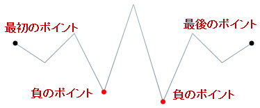

////

|metadata|
{
    "name": "xamsparkline-defining-markers",
    "controlName": ["xamSparkline"],
    "tags": ["API","Charting","Layouts","Styling"],
    "guid": "a727b367-959f-4ff3-ae80-868e37929a67",  
    "buildFlags": [],
    "createdOn": "2016-05-25T18:21:59.2563877Z"
}
|metadata|
////

= マーカーの定義

== トピックの概要

=== 目的

このトピックは、コード例を示して、 link:{ApiPlatform}controls.charts.xamsparkline{ApiVersion}.html[xamSparkline]™ コントロールのマーカーを定義する方法を説明します。

=== 前提条件

以下の表に、このトピックを理解するための前提条件として求められるトピックをリストします。

[options="header", cols="a,a"]
|====
|トピック|目的

| link:xamsparkline-xamsparkline-overview.html[xamSparkline の概要]
|このトピックは、xamSparkline コントロールの概要、その利点、およびサポートされるチャート タイプを提供します。

| link:xamsparkline-configuring-xamsparkline.html[xamSparkline を構成]
|このトピックは、 _xamSparkline_ コントロールを構成するあらゆる方法の概要について説明します。構成の詳細情報へのリンク (別のトピックで参照可能) も記載されています。

|====

=== このトピックの構成

このトピックには次のセクションがあります。

* <<_Ref317083829,マーカーを定義 - 概念的概要>>

** <<_Ref317161385,概要>>
** <<_Ref317161389,プロパティ設定>>
** <<_Ref317161394,例>>
** <<_Ref317179476,マーカーの構成>>

* <<_Ref317083809,マーカーを定義 - コード例>>

** <<_Ref317161460,説明>>
** <<Preview,プレビュー>>
** <<_Ref317161464,コード>>

* <<_Ref317161501,関連コンテンツ>>

[[_Ref317083802]]
[[_Ref317083829]]
== マーカーを定義 - 概念的概要

[[_Ref317161385]]

=== 概要

マーカーは、 _X/Y_   座標に基づいて個別のデータ ポイントを示すために、スパークライン上にオーバーレイ表示されたシンボル (円形の色が付いたアイコン) です。マーカーは、タイプ link:{ApiPlatform}controls.charts.xamsparkline{ApiVersion}~infragistics.controls.charts.sparklinedisplaytype.html[Line]、 link:{ApiPlatform}controls.charts.xamsparkline{ApiVersion}~infragistics.controls.charts.sparklinedisplaytype.html[Area] および link:{ApiPlatform}controls.charts.xamsparkline{ApiVersion}~infragistics.controls.charts.sparklinedisplaytype.html[Column] のスパークラインで設定できます。スパークラインの link:{ApiPlatform}controls.charts.xamsparkline{ApiVersion}~infragistics.controls.charts.sparklinedisplaytype.html[WinLoss] タイプはマーカーを受け入れません。

マーカーは、最初、最後、最高、最低、および負の各データ ポイント、またその組み合わせで表示できます。

既定では、マーカーは表示されません。

[[_Ref317161389]]

=== プロパティ設定

以下の表では、マーカーの表示に関するタスクをそれらを構成するプロパティ設定にマップしています。

注: Collapsed 設定は、表示されないマーカーのデフォルトの状態を示します。

[options="header", cols="a,a,a"]
|====
|以下を行うために:|プロパティ|次に設定

|[[_Hlk317185178]] 

すべてのマーカーを表示
| link:xamsparkline-xamsparkline-property-reference.html#MarkerVisibility[MarkerVisibility]
| _Visible_ 

|すべてのマーカーを非表示
| link:xamsparkline-xamsparkline-property-reference.html#MarkerVisibility[MarkerVisibility] 

| _Collapsed_ 

|最初のデータ ポイントでマーカーを表示
| link:xamsparkline-xamsparkline-property-reference.html#FirstMarkerVisibility[FirstMarkerVisibility]
| _Visible_ 

|最初のデータ ポイントでマーカーを非表示
| link:xamsparkline-xamsparkline-property-reference.html#FirstMarkerVisibility[FirstMarkerVisibility] 

| _Collapsed_ 

|最後のデータ ポイントでマーカーを表示
| link:xamsparkline-xamsparkline-property-reference.html#LastMarkerVisibility[LastMarkerVisibility]
| _Visible_ 

|最後のデータ ポイントのマーカーを非表示にする
| link:xamsparkline-xamsparkline-property-reference.html#LastMarkerVisibility[LastMarkerVisibility] 

| _Collapsed_ 

|最高のデータ ポイントでマーカーを表示
| link:xamsparkline-xamsparkline-property-reference.html#HighMarkerVisibility[HighMarkerVisibility]
| _Visible_ 

|最高値のデータ ポイントのマーカーを非表示にする
| link:xamsparkline-xamsparkline-property-reference.html#HighMarkerVisibility[HighMarkerVisibility]
| _Collapsed_ 

|最低のデータ ポイントでマーカーを表示
| link:xamsparkline-xamsparkline-property-reference.html#LowMarkerVisibility[LowMarkerVisibility]
| _Visible_ 

|最低値のデータ ポイントのマーカーを非表示にする
| link:xamsparkline-xamsparkline-property-reference.html#LowMarkerVisibility[LowMarkerVisibility]
| _Collapsed_ 

|負のデータ ポイントでマーカーを表示
| link:xamsparkline-xamsparkline-property-reference.html#NegativeMarkerVisibility[NegativeMarkerVisibility]
| _Visible_ 

|負のデータ ポイントのマーカーを非表示にする
| link:xamsparkline-xamsparkline-property-reference.html#NegativeMarkerVisibility[NegativeMarkerVisibility]
| _Collapsed_ 

|====

[[_Ref317161394]]

=== 例

以下のスクリーンショットは、以下の設定の結果、スパークラインがどのように表示されるかを示しています。

[options="header", cols="a,a"]
|====
| *プロパティ* | *値* 

| link:{ApiPlatform}controls.charts.xamsparkline{ApiVersion}~infragistics.controls.charts.xamsparkline~markervisibility.html[MarkerVisibility]
| _Visible_ 

|====

image::images/Sparkline_Defining_Markers_1.png[]

[[_Ref317179476]]

=== マーカーの構成

マーカーは、以下の点で構成できます。

* 最初、最後、最高、最低および負の値などを個々に、または組み合わせて示すようにデータ ポイントを選択します。詳細は、<<_Ref317161389,プロパティ設定>>のブロックを参照してください。

* サイズ

* 色

マーカーのサイズおよび色を構成する方法の詳細については、 link:xamsparkline-configuring-markers.html[「マーカーを構成」]のトピックを参照してください。

[[_Ref317083809]]
== マーカーを定義 - コード例

[[_Ref317161460]]

=== 説明

以下のコードは、以下のデータ ポイントにマーカーを表示する方法を示します:

* 最初のデータ ポイント

* 最後のデータ ポイント

* すべての負のデータ ポイント上

[[Preview]]

=== プレビュー

…

[[_Ref317161464]]

=== コード

*XAML の場合:*

[source,xaml]
----
<igSparkline:XamSparkline 
                MarkerVisibility="Collapsed"
                HighMarkerVisibility="Collapsed"
                LowMarkerVisibility="Collapsed"
                FirstMarkerVisibility="Visible"
                LastMarkerVisibility="Visible"
                NegativeMarkerVisibility="Visible" />
----

*C# の場合:*

[source,csharp]
----
this.xamSparkline1.MarkerVisibility = System.Windows.Visibility.Collapsed;
this.xamSparkline1.LowMarkerVisibility = System.Windows.Visibility.Collapsed;
this.xamSparkline1.HighMarkerVisibility = System.Windows.Visibility.Collapsed;
this.xamSparkline1.FirstMarkerVisibility = System.Windows.Visibility.Visible;
this.xamSparkline1.LastMarkerVisibility = System.Windows.Visibility.Visible;
this.xamSparkline1.NegativeMarkerVisibility = System.Windows.Visibility.Visible;
----

*Visual Basic の場合:*

[source,vb]
----
Me.xamSparkline1.MarkerVisibility = System.Windows.Visibility.Collapsed
Me.xamSparkline1.LowMarkerVisibility = System.Windows.Visibility.Collapsed
Me.xamSparkline1.HighMarkerVisibility = System.Windows.Visibility.Collapsed
Me.xamSparkline1.FirstMarkerVisibility = System.Windows.Visibility.Visible
Me.xamSparkline1.LastMarkerVisibility = System.Windows.Visibility.Visible
Me.xamSparkline1.NegativeMarkerVisibility = System.Windows.Visibility.Visible
----

[[_Ref317161501]]
== 関連コンテンツ

=== トピック

以下のトピックでは、このトピックに関連する情報を提供しています。

[options="header", cols="a,a"]
|====
|トピック|目的

| link:xamsparkline-xamsparkline-overview.html[xamSparkline の概要]
|このトピックは、 _xamSparkline_ コントロールの概要、その利点、およびサポートされるチャート タイプを提供します。

| link:xamsparkline-configuring-xamsparkline.html[xamSparkline を構成]
|このトピックは、 _xamSparkline_ コントロールを構成するあらゆる方法の概要について説明します。構成の詳細情報へのリンク (別のトピックで参照可能) も記載されています。

| link:xamsparkline-configuring-markers.html[マーカーの構成]
|このトピックは、コード例を示して、 _xamSparkline_ コントロールのマーカーを構成し、カスタマイズする方法を説明します。

| link:xamsparkline-xamsparkline-property-reference.html[xamSparkline プロパティ参照]
|このトピックは、 _xamSparkline_ コントロールの主なプロパティを説明します。

|====