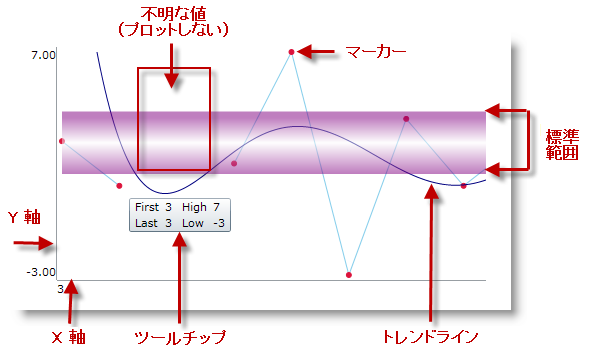
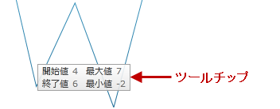

////
|metadata|
{
    "name": "xamsparkline-xamsparkline-features",
    "controlName": ["xamSparkline"],
    "tags": ["API","Charting","Getting Started"],
    "guid": "9769d0b8-bfa2-422f-9d58-c45d892e33d6",
    "buildFlags": [],
    "createdOn": "2016-05-25T18:21:59.2813577Z"
}
|metadata|
////

= xamSparkline の機能

== トピックの概要

=== 目的

このトピックは、 link:{ApiPlatform}controls.charts.xamsparkline{ApiVersion}.html[xamSparkline]™ コントロールの構成可能な視覚要素とこれらの視覚要素を管理する機能の概要を提供します。

=== 前提条件

以下の表に、このトピックを理解するための前提条件として求められるトピックをリストします。

[options="header", cols="a,a"]
|====
|トピック|目的

| link:xamsparkline-xamsparkline-overview.html[xamSparkline の概要]
|このトピックは、 _xamSparkline_ コントロールの概要、その利点、およびサポートされるチャート タイプを提供します。

|====

=== 本トピックの内容

このトピックには次のセクションがあります。

* <<Introduction,概要>>
* <<Configurable_Visual_Elements_of_xamSparkline_and_Related_Properties,xamSparkline の構成可能な視覚要素と関連プロパティ>>

** <<_Ref318913385,構成可能な視覚要素の概要>>
** <<_Ref318913402,構成可能な視覚要素および関連プロパティ>>

* <<xamSparkline_Features_Summary,xamSparkline 機能の概要>>
* <<Markers,マーカー>>

** <<_Ref318913434,マーカーの概要>>
** <<_Ref318913445,マーカー タイプ>>

* <<Trend_Lines,近似曲線>>

** <<_Ref318913575,近似曲線の概要>>
** <<_Ref318913584,トレンドラインのタイプ>>

* <<Normal_Range,標準範囲>>
* <<Interpolating_Unknown_Values,不明な値の補間>>

** <<_Ref318913700,不明な値の補間の概要>>
** <<_Ref318913707,サポートされる Sparkline のタイプ>>

* <<Axes,軸>>

** <<_Ref318913728,軸の概要>>
** <<_Ref318913738,軸のカスタマイズ>>

* <<Tooltips,ツールチップ>>

** <<_Ref318913754,ツールチップの概要>>
** <<_Ref318913762,ツールチップのカスタマイズ>>

* <<Related_Topics,関連トピック>>

[[Introduction]]

== 概要

=== xamSparkline 視覚要素と機能の紹介

_xamSparkline_   コントロールには複数の視覚要素と、これらの要素を構成およびカスタマイズするために使用可能な対応する機能があります。他のチャート コントロールと比較したスパークラインの利点は、グリッド セルなどの限られたスペースに、そのすべてのビジュアル要素を表示できることです。そのために、スパークラインではデータ ポイントのすべてのラベルを表示できません。Y 軸上には最大値と最小値のみを表示でき、X 軸には最初の値と最後の値のみを表示できます。

スパークラインには、最高、最低、最初、最後、そして負の値を示す楕円形のアイコンによってデータ ポイントをマークする機能があります。マーカーは、任意のシェイプ、色、または画像などでカスタマイズできます。

(X/Y) 軸を表示できます。これは、チャート サイズを縮小して軸とラベルの領域を確保することで、チャートから場所を取ります。

[[Configurable_Visual_Elements_of_xamSparkline_and_Related_Properties]]
== _xamSparkline_   の構成可能な視覚要素と関連プロパティ

[[_Ref318913385]]

=== 構成可能な視覚要素の概要

以下のスクリーンショットは、 _xamSparkline_   コントロールの視覚要素を示しています。プロパティを通して構成できる要素を以下にリストします。既定では、これらの視覚要素のいずれも表示されません。

*構成可能な視覚要素:* 

* マーカー

* 近似曲線

* 標準範囲

* 不明な値

* 軸

* ツールチップ

[[_Ref318913402]]

=== 構成可能な視覚要素および関連プロパティ

以下の表は、 _xamSparkline_   コントロールの視覚要素とそれらを構成するプロパティの関係を示しています。

[options="header", cols="a,a"]
|====
|視覚要素|プロパティ

|マーカー
| link:{ApiPlatform}controls.charts.xamsparkline{ApiVersion}~infragistics.controls.charts.xamsparkline~markervisibility.html[MarkerVisibility]

|近似曲線
| link:{ApiPlatform}controls.charts.xamsparkline{ApiVersion}~infragistics.controls.charts.xamsparkline~trendlinetype.html[TrendLineType]

|標準範囲
| link:{ApiPlatform}controls.charts.xamsparkline{ApiVersion}~infragistics.controls.charts.xamsparkline~normalrangevisibility.html[NormalRangeVisibility]

|プロットされたまたはプロットされていない不明な値
| link:{ApiPlatform}datavisualization{ApiVersion}~infragistics.controls.charts.unknownvalueplotting.html[UnknownValuePlotting]

|軸
| link:{ApiPlatform}controls.charts.xamsparkline{ApiVersion}~infragistics.controls.charts.xamsparkline~horizontalaxisvisibility.html[HorizontalAxisVisibility] link:{ApiPlatform}controls.charts.xamsparkline{ApiVersion}~infragistics.controls.charts.xamsparkline~verticalaxisvisibility.html[VerticalAxisVisibility]

|ツールチップ
|Tooltip

|====

[[xamSparkline_Features_Summary]]
== _xamSparkline_   機能の概要

=== 機能概要チャート

以下の表は、 _xamSparkline_   コントロールの主な機能をまとめています。機能の詳細は、表に続くテキスト ブロックで説明しています。

[options="header", cols="a,a,a"]
|====
|*機能*|*画像*|*説明*

|<<Markers,マーカー>>
|image::images/Sparkline_Visual_Elements_2.png[]
|マーカーは、X/Y 座標に基づいて個別のデータ ポイントを示すために、スパークライン上にオーバーレイ表示されたシンボルです。

|<<Trend_Lines,近似曲線>>
|image::images/Sparkline_Visual_Elements_3.png[]
|近似曲線は、始点から終点まで描画された線で、シリーズのトレンド性と動向を示します。その結果、データの傾向を評価し、過去の値、未来の値、不明な値を頭の中で予想できます。

|<<Normal_Range,標準範囲>>
|image::images/Sparkline_Visual_Elements_4.png[]
|標準範囲は、データを視覚化しているときに、あらかじめ定義された意味のある範囲を表す水平方向に延びる背景の縞模様です。

|<<Interpolating_Unknown_Values,不明な値の補間>>
|image::images/Sparkline_Visual_Elements_5.png[]
|_xamSparkline_ は不明な値 ( _null または double.NaN_ ) を検出し、指定された補間アルゴリズムを通して不明な値のスペースを描画できます。

|<<Axes,軸>>
|image::images/Sparkline_Visual_Elements_6.png[]
|_xamSparkline_ では、X 軸と Y 軸 (両方またはいずれか) を、対応するラベルとともに表示できます。

|<<Tooltips,ツールチップ>>
|image::images/Sparkline_Visual_Elements_7.png[]
|_xamSparkline_ では、マウスをスパークラインの上に置いたときに、ヒントを表示できます。

|====

[[Markers]]

== マーカー

[[_Ref318913434]]

=== マーカーの概要

マーカーは単一のデータ ポイントの上に重なり合ったシンボルで、X/Y 座標に基づいてチャートにプロットされた個々のデータ ポイントを示します。

image::images/Sparkline_Visual_Elements_8.png[]

_xamSparkline_   のマーカーは、データまたはデータ ポイントの位置に基づいてデータ ポイントを識別する場合に指定できます。

[[_Ref318913445]]

=== マーカー タイプ

以下の表は、サポートされているマーカー タイプを表示します。

[options="header", cols="a,a,a"]
|====
|*マーカー タイプ*|*画像*|*説明*

|すべてのデータ ポイント
|image::images/Sparkline_Visual_Elements_9.png[]
|マーカーはすべてのデータ ポイント上に表示されます。

|最初および最後のデータ ポイント
|image::images/Sparkline_Visual_Elements_10.png[]
|最初のデータ ポイントと最後のデータ ポイント上に 2 つのマーカーが表示されます。

|上および下のデータ ポイント
|image::images/Sparkline_Visual_Elements_11.png[]
|最高値のデータ ポイントと最低値のデータ ポイント上に 2 つのマーカーが表示されます。

|負のデータ ポイント
|image::images/Sparkline_Visual_Elements_12.png[]
|マーカーは負のデータ ポイント上に表示されます。負のデータ ポイントが複数存在する場合は、それらすべてがマークされます。

|====

==== 関連トピック:

* link:xamsparkline-configuring-markers.html[マーカーの構成]

[[Trend_Lines]]
== 近似曲線

[[_Ref318913575]]

=== 近似曲線の概要

近似曲線は、始点から終点まで描画された線で、シリーズのトレンド性と動向を示します。その結果、データの傾向を評価し、過去の値、未来の値、不明な値を頭の中で予想できます。

image::images/Sparkline_Visual_Elements_13.png[]

近似曲線機能により、トレンド性向ラインを生成する複数の数式を選択できます。数式は link:{ApiPlatform}controls.charts.xamsparkline{ApiVersion}~infragistics.controls.charts.xamsparkline~trendlinetype.html[TrendLineType] プロパティで指定します。シリーズ データがいつでも見えるよう、近似曲線はそのデータの前に描画されます。

[[_Ref318913584]]

=== サポートされている近似曲線のタイプ

以下の表は、サポートされている近似曲線のタイプを表示します。各近似曲線は、そのタイプの計算式に基づいて描画されます。

[options="header", cols="a,a,a,a"]
|====
|*近似曲線タイプ*|*画像*|*説明*| *link:xamsparkline-xamsparkline-property-reference.html#TrendLineType[TrendLineType] プロパティ設定*

|単純平均
|image::images/Sparkline_Visual_Elements_14.png[]
|単純平均は数のセットです。それぞれが対応するデータ ポイントのサブセットの平均値です。単純移動平均とも呼ばれています。
|_SimpleAverage_

|修正平均
|image::images/Sparkline_Visual_Elements_15.png[]
|修正平均は、設定された期間の移動平均を示します。トレンドの方向を強調し、変動を滑らかにする場合に使用します。
|_ModifiedAverage_

|指数平均
|image::images/Sparkline_Visual_Elements_16.png[]
|指数平均は単純平均と似ていますが、重み係数が追加されています。このタイプの平均は、最新のトレンド変化に迅速に反応すると言われています。
| _ExponentialAverage_ 

|累加平均
|image::images/Sparkline_Visual_Elements_17.png[]
|累加平均は、現在のポイントまでのすべてのデータの平均を計算し、データ ポイントを並べたものです。
| _CumulativeAverage_ 

|加重平均
|image::images/Sparkline_Visual_Elements_18.png[]
|加重平均は、異なる場所にあるデータに重みを与える乗率を持つ任意の平均です。
| _WeightedAverage_ 

|キュービック フィット
|image::images/Sparkline_Visual_Elements_19.png[]
|多項式数学関数を使用して、キュービック フィット近似曲線をシリーズで指定します。
| _CubicFit_ 

|指数フィット
|image::images/Sparkline_Visual_Elements_20.png[]
|指数数学関数を使用して、指数フィット近似曲線をシリーズで指定します。
| _ExponentialFit_ 

|ライン フィット
|image::images/Sparkline_Visual_Elements_21.png[]
|最もフィットした直線の近似曲線です。
| _LineFit_ 

|対数フィット
|image::images/Sparkline_Visual_Elements_22.png[]
|最もフィットした曲線です。データの変化率が素早く増減し、平均になった場合に使用されます。このタイプの近似曲線は、データば十分ある場合に非常に便利です。
| _LogarithmicFit_ 

|べき乗フィット
|image::images/Sparkline_Visual_Elements_23.png[]
|べき乗近似曲線は、べき関数で線を描画する曲線です。べき関数ではゼロ点は有効でないため、ゼロ (0) 点を避けるのが良いでしょう。スパークラインはエラーを起こすことなくゼロ点をプロットしますが、べき乗近似曲線の視点から見ると、結果は正確でなくなります。べき乗近似曲線は、特定の率で増加する測定値を比較するデータ セットに便利です。
| _PowerLowFit_ 

|二次フィット
|image::images/Sparkline_Visual_Elements_24.png[]
|二次方程式を使用して、近似曲線を形成します。線形曲線の精度で、高データ ポイントと低データ ポイントの効果全体を示します。
| _QuadraticFit_ 

|四次フィット
|image::images/Sparkline_Visual_Elements_25.png[]
|四次多項式を使用して、近似曲線をシリーズで指定します。
| _QuarticFit_ 

|五次フィット
|image::images/Sparkline_Visual_Elements_26.png[]
|五次多項式を使用して、近似曲線をシリーズで指定します。
| _QuinticFit_ 

|====

==== 関連トピック:

* link:xamsparkline-configuring-the-trend-line.html[近似曲線の構成]

[[Normal_Range]]
== 標準範囲

=== 標準範囲の概要

標準範囲は、データを視覚化しているときに、あらかじめ定義された意味のある範囲を表す水平方向に延びる背景の縞模様です。

image::images/Sparkline_Visual_Elements_27.png[]

標準範囲は一般的に、どの値が正常または良好と見なされるか示す場合に使用します。たとえば、スパークラインが時間の経過とともに人の鼓動を表している場合、1 分間当たり 60 ～ 100 拍の標準範囲が標準として強調表示されるため、この範囲外のデータ ポイントは簡単に識別できます。

範囲の幅と位置は link:xamsparkline-xamsparkline-property-reference.html#NormalRangeMaximum[NormalRangeMinimum] プロパティと link:xamsparkline-xamsparkline-property-reference.html#NormalRangeMinimum[NormalRangeMaximum] プロパティによって決定されます。

==== 関連トピック:

* link:xamsparkline-configuring-the-normal-range.html[標準範囲の構成]

[[Interpolating_Unknown_Values]]
== 不明な値の補間

[[_Ref318913700]]

=== 不明な値の補間の概要

_xamSparkline_   は不明な値を検出し、指定された補間アルゴリズムを通して不明な値のスペースを描画できます。

データに欠けている値がある場合 (通常、データに見られる「不明な」値は  _null_   および  _double.NaN_  )、 _xamSparkline_   は線形補間により不明な値のあるスペースに描画できます。以下の表は、Unknown Values Plotting を使用した場合と使用しない場合の、(欠けている値を含む) 同じデータ セットからプロットされたスパークラインの違いを示しています。

[options="header", cols="a,a"]
|====
|*不明な値のプロットを適用したか?*|*プレビュー*

|いいえ
|image::images/Sparkline_Visual_Elements_28.png[]

|はい
|image::images/Sparkline_Visual_Elements_29.png[]

|====

この機能は link:xamsparkline-xamsparkline-property-reference.html#UnknownValuePlotting[UnknownValuePlotting] プロパティで制御します。指定できる値は  _DontPlot_   および  _LinearInterpolate_   です。

[[_Ref318913707]]

=== サポートされる Sparkline のタイプ

以下のスパークライン タイプが Unknown Values Plotting をサポートしています。

* Area
* Line

Column 型と Win/Loss 型は不明な値を補間しません。これらのスパークライン タイプは常に、不明な値が存在するブランク スペースを表示します。

==== 関連トピック:

* link:xamsparkline-interpolating-unknown-values.html[不明な値の補間]

[[Axes]]
== 軸

[[_Ref318913728]]

=== 軸の概要

Sparkline により対応するラベルとともに X 軸と Y 軸 (両方またはそのいずれか一方) を表示できます。

image::images/Sparkline_Visual_Elements_30.png[]

image::images/Sparkline_Visual_Elements_31.png[]

image::images/Sparkline_Visual_Elements_32.png[]

[[_Ref318913738]]

=== 軸のカスタマイズ

_xamSparkline_   コントロールの軸は、以下の点でカスタマイズできます。

* 可視性

X 軸と Y 軸の可視性は個別のプロパティ (それぞれ link:{ApiPlatform}controls.charts.xamsparkline{ApiVersion}~infragistics.controls.charts.xamsparkline~horizontalaxisvisibility.html[HorizontalAxisVisibility] と link:{ApiPlatform}controls.charts.xamsparkline{ApiVersion}~infragistics.controls.charts.xamsparkline~verticalaxisvisibility.html[VerticalAxisVisibility]) で管理されるため、その 1 つだけ表示させることができます。

* ラベル

** ラベル テキスト

記述的なラベルを X 軸に追加できます。この機能は link:xamsparkline-xamsparkline-property-reference.html#LabelMemberPath[LabelMemberPath] プロパティで制御します。

* ラベルのフォント

ラベルのフォントは一般的なフォント関連のコントロール プロパティを使用してカスタマイズできます: link:http://msdn.microsoft.com/ja-jp/library/system.windows.controls.control.foreground.aspx[Foreground], link:http://msdn.microsoft.com/ja-jp/library/system.windows.controls.control.fontfamily.aspx[FontFamily]、 link:http://msdn.microsoft.com/ja-jp/library/system.windows.controls.control.fontsize.aspx[FontSize]、 link:http://msdn.microsoft.com/ja-jp/library/system.windows.controls.control.fontstyle.aspx[FontStyle] および link:http://msdn.microsoft.com/ja-jp/library/system.windows.controls.control.fontstretch.aspx[FontStretch]。したがって、軸ごとに異なるフォントを使用することはできません。

==== 関連トピック:

* link:xamsparkline-configuring-xamsparkline.html[xamSparkline の構成]

[[Tooltips]]
== ヒント

[[_Ref318913754]]

=== ヒントの概要

_xamSparkline_   では、マウスをスパークラインの上に置いたときに、ヒントを表示できます。ヒントは、高、低、最初、および最後の各データ ポイントを表示するよう設計されています。

ヒントは link:xamsparkline-xamsparkline-property-reference.html#ToolTip[ToolTip] プロパティで制御します。

[[_Ref318913762]]

=== ヒントのカスタマイズ

_xamSparkline_   のヒントは、以下の点でカスタマイズできます。

* ラベル テキスト
* ラベルのフォント
* ラベルの色
* フォント サイズ

ツールチップのカスタマイズの詳細については、 link:xamsparkline-configuring-the-tooltip.html[「ツールチップの構成」]のトピックを参照してください。

==== 関連トピック:

* link:xamsparkline-configuring-the-tooltip.html[ヒントの構成]

[[Related_Topics]]
== 関連コンテンツ

=== トピック

以下のトピックでは、このトピックに関連する情報を提供しています。

[options="header", cols="a,a"]
|====
|トピック|目的

| link:xamsparkline-xamsparkline-overview.html[xamSparkline の概要]
|このトピックは、 _xamSparkline_ コントロールの概要、その利点、およびサポートされるチャート タイプを提供します。

| link:xamsparkline-configuring-xamsparkline.html[xamSparkline を構成]
|このトピックは、 _xamSparkline_™ コントロールを構成できる方法の概要を提供します。詳細な構成へのリンク (別個のトピックで使用可能) も提供されます。

| link:xamsparkline-xamsparkline-property-reference.html[xamSparkline プロパティ参照]
|このトピックは、 _xamSparkline_™ コントロールの主なプロパティを説明します。

|====