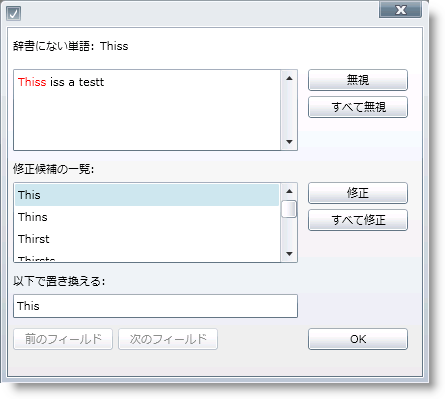

////

|metadata|
{
    "name": "xamspellchecker-about-xamspellchecker",
    "controlName": ["xamSpellChecker"],
    "tags": ["Getting Started"],
    "guid": "{C330F7E4-91B7-41A2-9B85-9DF58E65A2E4}",  
    "buildFlags": [],
    "createdOn": "2016-05-25T18:21:59.1333792Z"
}
|metadata|
////

= xamSpellChecker について

xamSpellChecker コントロールは、スペルの修正のユーザー インターフェイスをエンドユーザーに提供する完全にカスタマイズ可能なダイアログです。スペルミスの単語がテキストで見つかると、ユーザー インターフェイスがエンドユーザーに表示されます。

xamSpellChecker コントロールの特徴の一部には以下が含まれます:

* 辞書のサポート - xamSpellChecker コントロールには、オランダ、英語 (アメリカ、オーストラリア、イギリス、カナダ)、フランス、ドイツ、スペイン、ポルトガルの 9 ヶ国語の辞書が標準で付属します。
* SpellChecker ダイアログ -- xamSpellChecker コントロールのスペルチェック ダイアログは、検証またはボタン クリックで起動できます。このダイアログはエンドユーザーのスペルミスを見つけ出して、語を無視する、または修正候補の語に変更することができます。

*スペルチェック ダイアログ ウィンドウについて*

xamSpellChecker はスペルミスの単語を発見すると、SpellCheckDialog box を表示します。ドキュメントのスペルミスがある単語の取り扱いについてはいくつかの役に立つオプションがあります。xamSpellChecker は SpellCheckDialog ボックスでスペルチェックを行い、すべてのスペルミスを無視するか修正されるまで、一度にひとつのスペルミスのある単語を移動します。

以下は SpellCheckDialog ボックスの画像です。ダイアログ ボックスの異なる部分は、詳細を以下に説明します。

* *辞書にない* -- 以下のテキストボックスはスペルミスの単語を表示します。
* *無視する* - [無視する] をクリックすると、スペル チェッカーはスペルミスがある語のこの 1 つのインスタンスを無視し、次のスペルミスがある語に進みます。
* *すべてを無視* - [すべてを無視] はスペルミス ワードおよびすべての以降のインスタンスを無視します。[すべてを無視] は本質的には、そのワードが辞書に存在するとスペル チェッカーに思わせる「トリック」です。ただし、次にスペル チェック ダイアログ ボックスが開くと、これらの設定は記憶されません。
* *変更* -- このボタンをクリックすると、スペルミス ワードは、修正候補リストから選択したワードで置き換えられます。これはワードの現在のインスタンスだけを置き換えます。
* *すべてを変更* - [すべてを変更] をクリックすると、ドキュメント全体のスペルミス ワードの発生を修正候補リストから選択したワードに置き換えます。
* *修正候補* - [修正候補] ボックスのリストは、スペルミスがある語に対するすべての可能性のある修正候補を表示します。修正候補を選択して [変更] をクリックすると、スペルミスしたワードは選択したワードで置き換えられます。

== 関連トピック

link:xamspellchecker-adding-xamspellchecker-to-your-page.html[xamSpellChecker をページに追加]

link:xamspellchecker-using-xamspellchecker.html[xamSpellChecker の使用]