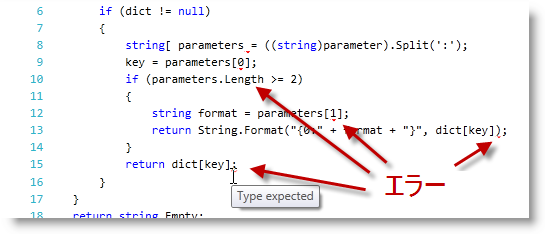

////

|metadata|
{
    "name": "xamsyntaxeditor-error-reporting",
    "controlName": ["xamSyntaxEditor"],
    "tags": ["Error Handling","How Do I"],
    "guid": "a6b70736-4cf2-44b6-bf71-8bfd31ce2c7e",  
    "buildFlags": [],
    "createdOn": "2016-05-25T18:21:59.4273977Z"
}
|metadata|
////

= エラー報告 (xamSyntaxEditor)

== トピックの概要

=== 目的

このトピックでは、 _xamSyntaxEditor™_   コントロールのエラー報告機能の概要と、コントロールの構成方法およびその使用方法を紹介します。

=== 前提条件

このトピックを理解するためには、以下のトピックを理解しておく必要があります。

[options="header", cols="a,a"]
|====
|トピック|目的

| link:xamsyntaxeditor-overview.html[ _xamSyntaxEditor_ の概要]
|このトピックでは、 _xamSyntaxEditor_ の機能を分かりやすく解説します。

| link:xamsyntaxeditor-editing-support-overview.html[編集サポートの概要]
|このトピックでは、開発者とユーザー双方の視点から _xamSyntaxEditor_ コントロールのテキスト編集機能をまとめました。

|====

=== このトピックの内容

このトピックは、以下のセクションで構成されます。

* <<_Ref333307870, はじめに >>
* <<_Ref333307871,  _xamSyntaxEditor_   でエラー波下線を表示するかどうかを構成 >>
* <<_Ref333307877, 波下線の色を構成 >>
* <<_Ref333307885, ドキュメントのエラーを取得 >>
* <<_Ref333307894, 関連コンテンツ >>

[[_Ref333307870]]
== はじめに

=== エラー報告のサマリー

_xamSyntaxEditor_   は、現在の言語の文書校正ルールに従って、構文的に正しくないというフラグが付いたテキストをハイライト表示します。正しくないテキストは波下線で区別できます。波下線はデフォルトで赤く表示されます。波下線にマウスを合わせるとツールチップにエラーの詳細情報が表示されます。

以下に示したのは  _xamSyntaxEditor_   のスクリーンショットです。数カ所のエラーと、マウス位置のエラーに関するエラーの内容がツールチップに表示されています。

[[_Ref333307871]]
== _xamSyntaxEditor_   でエラー波下線を表示するかどうかを構成

=== 概要

_xamSyntaxEditor の_   link:{ApiPlatform}controls.editors.xamsyntaxeditor{ApiVersion}~infragistics.controls.editors.xamsyntaxeditor~errordisplaymode.html[ErrorDisplayMode] プロパティを設定すると、エラー波下線を表示するかどうかを設定できます。

=== プロパティ設定

以下の表では、目的のプロパティ設定の構成をマップしています。

[options="header", cols="a,a,a"]
|====
|目的:|使用するプロパティ:|設定値

|エラー波下線の表示モードを変更
|`ErrorDisplayMode`
| link:{ApiPlatform}controls.editors.xamsyntaxeditor{ApiVersion}~infragistics.controls.editors.syntaxerrordisplaymode.html[SyntaxErrorDisplayMode] のインスタンス。

|====

[[_Ref333307877]]
== 波下線の色を構成

=== 概要

波下線の色は  _xamSyntaxEditor_   の link:{ApiPlatform}controls.editors.xamsyntaxeditor{ApiVersion}~infragistics.controls.editors.xamsyntaxeditor~classificationappearancemap.html[ClassificationAppearanceMap] プロパティで変更できます。

=== 例

以下のコードでは、波下線の色をマゼンタ色に変更します。

*C# の場合:*

[source,csharp]
----
// 新しい分類外観マップを作成する
ClassificationAppearanceMap cam = new ClassificationAppearanceMap();
// マゼンタ色の塗りつぶし色ブラシを "SyntaxError" 分類タイプで追加する
cam.AddMapEntry(
    ClassificationType.SyntaxError,
    new TextDocumentAppearance()
    {
        Foreground = new SolidColorBrush(Colors.Magenta)
    }
);
// xamSyntaxEditor にマップを設定する
this.xamSyntaxEditor1.ClassificationAppearanceMap = cam;
----

*Visual Basic の場合:*

[source,vb]
----
' 新しい分類外観マップの作成
Dim cam As New ClassificationAppearanceMap()
' マゼンタ色の塗りつぶし色ブラシを "SyntaxError" 分類タイプで追加する
cam.AddMapEntry(ClassificationType.SyntaxError, New TextDocumentAppearance() With { _
      .Foreground = New SolidColorBrush(Colors.Magenta) _
})
' xamSyntaxEditor にマップを設定する
Me.xamSyntaxEditor1.ClassificationAppearanceMap = cam
----

[[_Ref333307885]]
== ドキュメントのエラーを取得

=== 概要

エディターでドキュメントの内容を変更した後にドキュメントを読み込むと、 _xamSyntaxEditor_   はドキュメントの内容を構文解析し直します。これは非同期プロセスです。このプロセスは、 link:{ApiPlatform}documents.textdocument{ApiVersion}~infragistics.documents.textdocument_members.html[TextDocument] の link:{ApiPlatform}documents.textdocument{ApiVersion}~infragistics.documents.textdocument~propertychanged_ev.html[PropertyChanged] イベントにハンドラーをアタッチし、 link:{ApiPlatform}documents.textdocument{ApiVersion}~infragistics.documents.textdocument~syntaxtree.html[SyntaxTree] プロパティをチェックして監視できます。`SyntaxTree` のプロパティを変更したあとは、構文ツリーの各ノードの link:{ApiPlatform}documents.textdocument{ApiVersion}~infragistics.documents.parsing.syntaxnode~containsdiagnostics.html[ContainsDiagnostics] プロパティを照会すればエラーの有無をチェックできます。

=== 例

以下のコード例では、構文エラー リストの取得方法と、エラーの記述とエラーの発生行の検索方法を示します。

*C# の場合:*

[source,csharp]
----
// ドキュメントを取得する
TextDocument doc = this.xamSyntaxEditor1.Document;
if (doc.SyntaxTree.RootNode.ContainsDiagnostics)
{
    // ドキュメント全体の中のテキストの範囲を作成する
    TextSpan ts = new TextSpan(0, doc.CurrentSnapshot.Length);
    // ドキュメント全体からエラーを取得する
    IEnumerable<NodeDiagnostic> diagnostics =
        doc.SyntaxTree.RootNode.GetDiagnostics(ts);
    foreach (NodeDiagnostic nd in diagnostics)
    {
 // エラーの場所を取得する
 SnapshotSpan span = nd.SnapshotSpan;
 TextLocation location = span.Snapshot.LocationFromOffset(span.Offset);
 int errorLineNumber = location.Line + 1;
 int errorCharacter = location.Character + 1;
        // エラー メッセージを取得する
        string errorMessage = nd.Message;
 }
}
----

*Visual Basic の場合:*

[source,vb]
----
' ドキュメントを取得する
Dim doc As TextDocument = Me.xamSyntaxEditor1.Document
If doc.SyntaxTree.RootNode.ContainsDiagnostics Then
    ' ドキュメント全体の中のテキストの範囲を作成する
    Dim ts As New TextSpan(0, doc.CurrentSnapshot.Length)
    ' ドキュメント全体からエラーを取得する
    Dim diagnostics As IEnumerable(Of NodeDiagnostic) = _
        doc.SyntaxTree.RootNode.GetDiagnostics(ts)
    For Each nd As NodeDiagnostic In diagnostics
 ' エラーの場所を取得する
        Dim span As SnapshotSpan = nd.Span
        Dim location As TextLocation = span.Snapshot.LocationFromOffset(span.Offset)
        Dim errorLineNumber As Integer = location.Line + 1
        Dim errorCharacter As Integer = location.Character + 1
        ' エラー メッセージを取得する
        Dim errorMessage As String = nd.Message
    Next
End If
----

[[_Ref333307894]]
== 関連コンテンツ

このトピックの追加情報については、以下のトピックも合わせてご参照ください。

[options="header", cols="a,a"]
|====
|トピック|目的

| link:xamsyntaxeditor-supported-languages.html[サポート対象言語]
|このトピックでは、 _xamSyntaxEditor_ がサポートしている言語を紹介し、それぞれの使用方法を解説します。

| link:xamsyntaxeditor-changing-default-classification-types-appearance.html[デフォルト分類タイプの外観の変更]
|このトピックでは、 _xamSyntaxEditor_ で言語要素に割り当てられた色や、その他属性の変更方法を説明します。

| link:xamsyntaxeditor-changing-font-and-styles.html[フォントとスタイルの変更]
|このトピックでは、 _xamSyntaxEditor_ 内のドキュメントのコンテンツの表示の変更方法を説明します。

|====
