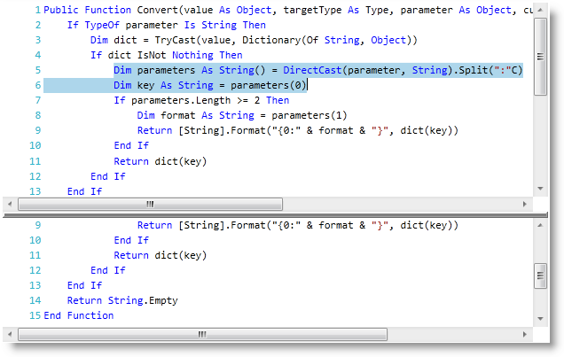

////

|metadata|
{
    "name": "xamsyntaxeditor-overview",
    "controlName": ["xamSyntaxEditor"],
    "tags": ["Getting Started"],
    "guid": "b7042f4b-b074-4f5a-8c89-9a19d64b3088",  
    "buildFlags": [],
    "createdOn": "2016-05-25T18:21:59.3153607Z"
}
|metadata|
////

= xamSyntaxEditor の概要

== トピックの概要

=== 目的

このトピックでは、 _xamSyntaxEditor™ の_  機能をわかりやすく解説します。

=== このトピックの内容

このトピックは以下のセクションからなります。

* <<_Ref329268346,はじめに>>
* <<_Ref329268647,機能概要>>
* <<_Ref329268653,関連コンテンツ>>

[[_Ref329268346]]
== はじめに

=== xamSyntaxEditor とは

_xamSyntaxEditor_   は、Microsoft の Visual Studio Integrated Development Environment (IDE) コード ウィンドウに似た link:xamsyntaxeditor-editing-support-overview.html[コード編集]の操作性を備えたクロス プラットフォーム コントロールです。

_xamSyntaxEditor_   では、 link:{ApiPlatform}documents.textdocument{ApiVersion}~infragistics.documents.textdocument.html[TextDocument] クラスに組み込まれているテキストの表示や編集ができます。`TextDocument` クラスでは、組み込まれているテキストの読み込み、保存、操作ができるように、プロパティ、メソッド、イベントを開示しています。`TextDocument` に組み込まれているテキストのサイズに制限はありません。

`TextDocument` クラスでは、高度に最適化した字句解析アルゴリズムと構文解析アルゴリズムを使用しており、 _xamSyntaxEditor_   コントロールでは、 link:xamsyntaxeditor-supported-languages.html[定義済み言語定義]による link:xamsyntaxeditor-syntax-highlighting.html[構文ハイライト表示]、(テキストのカラー化)、 link:xamsyntaxeditor-error-reporting.html[エラー ハイライト表示] (Visual Studio のような波下線を使用) が可能です。余裕があれば、必要に応じてバックグラウンド スレッドで、字句解析や構文解析など時間のかかる操作を行っておけば、サイズの大きな文書でもすぐに表示できます。

以下のスクリーン ショットは、 _xamSyntaxEditor_   で C# コードを分割モードで編集している様子を示しています。

[[_Ref329268647]]
== 機能要旨

=== xamSyntaxEditor コントロールの機能

_XamSyntaxEditor_   の主な機能:

[options="header", cols="a,a,a"]
|====
|機能|解説|デフォルトによる可用性

| link:xamsyntaxeditor-changing-font-and-styles.html[フォントとスタイルの変更]
|すべての OS で利用できるすべてのフォントとスタイルの構文エディターのサポートを提供します。
|image::images/Yes.png[]

| link:xamsyntaxeditor-clipboard-support.html[クリップボードのサポート]
|文書内や複数の文書間で利用できるテキスト情報の切り取り、コピー、貼り付けに構文エディターのサポートを提供します。
|image::images/Yes.png[]

| link:xamsyntaxeditor-find-replace.html[検索と置換]
|`TextDocument` における強力な検索メソッドと置換メソッドを提供します。
|image::images/Yes.png[]

| link:xamsyntaxeditor-configuring-initial-content.html[読み込みと保存]
|これらのメソッドは、ファイルやストリームに対する読み込みと保存の両方をサポートします。
|image::images/Yes.png[]

| link:xamsyntaxeditor-margins.html[マージン (組み込み)]
|_xamSyntaxEditor の_ 組み込みマージンが可能です。
|image::images/Yes.png[]

| link:xamsyntaxeditor-custom-margins.html[マージン (カスタム)]
|_xamSyntaxEditor の_ カスタム マージンが可能です。
|image::images/No.png[]

| link:xamsyntaxeditor-editing-support-overview.html[プログラムによる追加/挿入/削除]
|`TextDocument の`メソッドでテキスト コンテンツをプログラムから変更できます。
|image::images/Yes.png[]

| link:xamsyntaxeditor-undo-redo.html[元に戻す/やり直し]
| link:undo-redo-framework.html[インフラジスティックスの元に戻す/やり直しのフレームワーク]により、元に戻す/やり直しによる変更を無制限に実行できます。
|image::images/Yes.png[]

| link:xamsyntaxeditor-editing-support-overview.html[ユーザー編集]
|キーボードやマウスを使用した複数のインタラクションによるユーザー入力 _xamSyntaxEditor_ サポートを提供します。
|image::images/Yes.png[]

| link:xamsyntaxeditor-working-with-snapshots.html[スナップショット]
|`TextDocument` スナップショットは、編集中の現在の文書の状態を示し、文書のコンテンツを取り出して操作するためのメソッドを公開します。
|image::images/Yes.png[]

| link:xamsyntaxeditor-splitting.html[分割]
|ナビゲーション エイドとして、編集領域を左右または上下に 2 分割して、編集中のファイルの異なる部分を同時に表示できます。
|image::images/No.png[]

| link:xamsyntaxeditor-syntax-highlighting.html[構文のハイライト表示]
|構文のハイライト表示では、エディターによるテキスト (キーワード、コメントなど) の読み取り方法のビジュアル キューを利用できます。
|image::images/Yes.png[]

|====

[[_Ref329268653]]
== 関連箇所

=== トピック

このトピックについては、以下のトピックも参照してください。

[options="header", cols="a,a"]
|====
|トピック|目的

| link:xamsyntaxeditor-adding-to-your-page.html[ _xamSyntaxEditor_ をページに追加]
|このトピックで紹介するのは、 _xamSyntaxEditor_ を短時間で起動、実行するのに役立つ体系的な操作方法です。

| link:xamsyntaxeditor-configuring.html[ _xamSyntaxEditor_ の構成]
|このセクションでは、 _xamSyntaxEditor_ クロス プラットフォーム コントロールのさまざまな機能を使用する上で役立つ、主要概念やタスク ベースの情報について解説します。

ifdef::wpf[]
| link:xamsyntaxeditor-ime-support.html[IME サポート]
|このトピックは、xamSyntaxEditor の IME サポートを説明します。
endif::wpf[]

|====