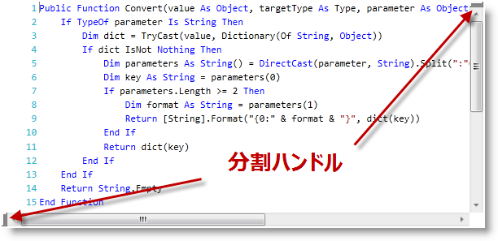
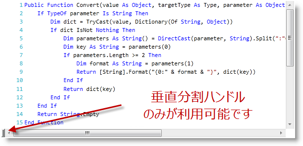

////

|metadata|
{
    "name": "xamsyntaxeditor-splitting",
    "controlName": ["xamSyntaxEditor"],
    "tags": ["Editing","Layouts"],
    "guid": "c74d8e61-3d7c-4cb6-8528-9b761e255568",  
    "buildFlags": [],
    "createdOn": "2016-05-25T18:21:59.4843606Z"
}
|metadata|
////

= 分割 (xamSyntaxEditor)

== トピックの概要

=== 目的

このトピックでは、 _xamSyntaxEditor™_   のドキュメント分割機能と、そのカスタマイズ方法を説明します。

=== 前提条件

このトピックの本題に入る前に、以下のトピックをお読みください。

[options="header", cols="a,a"]
|====
|トピック|目的

| link:xamsyntaxeditor-overview.html[ _xamSyntaxEditor_ の概要]
|このトピックでは、 _xamSyntaxEditor の_ 機能をわかりやすく解説します。

| link:xamsyntaxeditor-editing-support-overview.html[編集サポートの概要]
|このトピックでは、開発者とユーザー双方の視点から _xamSyntaxEditor_ コントロールのテキスト編集機能をまとめました。

|====

=== このトピックの内容

このトピックは以下のセクションからなります。

* <<_Ref332805583, はじめに >>
* <<_Ref332805592, コントロール構成の要旨 >>
* <<_Ref332805556, 各種分割タイプの有効化/無効化 >>
* <<_Ref332805564, 現在の分割ステータスの取得/設定 >>
* <<_Ref332805620, 関連コンテンツ >>

[[_Ref332805583]]
== はじめに

=== 分割の要旨

_xamSyntaxEditor_   では、編集領域を分割できます (左右または上下方向)。この機能を有効にすると、編集したドキュメントの 2 つのパーツの見た目を比較して、その両方を変更することができます。ユーザーはどちらの分割方法を使用するかを構成できます (以下の表参照)。また、 _xamSyntaxEditor の_  編集領域の現在の分割ステータスを決定できるプロパティがあります。

以下のスクリーンショットは、 _xamSyntaxEditor の_  分割ハンドルです。

以下のスクリーンショットは、 _xamSyntaxEditor_   を上下に分割した状態です。

image::images/xamSyntaxEditor_Splitting2.png[]

[[_Ref332805592]]
== コントロール構成の要旨

=== コントロール構成の要旨表

以下の表は、 _xamSyntaxEditor の_  分割機能で構成できる要素をまとめたものです。

[options="header", cols="a,a,a"]
|====
|構成可能な要素|詳細|プロパティ

|<<_Ref332805556,各種分割タイプの有効化/無効化>>
|ユーザーが利用できる分割方法を有効/無効にできます。
|
* link:{ApiPlatform}controls.editors.xamsyntaxeditor{ApiVersion}~infragistics.controls.editors.xamsyntaxeditor~splitoptions.html[SplitOptions] 

|<<_Ref332805564,現在の分割ステータスの取得/設定>>
|現在の分割ステータスを取得/設定でき、編集領域が分割されたか、そしてどのように分割されたかを確認できます。
|
* link:{ApiPlatform}controls.editors.xamsyntaxeditor{ApiVersion}~infragistics.controls.editors.xamsyntaxeditor~splitstatus.html[SplitStatus] 

|====

注:

[NOTE]
====
分割タイプを有効/無効にするコマンドと分割を設定するコマンドも利用できます。詳細については、 link:xamsyntaxeditor-events-and-commands.html[イベントとコマンド]のトピックを参照してください。
====

[[_Ref332805556]]
== 各種分割タイプの有効化/無効化

=== 概要

ユーザーが利用できる分割方法を有効/無効にできます。

=== プロパティ設定

以下の表は、構成目的をプロパティ設定にマップした表です。

[options="header", cols="a,a,a"]
|====
|目的:|使用するプロパティ:|設定の選択肢:

|ユーザーが利用できる分割オプションを変更
|`SplitOptions`
|タイプ link:{ApiPlatform}controls.editors.xamsyntaxeditor{ApiVersion}~infragistics.controls.editors.editordocumentviewsplitoptions.html[EditorDocumentViewSplitOptions] の値

|====

=== 例

以下のスクリーンショットは、以下の設定による、 _xamSyntaxEditor_   の表示結果です。

[options="header", cols="a,a"]
|====
|プロパティ|値

|`SplitOptions`
|`EditorDocumentViewSplitOptions.AllowVerticalSplitsOnly`

|====

[[_Ref332805564]]
== 現在の分割ステータスの取得/設定

=== 概要

現在の分割ステータスを取得/設定でき、編集領域が分割されたか、そしてどのように分割されたかを確認できます。

=== プロパティ設定

以下の表は、構成目的をプロパティ設定にマップした表です。

[options="header", cols="a,a,a"]
|====
|目的:|使用するプロパティ:|対応または選択肢

|現在の分割ステータスを取得
|`SplitStatus`
|値を読み取る

|現在の分割ステータスを設定
|`SplitStatus`
|タイプ link:{ApiPlatform}controls.editors.xamsyntaxeditor{ApiVersion}~infragistics.controls.editors.editordocumentviewsplitstatus.html[EditorDocumentViewSplitStatus] の値に設定する

|====

=== コード

以下のコード例では、現在の分割ステータスの取得方法を示します。

*C# の場合:*

[source,csharp]
----
if (this.xamSyntaxEditor1.SplitStatus ==
    EditorDocumentViewSplitStatus.SplitHorizontally)
{
    // 何かの操作を行う
}
else if (this.xamSyntaxEditor1.SplitStatus ==
    EditorDocumentViewSplitStatus.SplitVertically)
{
    // さらに他の何かの操作を行う
}
----

*Visual Basic の場合:*

[source,vb]
----
If Me.xamSyntaxEditor1.SplitStatus = _
    EditorDocumentViewSplitStatus.SplitHorizontally Then
        ' 何かの操作を行う
ElseIf Me.xamSyntaxEditor1.SplitStatus = _
    EditorDocumentViewSplitStatus.SplitVertically Then
        ' さらに他の何かの操作を行う
End If
----

以下のコード例では、現在の分割ステータスを左右に設定する方法を示します。

*C# の場合:*

[source,csharp]
----
this.xamSyntaxEditor1.SplitStatus = EditorDocumentViewSplitStatus.SplitVertically;
----

*Visual Basic の場合:*

[source,vb]
----
Me.xamSyntaxEditor1.SplitStatus = EditorDocumentViewSplitStatus.SplitVertically
----

[[_Ref332805620]]
== 関連コンテンツ

このトピックについては、以下のトピックも参照してください。

[options="header", cols="a,a"]
|====
|トピック|目的

| link:xamsyntaxeditor-changing-font-and-styles.html[フォントとスタイルの変更]
|このトピックでは、 _xamSyntaxEditor_ 内のドキュメントのコンテンツの表示の変更方法を説明します。

| link:xamsyntaxeditor-currentlinehl.html[現在の行の強調表示]
|このトピックは現在の行の強調表示機能について説明します。

|====
