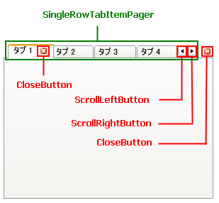
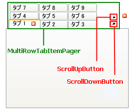

////

|metadata|
{
    "name": "xamtabcontrol-about-styling-xamtabcontrol",
    "controlName": ["xamTabControl"],
    "tags": ["Styling"],
    "guid": "{95ED6CA0-3404-470A-93FA-A2C59A0FEA2D}",  
    "buildFlags": [],
    "createdOn": "2012-01-30T19:39:54.4412413Z"
}
|metadata|
////

= xamTabControl のスタイリング

Microsoft® Windows® Presentation Foundation のコントロールのように Styles および ControlTemplates を使用して xamTabControl™ を再スタイルできます。ただし、xamTabControl を構成するさまざまなクラスは、Style または ControlTemplate の Key プロパティとして使用できる静的なプロパティを公開することによってより簡単にスタイリングできます。xamTabControl が事前に定義されたキーを使用する Style または ControlTemplate を見つけると、xamTabControl コントロールは自動的にユーザーが作成した Style または ControlTemplate を使用します。

以下の表は、ユーザーの Styles および ControlTemplates を作成する時にユーザーがキーとして使用できる静的プロパティをリストしています。各セクションの見出しは、プロパティが公開するクラスです。プロパティ名が「TemplateKey」で終わっている場合、その要素をスタイルするために ControlTemplate を作成する必要があります。プロパティ名が "StyleKey" で終わっている場合、その要素をスタイルするために Style を作成する必要があります。たとえば、TabItemEx オブジェクトを閉じる Button コントロールをスタイルしたい場合、以下の表を使用してクラスとプロパティ名を最初に見つけます。プロパティが見つかれば、そのプロパティの名前に基づいて ControlTemplate または Style を作成します。マークアップ拡張を使用してプロパティに ControlTemplate または Style の Key プロパティを設定します。

*XAML の場合:*

----
<!--
プロパティ名が「StyleKey」で終わっているのでスタイルを作成します。
コントロール テンプレートの Key プロパティを XamTabControl クラスによって公開されている静的プロパティに設定します。
コントロール テンプレートの TargetType プロパティを Button に設定します。
-->

----

== link:{RootAssembly}{ApiVersion}~infragistics.windows.controls.xamtabcontrol.html[XamTabControl] クラス (スタイルおよび ControlTemplate キー)

[options="header", cols="a,a"]
|====
|プロパティ名|ターゲット タイプ

| link:{RootAssembly}{ApiVersion}~infragistics.windows.controls.xamtabcontrol~closebuttonstylekey.html[CloseButtonStyleKey]
|ボタン

| link:{RootAssembly}{ApiVersion}~infragistics.windows.controls.xamtabcontrol~multirowtabitempagerstylekey.html[MultiRowTabItemPagerStyleKey]
| link:{RootAssembly}{ApiVersion}~infragistics.windows.controls.xampager.html[XamPager]

| link:{RootAssembly}{ApiVersion}~infragistics.windows.controls.xamtabcontrol~singlerowtabitempagerstylekey.html[SingleRowTabItemPagerStyleKey]
|XamPager

| link:{RootAssembly}{ApiVersion}~infragistics.windows.controls.xamtabcontrol~scrollleftbuttonstylekey.html[ScrollLeftButtonStyleKey]
|RepeatButton

| link:{RootAssembly}{ApiVersion}~infragistics.windows.controls.xamtabcontrol~scrollrightbuttonstylekey.html[ScrollRightButtonStyleKey]
|RepeatButton

| link:{RootAssembly}{ApiVersion}~infragistics.windows.controls.xamtabcontrol~scrollupbuttonstylekey.html[ScrollUpButtonStyleKey]
|RepeatButton

| link:{RootAssembly}{ApiVersion}~infragistics.windows.controls.xamtabcontrol~scrolldownbuttonstylekey.html[ScrollDownButtonStyleKey]
|RepeatButton

|====

