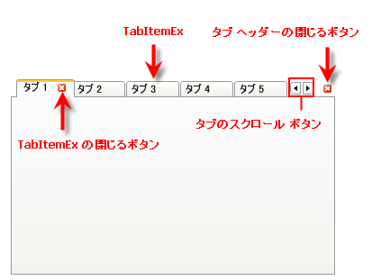
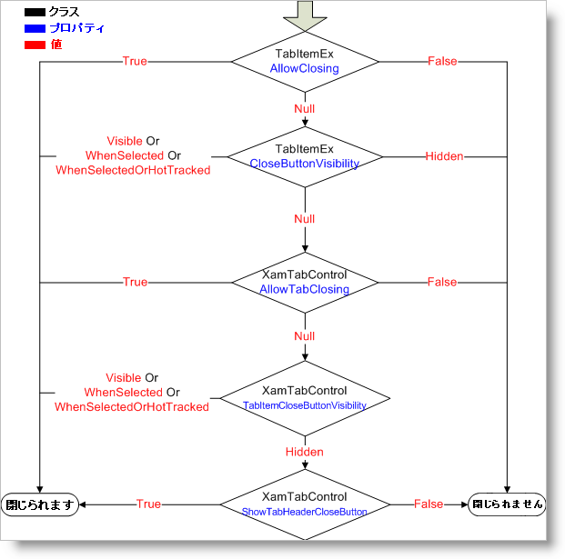

////

|metadata|
{
    "name": "xamtabcontrol-about-xamtabcontrol",
    "controlName": ["xamTabControl"],
    "tags": ["Getting Started"],
    "guid": "{56CF47BB-D45B-4E3F-810E-8968C19FA17F}",  
    "buildFlags": [],
    "createdOn": "2012-01-30T19:39:54.4432417Z"
}
|metadata|
////

= xamTabControl について

xamTabControl™ は、Microsoft® Windows® Presentation Foundation の TabControl クラスから派生します。そのため、新しいオブジェクト モデルを学習することなく xamTabControl を使用開始できます。Windows Presentation Foundation の TabControl の機能と特徴に加え、xamTabControl は以下の追加機能を公開します。

* *タブを閉じる* - この機能を有効にすると、エンド ユーザーは、タブ ヘッダーを中クリックするかタブの閉じるボタンをクリックすることでタブを閉じることができます。
* *タブ レイアウト* - 単一行または複数行にタブ ヘッダーを配置できます。
* *タブのスクロール* - タブ ヘッダーがアプリケーションの境界線をはみ出し、単一行または複数行に収まらない場合、xamTabControl はスクロール ボタンを表示して、エンド ユーザーがビューの中でタブ ヘッダーをスクロールできるようにします。
* *タブ コンテンツの最小化* - エンド ユーザーはタブ ヘッダーをダブルクリックして、そのコンテンツを最小化できます。

== タブを閉じることについて

デフォルトで、エンド ユーザーは実行時に link:{RootAssembly}{ApiVersion}~infragistics.windows.controls.tabitemex.html[TabItemEx] オブジェクトを閉じることができます。ただし、この機能を有効にするには、それぞれの独立した TabItemEx にプロパティを設定するか、または、xamTabControl™ にプロパティを設定します。

[NOTE]
====
*注:* xamTabControl の項目コレクションの TabItemEx オブジェクトのみ閉じることができます。
====

xamTabControl は、個々の TabItemEx オブジェクトを開始するプロパティをクエリし、コントロールに上がることによって、タブを閉じることができるかどうかを決定します。以下の図は、xamTabControl がタブを閉じることができるかどうかを解決する方法を説明します。

== 関連トピック

link:xamtabcontrol-adding-xamtabcontrol-to-your-page-.html[xamTabControl をアプリケーションに追加]

link:xamtabcontrol-using-xamtabcontrol.html[xamTabControl の使用]