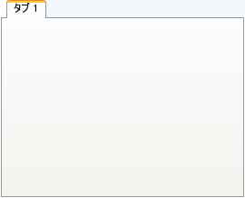

////

|metadata|
{
    "name": "xamtabcontrol-add-a-tab-to-xamtabcontrol",
    "controlName": ["xamTabControl"],
    "tags": ["How Do I"],
    "guid": "{9E9272D2-3559-4C4A-9D85-C9563CF50772}",  
    "buildFlags": [],
    "createdOn": "2012-01-30T19:39:54.4452421Z"
}
|metadata|
////

= タブを xamTabControl に追加

Microsoft® Windows® Presentation Foundation に見られるタブ コントロールとちょうど同じように、タブ付けされたコンテンツを表示するには、xamTabControl™ にタブを追加する必要があります。Windows Presentation Foundation の TabControl と異なり、xamTabControl は TabItem オブジェクトおよび拡張された link:{RootAssembly}{ApiVersion}~infragistics.windows.controls.tabitemex.html[TabItemEx] オブジェクトと一緒に機能します。TabItemEx オブジェクトを xamTabControl の link:{RootAssembly}{ApiVersion}~infragistics.windows.controls.xamtabcontrol.html[項目コレクション] に追加する場合、タブを閉じることができます。通常の TabItem オブジェクトを追加する場合、この機能は使用できません。

以下のコード例は、タブを xamTabControl に追加する方法を示します。

*XAML の場合:*

----
<igWindows:XamTabControl Name="xamTabControl1">
    <igWindows:TabItemEx Header="Tab 1">
        <!--TODO: ここでコンテンツを含むパネルを追加します-->
    </igWindows:TabItemEx>
</igWindows:XamTabControl>
----

*Visual Basic の場合:*

----
Imports Infragistics.Windows.Controls
...
Dim tab1 As New TabItemEx() With {.Header = "Tab 1"}
Me.xamTabControl1.Items.Add(tab1)
----

*C# の場合:*

----
using Infragistics.Windows.Controls;
...
TabItemEx tab1 = new TabItemEx(){ Header = "Tab 1" };
this.xamTabControl1.Items.Add(tab1);
----

== 関連トピック

link:xamtabcontrol-about-styling-xamtabcontrol.html[xamTabControl のスタイリングについて]

link:xamtabcontrol-add-content-to-a-tab.html[コンテンツをタブに追加]

link:xamtabcontrol-close-a-tab.html[タブを閉じる]

link:xamtabcontrol-enable-multiple-tab-rows.html[複数のタブ行を有効にする]

link:xamtabcontrol-removing-a-closed-tab.html[閉じたタブを削除]

link:xamtabcontrol-select-a-tab.html[タブを選択]

link:xamtabcontrol-tabs-dragging-and-reordering.html[タブのドラッグおよび順序変更 (xamTabControl)]