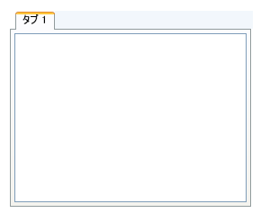

////

|metadata|
{
    "name": "xamtabcontrol-add-content-to-a-tab",
    "controlName": ["xamTabControl"],
    "tags": ["How Do I"],
    "guid": "{7B040F1D-D8E7-4AB5-8085-8F09026F4F48}",  
    "buildFlags": [],
    "createdOn": "2012-01-30T19:39:54.4482427Z"
}
|metadata|
////

= コンテンツをタブに追加

link:{RootAssembly}{ApiVersion}~infragistics.windows.controls.tabitemex.html[TabItemEx] オブジェクトは、HeaderedContentControl から派生している TabItem から派生しているので、このオブジェクトの使用は Microsoft Windows® Presentation Foundation のヘッダー付きコンテンツ コントロールに似ています。Windows Presentation Foundation のコンテンツ コントロールと同じように、タブの link:{RootAssembly}{ApiVersion}~infragistics.windows.controls.tabitemex.html[Content] プロパティをオブジェクトのインスタンスに設定できます。多くのケースでは、グリッドパネルなどのレイアウト コンテナーをルート要素として使用します (レイアウト コンテナーに補足要素を追加する)。

以下のコード例は、コンテンツをタブに追加する方法を示します。

*XAML の場合:*

----
<igWindows:XamTabControl Name="xamTabControl1">
    <igWindows:TabItemEx Header="Tab 1">
        <Grid>
            <RichTextBox />
        </Grid>
    </igWindows:TabItemEx>
</igWindows:XamTabControl>
----

*Visual Basic の場合:*

----
Imports Infragistics.Windows.Controls
...
Dim grid1 As New Grid() 
grid1.Children.Add(New RichTextBox()) 
Dim tab1 As New TabItemEx() With {.Header = "Tab 1", .Content = grid1}
Me.xamTabControl1.Items.Add(tab1)
...
----

*C# の場合:*

----
using Infragistics.Windows.Controls;
...
Grid grid1 = new Grid();
grid1.Children.Add(new RichTextBox());
TabItemEx tab1 = new TabItemEx()
{
    Header = "Tab 1",
    Content = grid1
};
this.xamTabControl1.Items.Add(tab1);
...
----

== 関連トピック

link:xamtabcontrol-about-styling-xamtabcontrol.html[xamTabControl のスタイリングについて]

link:xamtabcontrol-add-a-tab-to-xamtabcontrol.html[タブを xamTabControl に追加]

link:xamtabcontrol-close-a-tab.html[タブを閉じる]

link:xamtabcontrol-enable-multiple-tab-rows.html[複数のタブ行を有効にする]

link:xamtabcontrol-removing-a-closed-tab.html[閉じたタブを削除]

link:xamtabcontrol-select-a-tab.html[タブを選択]

link:xamtabcontrol-tabs-dragging-and-reordering.html[タブのドラッグおよび順序変更 (xamTabControl)]