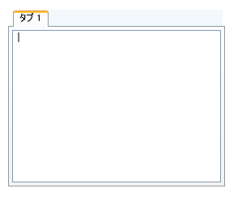

////
|metadata|
{
    "name": "xamtabcontrol-adding-xamtabcontrol-to-your-page ",
    "controlName": ["xamTabControl"],
    "tags": ["Getting Started"],
    "guid": "d92383a4-3a5d-4b92-a1c0-0075e13c2a5e",
    "buildFlags": [],
    "createdOn": "2012-01-30T19:39:54.4742479Z"
}
|metadata|
////

= xamTabControl をアプリケーションに追加

== 始める前に

Microsoft® Windows® Presentation Foundation のコントロールと同じパターンを使用して xamTabControl™ を Window に追加できます。このパターンは、Window のメイン コンテンツとしてレイアウト コンテナーを使用し、レイアウト コンテナーの Children コレクションにコントロールを追加することが必要となります。コード ビハインドから参照できるように、XAML のレイアウト コンテナーに名前を付けることが重要です。

== 達成すること

XAML またはプロシージャ コードを使用して xamTabControl を Window に追加します。xamTabControl にタブを追加し、タブのコンテンツを RichTextBox コントロールに設定します。

完成したプロジェクトを実行すると、以下のスクリーンショットに似た xamTabControl が Window に表示されます。

== 次の手順を実行します

[start=1]
. Microsoft® Windows® Presentation Foundation Window プロジェクトを作成します。
[start=2]
. 以下の NuGet パッケージ参照をアプリケーションに追加します。

** Infragistics.WPF

+
NuGet フィードのセットアップと NuGet パッケージの追加の詳細については、link:nuget-feeds.html[NuGet フィード] ドキュメントを参照してください。

[start=3]
. XAML の開始 Window タグ内で xamTabControl の XML 名前空間宣言を追加します。コード ビハインドでは、using/Imports のディレクティブが必要です。そうすると、メンバーの完全修飾名を入力する必要がなくなります。

*XAML の場合:*

----
xmlns:igWindows="http://infragistics.com/Windows"
----

*Visual Basic の場合:*

----
Imports Infragistics.Windows.Controls
----

*C# の場合:*

----
using Infragistics.Windows.Controls;
----

[start=4]
. Window でデフォルトのグリッド レイアウト パネルに名前を付け、コード ビハインドでそれを参照できます。

*XAML の場合:*

----
<Grid Name="layoutRoot">
</Grid>
----

[start=5]
. xamTabControl のインスタンスを作成し名前を指定します。

*XAML の場合:*

----
<igWindows:XamTabControl Name="xamTabControl1"> 
    <!--TODO: ここでタブを追加します -->
</igWindows:XamTabControl>
----

InitializeComponent メソッドの後に Window コンストラクターで xamTabRibbon コントロールのインスタンスを作成し、それをグリッドの子コレクションに追加します。

*Visual Basic の場合:*

----
Dim xamTabControl1 As New XamTabControl()
layoutRoot.Children.Add(xamTabControl1)
----

*C# の場合:*

----
XamTabControl xamTabControl1 = new XamTabControl();
layoutRoot.Children.Add(xamTabControl1);
----

[start=6]
. link:{RootAssembly}{ApiVersion}~infragistics.windows.controls.tabitemex.html[TabItemEx] オブジェクトを xamTabControl の link:https://msdn.microsoft.com/ja-jp/library/system.windows.controls.itemscontrol.items(v=vs.100).aspx[Items] コレクションに追加し、その link:https://msdn.microsoft.com/ja-jp/library/system.windows.controls.headeredcontentcontrol.header(v=vs.100).aspx[Header] プロパティを設定します。

xamTabControl の Items コレクションのタグを明示的に宣言する必要はありません。

*XAML の場合:*

----
<igWindows:TabItemEx Header="Tab 1">
    <!--TODO: ここでコンテンツを追加します-->
</igWindows:TabItemEx>
----

*Visual Basic の場合:*

----
Dim tab1 As New TabItemEx()
tab1.Header = "Tab 1"
xamTabControl1.Items.Add(tab1)
----

*C# の場合:*

----
TabItemEx tab1 = new TabItemEx();
tab1.Header = "Tab 1";
xamTabControl1.Items.Add(tab1);
----

[start=7]
. RichTextBox コントロールをタブ項目に追加します。

*XAML の場合:*

----
<RichTextBox />
----

*Visual Basic の場合:*

----
tab1.Content = New RichTextBox()
----

*C# の場合:*

----
tab1.Content = new RichTextBox();
----

[start=8]
. プロジェクトを実行します。

== 関連トピック

link:xamtabcontrol-about-xamtabcontrol.html[xamTabControl について]

link:xamtabcontrol-using-xamtabcontrol.html[xamTabControl の使用]