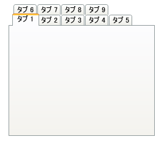

////

|metadata|
{
    "name": "xamtabcontrol-enable-multiple-tab-rows",
    "controlName": ["xamTabControl"],
    "tags": ["Editing"],
    "guid": "{646EB43B-3757-4C55-8431-2425220519DB}",  
    "buildFlags": [],
    "createdOn": "2012-01-30T19:39:54.4592449Z"
}
|metadata|
////

= 複数のタブ行を有効にする

xamTabControl™ にタブを追加する場合、デフォルトのレイアウト動作が 1 行のタブを作成します。さらに、xamTabControl が自動的に各タブ ヘッダーの幅をサイズ変更し、その内容をフィットさせます。ただし、xamTabControl の link:{RootAssembly}{ApiVersion}~infragistics.windows.controls.xamtabcontrol~tablayoutstyle.html[TabLayoutStyle] を link:{RootAssembly}{ApiVersion}~infragistics.windows.controls.tablayoutstyle.html[TabLayoutStyle enumeration] の値に設定することにより、この動作を変更できます。

以下のコード例は、タブ レイアウトの変更方法を示します。

*XAML の場合:*

----
<igWindows:XamTabControl Name="xamTabControl1" TabLayoutStyle="MultiRowAutoSize">
    <!--TODO: ここでタブを追加します-->
</igWindows:XamTabControl>
----

*Visual Basic の場合:*

----
Imports Infragistics.Windows.Controls
...
Me.xamTabControl1.TabLayoutStyle = TabLayoutStyle.MultiRowAutoSize
...
----

*C# の場合:*

----
using Infragistics.Windows.Controls;
...
this.xamTabControl1.TabLayoutStyle = TabLayoutStyle.MultiRowAutoSize;
...
----

== 関連トピック

link:xamtabcontrol-about-styling-xamtabcontrol.html[xamTabControl のスタイリングについて]

link:xamtabcontrol-add-a-tab-to-xamtabcontrol.html[タブを xamTabControl に追加]

link:xamtabcontrol-add-content-to-a-tab.html[コンテンツをタブに追加]

link:xamtabcontrol-close-a-tab.html[タブを閉じる]

link:xamtabcontrol-removing-a-closed-tab.html[閉じたタブを削除]

link:xamtabcontrol-select-a-tab.html[タブを選択]

link:xamtabcontrol-tabs-dragging-and-reordering.html[タブのドラッグおよび順序変更 (xamTabControl)]