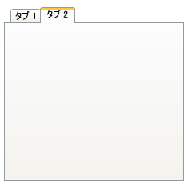

////

|metadata|
{
    "name": "xamtabcontrol-select-a-tab",
    "controlName": ["xamTabControl"],
    "tags": ["Selection"],
    "guid": "{15EEC946-43BA-4912-ABD1-44D7D33F108B}",  
    "buildFlags": [],
    "createdOn": "2012-01-30T19:39:54.4672465Z"
}
|metadata|
////

= タブを選択

エンド ユーザーは実行時にタブのヘッダーをクリックして、タブの内容を選択および表示できます。エンド ユーザーの操作に加え、アプリケーションの起動時に、プログラム的にタブを選択してその内容を表示したり、XAML を使用してタブを選択し、タブの内容を表示したりできます。

以下のコード例は、タブの選択方法を示します。プロシージャー コードは、 link:{RootAssembly}{ApiVersion}~infragistics.windows.controls.xamtabcontrol.html[Items コレクション] に link:{RootAssembly}{ApiVersion}~infragistics.windows.controls.tabitemex.html[TabItemEx] オブジェクトまたは TabItem オブジェクトが少なくとも 2 つあることを想定しています。

*XAML の場合:*

----
<igWindows:XamTabControl Name="xamTabControl1">
    <igWindows:TabItemEx Header="Tab 1">
        <!--TODO: ここでパネルを追加します-->
    </igWindows:TabItemEx>
    <igWindows:TabItemEx Header="Tab 2" IsSelected="True">
        <!--TODO: ここでパネルを追加します-->
    </igWindows:TabItemEx>
</igWindows:XamTabControl>
----

*Visual Basic の場合:*

----
DirectCast(Me.xamTabControl1.Items(1), TabItem).IsSelected = True
----

*C# の場合:*

----
((TabItem)this.xamTabControl1.Items[1]).IsSelected = true;
----

== 関連トピック

link:xamtabcontrol-about-styling-xamtabcontrol.html[xamTabControl のスタイリングについて]

link:xamtabcontrol-add-a-tab-to-xamtabcontrol.html[タブを xamTabControl に追加]

link:xamtabcontrol-add-content-to-a-tab.html[コンテンツをタブに追加]

link:xamtabcontrol-close-a-tab.html[タブを閉じる]

link:xamtabcontrol-enable-multiple-tab-rows.html[複数のタブ行を有効にする]

link:xamtabcontrol-removing-a-closed-tab.html[閉じたタブを削除]

link:xamtabcontrol-tabs-dragging-and-reordering.html[タブのドラッグおよび順序変更 (xamTabControl)]