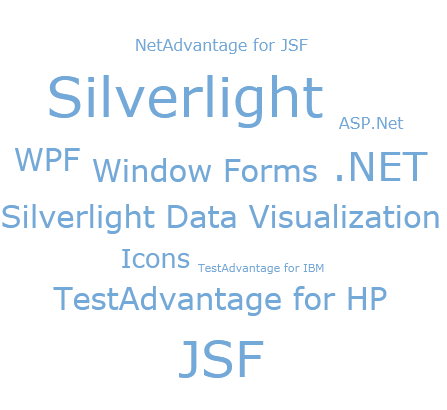

////

|metadata|
{
    "name": "xamtagcloud-about-xamtagcloud",
    "controlName": ["xamTagCloud"],
    "tags": [],
    "guid": "{C97C9536-CEEC-41EA-B5F2-CBD4556F3FC7}",  
    "buildFlags": [],
    "createdOn": "2016-05-25T18:21:59.5413638Z"
}
|metadata|
////

= xamTagCloud について

xamTagCloud™ コントロールによって、タグ クラウド スタイル ナビゲーション要素をアプリケーションに追加できます。xamTagCloud コントロールは、対応するウェイトで関連するタグのセットを表示します。発生の頻度、重要性、または他の任意のアルゴリズムに基づいて各タグに重みを付けることができます。クラウド項目のサイズは、xamTagCloud コントロールによってスケールされます。xamTagCloud コントロールを一瞥しただけでエンドユーザーは最も一般的なタグを識別します。

以下は xamTagCloud コントロールの主要な機能のリストです:

* データ バインディング - Content プロパティと Weight プロパティを持つ項目の列挙可能なソースにタグ クラウドの ItemsSource プロパティを設定します。
* リンク可能なタグ - クラウドに現れる項目をハイパーリンクできます。これによりエンドユーザーはこれらをクリックして定義する URI に移動できます。
* タグ項目 - タグ コンテンツおよびそのサイズが xamTagCloud コントロールでスケールされる時に任意のコントロールを設定することもできます。
* ウェイトおよびサイズ - タグ クラウドのウェイトの範囲をカスタマイズでき、これらは対応するフォント サイズにマップされます。

== 関連トピック

link:xamtagcloud-adding-xamtagcloud-to-your-page.html[xamTagCloud をページに追加]

link:xamtagcloud-using-xamtagcloud.html[xamTagCloud の使用]