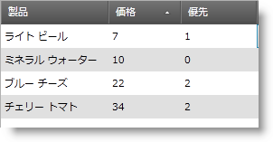

////

|metadata|
{
    "name": "xamtexteditor-using-xamtexteditor-as-a-field-in-xamdatagrid",
    "controlName": ["xamTextEditor"],
    "tags": ["Grids","How Do I"],
    "guid": "{31E5671A-A4E2-4A12-8773-31C480623615}",  
    "buildFlags": [],
    "createdOn": "2012-09-05T19:05:30.2559781Z"
}
|metadata|
////

= xamDataGrid でフィールドとして xamTextEditor を使用

xamTextEditor™ コントロールの重要な機能は、xamDataGrid™ link:{ApiPlatform}datapresenter{ApiVersion}~infragistics.windows.datapresenter.field.html[Field] に組み込むことができることです。この機能によって、セルの値を修正する間にエンドユーザーはエディタの機能を十分に活用することができます。

これらの手順に従って、xamDataGrid の Field に xamTextEditor を表示します。

[start=1]
. Microsoft® Windows® Presentation Foundation Window または Page プロジェクトを作成します。
[start=2]
. 以下の名前空間宣言を開始の Page タグまたは Window タグに配置します。これらの宣言によって、 xamDataGrid、xamTextEditor を参照してタイプを定義することができます (つまり Int32、Boolean)。

*XAML の場合:*

----
xmlns:igDP="http://infragistics.com/DataPresenter"
xmlns:igEditors="http://infragistics.com/Editors"
xmlns:sys="clr-namespace:System;assembly=mscorlib"
----

[start=3]
. XmlDataProvider を定義するリソース セクションを作成します。XmlDataProvider は link:resources-employees.html[Employees] XML ファイルを参照します。Grid パネル内に以下の XAML を配置します。

*XAML の場合:*

----
<Grid.Resources>
        <XmlDataProvider Source="../Data/Orders.xml" 
          x:Key="OrderData" XPath="/Orders" />
</Grid.Resources>
----

[start=4]
. XamDataGrid のインスタンスを作成して名前を指定し、前述の手順で作成された XmlDataProvider に DataSource プロパティを設定します。

*XAML の場合:*

----
<igDP:XamDataGrid x:Name="XamDataGrid1" 
  DataSource="{Binding Source={StaticResource OrderData}, XPath=Order}">
        ...
</igDP:XamDataGrid>
----

[start=5]
. link:{ApiPlatform}datapresenter{ApiVersion}~infragistics.windows.datapresenter.fieldlayoutsettings.html[FieldLayoutSettings] オブジェクトの link:{ApiPlatform}datapresenter{ApiVersion}~infragistics.windows.datapresenter.fieldlayoutsettings~autogeneratefields.html[AutoGenerateFields] プロパティを False に設定します。前述の手順で作成されたタグの間に以下の XAML を配置します。

*XAML の場合:*

----
...
<igDP:XamDataGrid.FieldLayoutSettings>
        <igDP:FieldLayoutSettings AutoGenerateFields="False" />
</igDP:XamDataGrid.FieldLayoutSettings>
...
----

[start=6]
. 以下の XAML は Fields を作成し、最初の Field に対して link:{ApiPlatform}datapresenter{ApiVersion}~infragistics.windows.datapresenter.fieldsettings.html[FieldSettings] link:{ApiPlatform}datapresenter{ApiVersion}~infragistics.windows.datapresenter.fieldsettings~editastype.html[EditAsType] および link:{ApiPlatform}datapresenter{ApiVersion}~infragistics.windows.datapresenter.fieldsettings~editortype.html[EditorType] の各プロパティを設定します。EditAsType プロパティを String に設定します。EditorType プロパティは、使用する link:{ApiPlatform}editors{ApiVersion}~infragistics.windows.editors.valueeditor.html[ValueEditor] のタイプを定義します。このケースでは、XamTextEditor を使用しています。このコードを前述の手順のコードの下に配置します。

*XAML の場合:*

----
...
<igDP:XamDataGrid.FieldLayouts>
        <igDP:FieldLayout>
                <igDP:FieldLayout.Fields>
                        <igDP:Field Name="ProductName" >
                                <igDP:Field.Settings>
                                        <igDP:FieldSettings 
                                          EditAsType="{x:Type sys:String}" 
                                          EditorType="{x:Type igEditors:XamTextEditor}"/>
                                </igDP:Field.Settings>
                        </igDP:Field>
                        <igDP:Field Name="CostPerUnit" />
                        <igDP:Field Name="ShipAndHandle"/>
                </igDP:FieldLayout.Fields>
        </igDP:FieldLayout>
</igDP:XamDataGrid.FieldLayouts>
...
----

[start=7]
. プロジェクトをビルドして実行します。Field で xamTextEditor を使用する時の違いに気づきません。ただし、セル値を取得する場合には違いに気づきます。xamTextEditor に数値データを配置しようとする場合には、エディタは数字を文字列として返します。数値エディタに数値データを配置した場合、エディタは設定されているタイプでその値を返します (つまり、Int32、Double)。

