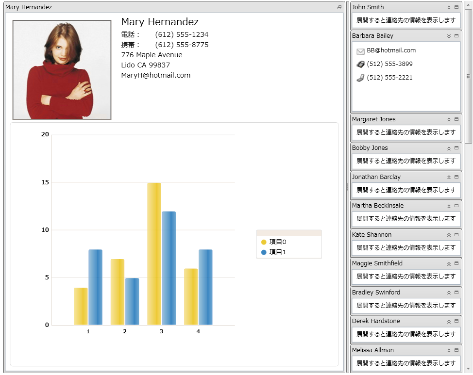

////

|metadata|
{
    "name": "xamtilemanager-about-xamtilemanager",
    "controlName": ["xamTileManager"],
    "tags": ["Data Presentation","Getting Started"],
    "guid": "445b0dff-4b40-4c57-95c2-acb53fc06a00",  
    "buildFlags": [],
    "createdOn": "2016-05-25T18:21:59.6184063Z"
}
|metadata|
////

= xamTileManager について

xamTileManager は矩形のタイルを使用してコンテンツを表示します。これらは連続して配列されて複数行のタイルとなります。エンド ユーザーは 1 つ以上のタイルを最大化できます。これによって残りのタイルは自動的に最小化されます。ただし、最小化されたタイルはコントロールの端に沿って今まで通りに表示されるので、エンドユーザーは素早く最大化して、ユーザーの注意を新しいコンテンツに移すことができます。

xamTileManager には以下の機能があります:

* *アニメーション* - xamTileManager には状態のトランジション中に再生されるアニメーションが組み込まれています。固有のアニメーションを追加して、このエクスペリエンスをカスタマイズできます。
* *データ バインディング* - xamTileManager は ItemsControl クラスから派生しているため、データ項目の Tile オブジェクトを自動的に作成するために ItemsSource プロパティを設定できます。
* *ドラッグ アンド ドロップ* - エンドユーザーはランタイムにタイルをドラッグして再配置できます。
* *明示的なタイトルレイアウト* - Grid パネルの概念を使用して明示的な列および行にタイルを配列できます (Column、Row、ColumnSpan および RowSpan)。
* *レイアウトの保存と読み込み* - エンド ユーザーがランタイムにレイアウトを変更した後で、変更を保存してアプリケーションのセッション間に復元できます。
* *状態に基づいた項目テンプレート* - タイルの状態に基づいて項目テンプレートを定義できます。xamTileManager は、エンド ユーザーがタイルの状態を変更すると、正しい項目テンプレートを自動的に適用します。
* *状態に基づいたサイズ制限* - 状態に基づいてタイルのサイズを制限できます。
* *タイルのサイズ変更* - エンド ユーザーはサイズ変更インジケーターを使用してタイルのサイズを変更できます。

== 関連トピック

link:xamtilemanager-adding-xamtilemanager-to-your-application.html[xamTileManager をアプリケーションに追加]

link:xamtilemanager-using-xamtilemanager.html[xamTileManager の使用]