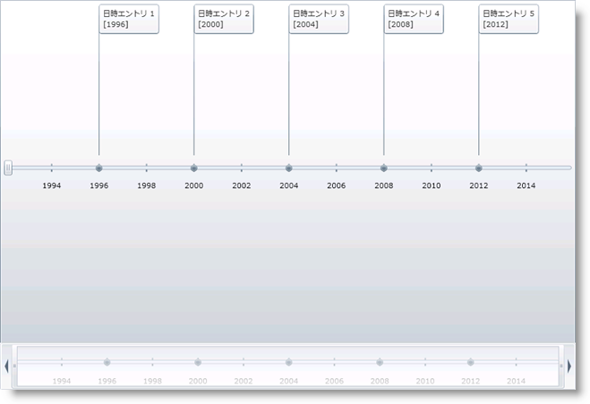

////

|metadata|
{
    "name": "xamtimeline-about-date-time-series",
    "controlName": ["xamTimeline"],
    "tags": ["Data Presentation","How Do I"],
    "guid": "{DF6E7CC5-204A-4C7B-BEB7-23C42CD2474D}",  
    "buildFlags": [],
    "createdOn": "2016-05-25T18:22:00.0763946Z"
}
|metadata|
////

= 日時シリーズについて

*日付/時刻の値*

xamTimeline コントロールによって、DateTime データを使用して link:{ApiPlatform}controls.timelines.xamtimeline{ApiVersion}~infragistics.controls.timelines.datetimeseries.html[DateTimeSeries] オブジェクトからタイムラインを作成できます。このデータは、ランタイムに手動で xamTimeline にバインドされるか入力されます。link:{ApiPlatform}controls.timelines.xamtimeline{ApiVersion}~infragistics.controls.timelines.datetimeentry.html[DateTimeEntry] オブジェクトの link:{ApiPlatform}controls.timelines.xamtimeline{ApiVersion}~infragistics.controls.timelines.datetimeentry~time.html[Time] プロパティは DateTime データを受け付けます。XAML でこの値を設定する場合、時刻が後続する日時のスペースで区切られた文字列を提供できます。ユーザーが入力できる日付と時刻値としては、DateTime 値に解析可能な任意の組み合わせ (日付、時刻、または日付と時刻) の文字列を使用できます。

*値の表示*

DateTimeSeries オブジェクトのイベント値は、文字列フォーマットを使用して希望する方法で表示されます。日、月、または年などの DateTime 値の部分を表示できます。詳細については、 link:xamtimeline-format-datetime-values.html[日時の値の書式設定]を参照してください。

*最小値と最大値*

DateTime データで作業する時に最小値および最大値を指定することが重要です。デフォルト軸の値を使用すると、データ ポイントのクラッタや広範囲への分散など、表示に不具合が発生する可能性が高くなります。link:{ApiPlatform}controls.timelines.xamtimeline{ApiVersion}~infragistics.controls.timelines.datetimeseries~mintime.html[MinTime] および link:{ApiPlatform}controls.timelines.xamtimeline{ApiVersion}~infragistics.controls.timelines.datetimeseries~maxtime.html[MaxTime] プロパティは、DateTime 値を受け付け、XAML でそれらを設定する時に Time プロパティと同じ概念に従います。鮮明なディスプレイのためには、Minimum および Maximum 値の設定に加えて、 link:{ApiPlatform}datavisualization{ApiVersion}~infragistics.axisbase~autorange.html[AutoRange] を False に、また link:{ApiPlatform}controls.timelines.xamtimeline{ApiVersion}~infragistics.controls.timelines.timelineaxis~unit.html[DateTimeAxis] オブジェクトの link:{ApiPlatform}controls.timelines.xamtimeline{ApiVersion}~infragistics.controls.timelines.datetimeaxis~unittype.html[Unit] および link:{ApiPlatform}controls.timelines.xamtimeline{ApiVersion}~infragistics.controls.timelines.datetimeaxis.html[UnitType] プロパティに設定できます。これによって値の固有の範囲を指定できます。

*単位タイプ*

DateTime 値はさまざまな順序で並べられるので、タイムラインの範囲を指定するために DateTimeAxis オブジェクトの Unit および UnitType プロパティを設定することが重要です。たとえば、タイムラインのデータは日付と時刻の両方が可能ですが、6 か月のセグメントに基づいて値を表示するためにより視覚的に魅力を高めることができます。この場合、UnitType を Months そして Unit を 6 に設定します。

*期間*

同様に、DateTime エントリの link:{ApiPlatform}controls.timelines.xamtimeline{ApiVersion}~infragistics.controls.timelines.datetimeentry~duration.html[Duration] を設定する場合、適切に UnitType を使用することが重要です。Duration は日または時間、分、秒で値を設定する TimeSpan であるため、年などの大きな UnitType を持ったり Duration が時間である場合、スパンが表示できなくなります。詳細については、 link:xamtimeline-set-duration-in-date-time-series.html[日時シリーズで時間を設定]を参照してください。

== 関連トピック

link:xamtimeline-display-date-time-series.html[DateTimeSeries の表示]

link:xamtimeline-set-duration-in-date-time-series.html[DateTimeSeries で時間を設定]