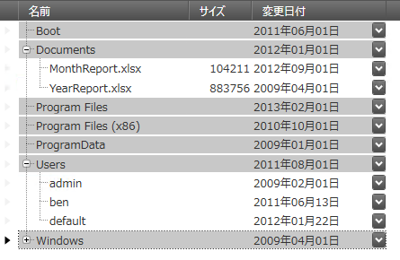
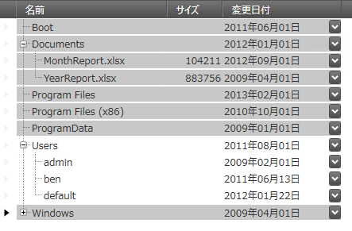
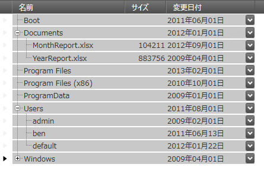

////

|metadata|
{
    "name": "xamtreegrid-conf-selection",
    "tags": ["Selection"],
    "controlName": ["xamTreeGrid"],
    "guid": "2885289b-84f1-45c4-868b-e5abfd7e015c",  
    "buildFlags": [],
    "createdOn": "2015-02-06T12:28:08.9955111Z"
}
|metadata|
////

= 選択の構成 (xamTreeGrid)

== トピックの概要

=== 目的

このトピックでは、子レベルのレコードに対して選択動作を構成する方法を説明します。

=== 前提条件

このトピックを理解するために、以下のトピックを参照することをお勧めします。

[options="header", cols="a,a"]
|====
|トピック|目的

| link:xamtreegrid-features-overview.html[機能の概要 (xamTreeGrid)]
|このトピックでは、このコントロールでサポートする機能を開発者の観点から説明します。

| link:xamtreegrid-visual-elements-overview.html[視覚要素の概要 (xamTreeGrid)]
|このトピックでは、コントロールの視覚要素についての概要を紹介します。

| link:xamdata-selection-overview.html[選択の概要 (xamDataGrid)]
|このトピックでは、データ プレゼンターのセル、列、およびフィールドの選択について概要を説明します。

|====

== 選択の概要

=== 選択の概要

link:{ApiPlatform}datapresenter{ApiVersion}~infragistics.windows.datapresenter.xamtreegrid.html[xamTreeGrid] コントロールにより、ユーザーが選択したレコードまたはセルの範囲に応じて、選択するレコードをプロパティで構成できます。以下の 3 つの例では、初期状態は同じです。

* 初期選択なし
* "Documents" レコードは展開されています
* "Users" レコードは縮小されています
* ユーザーは "Boot" レコード セレクターをクリックすることによりクロス レベル選択を実行した後、"Windows" レコード セレクターでシフトクリックします
* 選択後、ユーザーは "Users" レコードを展開します

==== "Single" デプス選択モード

この場合、親レコードの展開状態にかかわらず、ネストされたレコードは選択されません。現在の選択レベルにあるレコードのみが選択されます。これは、GridView のデフォルト設定です。

==== "VisibleOnly" デプス選択モード

この場合、ピボット レコードと選択終了レコードの間に表示されたすべてのレコードが選択されます。"Users" レコードの下にあるレコードは、選択後に表示されるため選択されません。これは、TreeView のデフォルト設定です。

==== "All" デブス選択モード

この場合、親の展開状態にかかわらず、すべてのレコード (選択レベルとネストされたすべてのレベルにあるレコード) が選択されます。

=== 選択構成の概要

以下の表は、 _xamTreeGrid_   コントロールの構成可能な要素を簡単に説明し、それを構成するプロパティにマップします。

[options="header", cols="a,a,a"]
|====
|構成可能な項目|詳細|プロパティ

|[[_Hlk356484826]] 

選択モード
|クロスレベル選択モードを指定します。
| link:{ApiPlatform}datapresenter{ApiVersion}~infragistics.windows.datapresenter.treeviewsettings~selectiondepthmode.html[XamTreeGrid.ViewSettings.SelectionDepthMode]

|====

注:

[NOTE]
====
選択された項目を取得するには、以下のデータ プレゼンター選択関連のトピックを参照してください。

* link:xamdatagrid-selected-data-items.html[選択されたデータ項目での作業 (xamDataGrid)]
* link:xamdata-accessing-records-through-the-recordmanager.html[RecordManager によるレコードへのアクセス]

====

=== コード例

以下のコード例は、クロスレベル デプス選択モードを "VisibleOnly" に設定する方法を示します。

*XAML の場合:*

[source,xaml]
----
<igDP:XamTreeGrid>
  <igDP:XamTreeGrid.ViewSettings>
    <igDP:TreeViewSettings SelectionDepthMode="VisibleOnly" />
  </igDP:XamTreeGrid.ViewSettings>
</igDP:XamTreeGrid>
----

== 関連コンテンツ

=== トピック

このトピックの追加情報については、以下のトピックも合わせてご参照ください。

[options="header", cols="a,a"]
|====
|トピック|目的

| link:xamtreegrid-conf-tree-field.html[ツリー フィールドの構成 (xamTreeGrid)]
|このトピックでは、コントロールのツリー フィールドを構成する方法を説明します。

| link:xamtreegrid-conf-expansion-indicators.html[展開インジケーターの構成 (xamTreeGrid)]
|このトピックでは、展開インジケーターの動作を構成する方法を説明します。

| link:xamtreegrid-conf-indentation-per-level.html[レベルごとのインデントの構成 (xamTreeGrid)]
|このトピックでは、子レコードの表示に使用するインデントの設定方法を説明します。

| link:xamtreegrid-conf-filtering.html[フィルタリングの構成 (xamTreeGrid)]
|このトピックでは、コントロールのフィルタリング機能を構成する方法を説明します。

| link:xamtreegrid-conf-summaries.html[集計の構成 (xamTreeGrid)]
|このトピックでは、コントロールの集計サポートの詳細を説明します。

|====