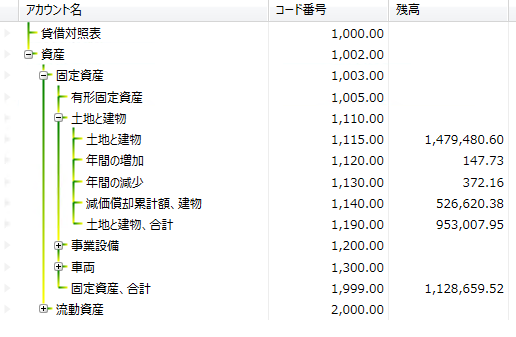

////

|metadata|
{
    "name": "xamtreegrid-styling-tree-connector-lines",
    "tags": ["Styling"],
    "controlName": ["xamTreeGrid"],
    "guid": "8655dab6-c200-48b9-a9b3-374ecbd93ec8",  
    "buildFlags": [],
    "createdOn": "2015-02-06T12:35:50.7675875Z"
}
|metadata|
////

= ツリー コネクタ線のスタイル設定 (xamTreeGrid)

== トピックの概要

=== 目的

このトピックでは、コントロールのツリー コネクタ線をスタイル設定する方法を説明します。

=== 前提条件

このトピックを理解するために、以下のトピックを参照することをお勧めします。

[options="header", cols="a,a"]
|====
|トピック|目的

| link:xamtreegrid-features-overview.html[機能の概要 (xamTreeGrid)]
|このトピックでは、このコントロールでサポートする機能を開発者の観点から説明します。

| link:xamtreegrid-visual-elements-overview.html[視覚要素の概要 (xamTreeGrid)]
|このトピックでは、コントロールの視覚要素についての概要を紹介します。

|====

=== このトピックの内容

このトピックは、以下のセクションで構成されます。

* <<_Ref410649522, ツリー コネクタ線のスタイル設定 >>
* <<_Ref410649530, 関連コンテンツ >>

[[_Ref410649522]]
== ツリー コネクタ線のスタイル設定

=== ツリー コネクタ線のスタイル設定の概要

_xamTreeGrid_   コントロールのコネクタ線は、 link:{ApiPlatform}datapresenter{ApiVersion}~infragistics.windows.datapresenter.xamtreegrid~viewsettings.html[ViewSettings] オブジェクトの `TreeLinePen` プロパティに `Pen` を提供することでスタイル設定できます。

[options="header", cols="a,a,a"]
|====
|構成可能な項目|詳細|プロパティ

|[[_Hlk356484826]] 

ツリー コネクタ線のスタイル設定
|コネクタ線を描画するカスタム ペンを設定します
| link:{ApiPlatform}datapresenter{ApiVersion}~infragistics.windows.datapresenter.treeviewsettings~treelinepen.html[TreeLinePen]

|====

=== コード例

以下のコード例は、コントロールのコネクタ線を描画するカスタム ペンを設定する方法を示しています。

*XAML の場合:*

[source,xaml]
----
<Page … >
  <Page.Resources>
    <ResourceDictionary>
      <Pen x:Key="YellowGreenBrush" Thickness="2">
        <Pen.Brush>
          <LinearGradientBrush>
            <GradientStop Offset="0.0" Color="Green" />
            <GradientStop Offset="1.0" Color="Yellow" />
          </LinearGradientBrush>
        </Pen.Brush>
      </Pen>
    </ResourceDictionary>
  </Page.Resources>
  <Grid x:Name="LayoutRoot">
    <igDP:XamTreeGrid x:Name="xtg" …>
      <igDP:XamTreeGrid.ViewSettings>
        <igDP:TreeViewSettings TreeLinePen="{StaticResource YellowGreenBrush}" />
      </igDP:XamTreeGrid.ViewSettings>
    </igDP:XamTreeGrid>
  </Grid>
</Page>
----

以下のスクリーンショットは、前述のコードの結果を示しています。

注:

[NOTE]
====
`Pen` の作成のみでもツリーコネクタ線の `Pen` が設定でき、`Key` プロパティを以下のように設定できます。

`{x:Static igDP:DataPresenterBrushKeys.TreeLinePen}`
====

[[_Ref410649530]]
== 関連コンテンツ

=== トピック

以下のトピックでは、このトピックに関連する追加情報を提供しています。

[options="header", cols="a,a"]
|====
|トピック|目的

| link:xamtreegrid-styling-expansion-indicators.html[展開インジケーターのスタイル設定 (xamTreeGrid)]
|このトピックでは、コントロールの展開インジケーターをスタイル設定する方法を説明します。

|====