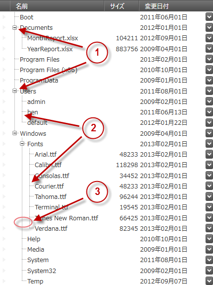

////

|metadata|
{
    "name": "xamtreegrid-visual-elements-overview",
    "tags": ["Getting Started"],
    "controlName": ["xamTreeGrid"],
    "guid": "de427eae-62f8-4d3c-80c2-b24b20a4ac27",  
    "buildFlags": [],
    "createdOn": "2015-02-06T12:21:16.9986398Z"
}
|metadata|
////

= 視覚要素の概要 (xamTreeGrid)

== トピックの概要

=== 目的

このトピックでは、コントロールの視覚要素についての概要を紹介します。

=== 前提条件

以下の表は、このトピックを理解するための前提条件として必要な概念とトピックの一覧です。

[options="header", cols="a,a"]
|====
|タイプ|コンテンツ

|概念
|Data Presenter Family
|==== 

=== トピック
[options="header", cols="a,a"] 

|==== 

|トピック|目的 

| link:wpf-about-the-data-presenter-family.html[Data Presenter Family について] 

|このトピックでは、コントロールの Data Presenter Family の概念を説明します。 

| link:xamdatagrid-understanding-xamdatagrid.html[xamDataGrid について] 

|このトピックは、 _xamDataGrid_ コントロールの概要を提供し、要素のダイアグラムを含みます。 

| link:xamtreegrid-features-overview.html[機能の概要 (xamTreeGrid)] 

|このトピックでは、このコントロールでサポートする機能を開発者の観点から説明します。 

|====

=== このトピックの内容

このトピックは、以下のセクションで構成されます。

* <<_Ref410311836, xamTreeGrid コントロールの視覚要素と関連プロパティ >>
* <<_Ref410311842, 関連コンテンツ >>

[[_Ref410311836]]
== xamTreeGrid コントロールの視覚要素と関連プロパティ

=== 視覚要素の概要

以下のスクリーンショットは、 link:{ApiPlatform}datapresenter{ApiVersion}~infragistics.windows.datapresenter.xamtreegrid.html[xamTreeGrid] 固有の視覚要素を示しています。設定可能な要素を図の後に示します。

[start=1]
. 展開 / 縮小インジケーター (ハンドル)
[start=2]
. コネクタ線
[start=3]
. ネストされたレコードのインデント

=== 視覚要素と関連プロパティ

以下の表は、 _xamTreeGrid_   固有の視覚要素とそれらを構成するプロパティのマップを示します。

[options="header", cols="a,a,a"]
|====
|視覚要素|プロパティ|トピック

|展開 / 縮小インジケーター (ハンドル)
| link:{ApiPlatform}datapresenter{ApiVersion}~infragistics.windows.datapresenter.fieldlayoutsettings~expansionindicatordisplaymode.html[XamTreeGrid.FieldLayoutSettings.ExpansionIndicatorDisplayMode]
| link:xamtreegrid-conf-expansion-indicators.html[展開インジケーターの構成 (xamTreeGrid)]

|コネクタ線
|
* link:{ApiPlatform}datapresenter{ApiVersion}~infragistics.windows.datapresenter.treeviewsettings~treelinevisibility.html[XamTreeGrid.ViewSettings.TreeLineVisibility] 

* link:{ApiPlatform}datapresenter{ApiVersion}~infragistics.windows.datapresenter.treeviewsettings~treelinepen.html[XamTreeGrid.ViewSettings.TreeLinePen] 

| link:xamtreegrid-styling-tree-connector-lines.html[ツリー コネクタ線のスタイル設定 (xamTreeGrid)]

|ネストされたレコードのインデント
| link:{ApiPlatform}datapresenter{ApiVersion}~infragistics.windows.datapresenter.treeviewsettings~indentperlevel.html[XamTreeGrid.ViewSettings.IndentPerLevel]
| link:xamtreegrid-conf-indentation-per-level.html[レベルごとのインデントの構成 (xamTreeGrid)]

|====

注:

[NOTE]
====
ツリーを含む列は「ツリー フィールド」と呼ばれ、`TreeCellValuePresenter` 型をターゲットにするスタイルを提供することで再テンプレートできます。
====

[[_Ref410311842]]
== 関連コンテンツ

=== トピック

このトピックの追加情報については、以下のトピックも合わせてご参照ください。

[options="header", cols="a,a"]
|====
|トピック|目的

| link:xamtreegrid-user-interactions-and-usability.html[ユーザー インタラクションと操作性 (xamTreeGrid)]
|このトピックでは、ユーザーが実行できる操作を紹介します。

| link:xamtreegrid-limitations.html[制限 (xamTreeGrid)]
|このトピックでは、このコントロールでサポートされていない Data Presenter の機能を説明します。

|====