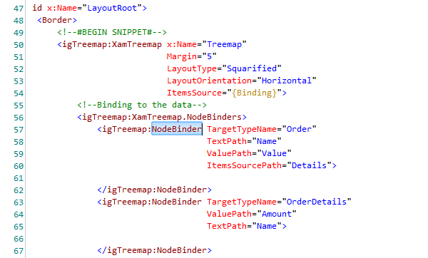
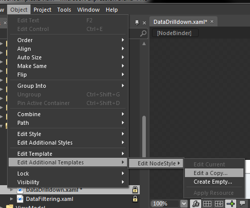
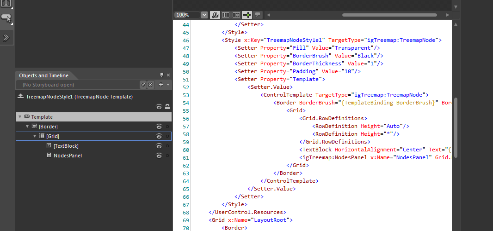
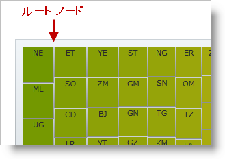

////

|metadata|
{
    "name": "xamtreemap-changing-the-style-of-the-nodes",
    "controlName": ["xamTreemap"],
    "tags": ["How Do I","Styling","Templating"],
    "guid": "287dcded-0ae5-4fb9-8c35-f3e1f4b6198d",  
    "buildFlags": [],
    "createdOn": "2016-05-25T18:21:59.8603908Z"
}
|metadata|
////

= ノードのスタイルを変更する

link:{ApiPlatform}controls.charts.xamtreemap{ApiVersion}~infragistics.controls.charts.nodebinder.html[NodeBinder] がノードに適用するスタイルの変更方法について説明します。各 NodeBinder はノードにさまざまなスタイルを適用できます。

== 始める前に

ノードのカスタム テンプレートには “NodesPanel” という名前の NodesPanel 要素を含まれる必要があります。この要素は、各子コードを保持します。

== スタイルの作成

[start=1]
. Blend でプロジェクトを作成し、xamTreemap コントロールに追加します。
[start=2]
. NodeBinders を xamTreemap に追加します。
[start=3]
. スタイルする NodeBinder を強調表示します。

[start=4]
. [オブジェクト] メニューから - オブジェクト - テンプレートの編集 - NodeStyle の編集 - コピーの編集… を選択します。

[start=5]
. カスタム ツリーマップ ノード スタイルのテンプレートを編集します。

== DefaultStyle プロパティ

xamTreemap コントロールをデータにバインドする場合、データ ソースからのノードを含むルートノードを作成します。 

xamTreemap コントロールのスタイルを link:{ApiPlatform}controls.charts.xamtreemap{ApiVersion}~infragistics.controls.charts.xamtreemap~defaultstyle.html[DefaultStyle] プロパティへ割り当ててこのノードのスタイルを設定できます。

== デフォルト ノード テンプレート

*XAML の場合:*

----

----