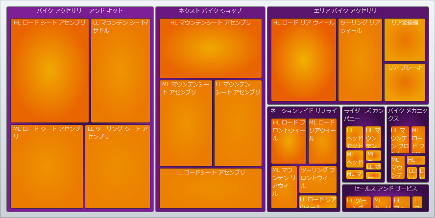

////

|metadata|
{
    "name": "xamtreemap-colormapper",
    "controlName": ["xamTreemap"],
    "tags": ["How Do I"],
    "guid": "0fbe69b0-8e83-468b-8cdb-01bfe34da172",  
    "buildFlags": [],
    "createdOn": "2016-05-25T18:21:59.8354203Z"
}
|metadata|
////

= ColorMapper

link:{ApiPlatform}controls.charts.xamtreemap{ApiVersion}~infragistics.controls.charts.colormapper.html[ColorMapper] は、指定した値によって xamTreemap コントロールのノードに色を設定します。データのプロパティをノードのプロパティにマップします。たとえば、塗りつぶし色または前景色。

== ColorMapper プロパティ

* link:{ApiPlatform}controls.charts.xamtreemap{ApiVersion}~infragistics.controls.charts.valuemapper~valuepath.html[ValuePath] - データを含むデータ ソースのプロパティ名を決定します。
* link:{ApiPlatform}controls.charts.xamtreemap{ApiVersion}~infragistics.controls.charts.valuemapper~valuetypename.html[ValueTypeName] - ValuePath によって指定されるデータを含むフィールドを持つタイプの名前を決定します。
* link:{ApiPlatform}controls.charts.xamtreemap{ApiVersion}~infragistics.controls.charts.valuemapper~targetproperty.html[TargetProperty] - カラー マッピングによって影響を受けるプロパティを決定します。
* link:{ApiPlatform}controls.charts.xamtreemap{ApiVersion}~infragistics.controls.charts.valuemapper~targetname.html[TargetName] - xamTreemap コントロールのノードにカスタム テンプレートが定義されていて、名前付きの要素がある場合、この要素を指定するために TargetName を使用できます。
* link:{ApiPlatform}controls.charts.xamtreemap{ApiVersion}~infragistics.controls.charts.valuemapper~mappingmode.html[MappingMode] - カラー マッピングによって影響を受けるノードを決定します。可能となる値は "AllNodes" と "LeafNodesOnly" です。
* link:{ApiPlatform}controls.charts.xamtreemap{ApiVersion}~infragistics.controls.charts.colormapper~from.html[From] および link:{ApiPlatform}controls.charts.xamtreemap{ApiVersion}~infragistics.controls.charts.colormapper~to.html[To] - この 2 つのプロパティは、各ノードの値によって決定される色の範囲を決定します。
* link:{ApiPlatform}controls.charts.xamtreemap{ApiVersion}~infragistics.controls.charts.rangemapper~dataminimum.html[DataMinimum] および link:{ApiPlatform}controls.charts.xamtreemap{ApiVersion}~infragistics.controls.charts.rangemapper~datamaximum.html[DataMaximum] - ValuePath によって指定された値が特定のノードの DataMinimum より小さい場合、マッパーは From プロパティの値を適用します。ValuePath によって指定された値が特定のノードの DataMaximum より大きい場合、マッパーは To プロパティの値を適用します。

== 例

Manufacturer と Product の 2 つのクラスがあります。Product クラスには double フィールド StandardCost があります。Manufacturer クラスには整数フィールド Revenue があります。

*XAML の場合:*

----
<ig:xamTreemap.ValueMappers>
    <ig:ColorMapper 
        ValueTypeName="Manufacturer"
        ValuePath="Revenue"
        TargetProperty="Fill"
        MappingMode="AllNodes"
        From="#9C9C9C"
        To="#555555" />
    <ig:ColorMapper 
        ValueTypeName="Product"
        ValuePath="StandardCost"
        TargetProperty="Fill"
        MappingMode="AllNodes"
        From="#ffba13"
        To="#80a80b" />
</ig:xamTreemap.ValueMappers>
----

== どのように動作するのか

最初のマッパーは、タイプ Manufacturer のすべてのノードに Fill を設定します。Fill は各ノードの Revenue フィールドに基づいて From 値と To 値の間の色の付いた単色ブラシとなります。

2 番目のマッパーは、タイプ Product のすべてのノードに Fill を設定します。Fill は各ノードの StandardCost 値に基づいて From 値と To 値の間の色の付いた単色ブラシとなります。

image::images/xamTreemap_ColorMapper_01.png[]

関連トピック

link:xamtreemap-node-binders.html[ノード バインダー]

link:xamtreemap-value-mappers.html[値のマッパー]